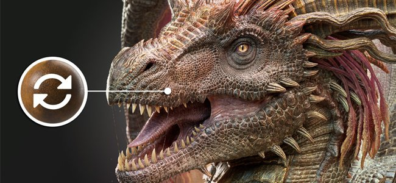

# Version 11.0

<b>Substance 3D Painter 11.0</b> fügt einen neuen Arbeitsablauf für die automatische Ressourcenaktualisierung, ein Tool für gefüllte Pfade sowie allgemeine Verbesserungen für Pfade, einen automatischen Käfig für Backen und mehrere neue Filter zum Erstellen stilisierter Texturen hinzu.

Freigabedatum: <b>11. März 2025</b>

>[!NOTE]
>
> Diese Painter-Version bietet keine Unterstützung mehr für Mac Intel-Konfigurationen. Weitere Informationen finden Sie unten.
> 
> Diese Version erhöht auch die unterstützte Mindestversion von Windows 10 auf 22H2.
> 
> Weitere Informationen finden Sie auf unserer Seite mit den Systemanforderungen für [&#128279;](../getting-started/system-requirements.md).

## Wichtigste Funktionen

### Neue automatische Aktualisierung von Ressourcen

Mit dem neuen Arbeitsablauf für die automatische Aktualisierung ist es jetzt möglich, Bibliotheken und Projekte mit den neuesten Versionen Ihrer Ressourcen auf dem neuesten Stand zu halten. Mit diesem neuen Prozess kann Painter Ressourcen auf der Festplatte überwachen, um nach Änderungen zu suchen, und sie automatisch neu laden und durch Ihre Bibliotheken und Projekte ersetzen.

* <b>Aktivieren der automatischen Aktualisierung im Fenster &quot;Elemente&quot;</b>\
  Unten rechts im Fenster &quot;Elemente&quot; ist jetzt eine Schaltfläche und ein Menü zum Konfigurieren des Systems für die automatische Aktualisierung verfügbar (das kleine Doppelpfeilsymbol). Aktivieren Sie die Option <b>Bedienfeld &quot;Elemente&quot;</b>, um Bibliotheken zu überwachen und neu zu laden.

  
* <b>Ressourcen in Projekten werden aktualisiert</b>\
  Beim erneuten Laden einer Ressource wird die in einem Projekt verwendete Version nicht automatisch über den Ebenenstapel, Anzeigeeinstellungen, Shader-Einstellungen usw. aktualisiert. Stellen Sie hierzu sicher, dass Sie auch die Option <b>Ressourcen, die in Projekt </b> verwendet werden, aktivieren.

  
* <b>Aktualisierungsfrequenz </b>\
  Wie oft Painter nach einem Update der Ressourcen suchen soll, kann in wenigen Minuten über eine dedizierte Einstellung festgelegt werden. Wenn Sie 0 Minuten verwenden, wird die Anwendung alle paar Sekunden aktualisiert. Beachten Sie jedoch, dass ein so niedriger Wert zu Leistungsproblemen führen kann. Die Anwendung wird auch automatisch aktualisiert, wenn der Fokus wieder aktiviert wird.
* <b>Manuelles Ressourcenupdate</b>\
  Der Aktualisierungs- und Aktualisierungsvorgang kann auch manuell über die entsprechenden Schaltflächen am unteren Rand des Menüs für die automatische Aktualisierung ausgelöst werden. Dies kann praktischer sein als die Verwendung und das Warten auf den automatischen Prozess.

  
* <b>Nichtübereinstimmung und Fehler im Protokollfenster</b>\
  Das Aktualisieren von Ressourcen kann zu Problemen führen, insbesondere wenn der Unterschied zwischen der alten und der neuen Version wichtig ist. Beispielsweise können sich Texturierungsergebnisse aufgrund fehlender/geänderter Parameter auf einer Substance-Ressource stark ändern oder beschädigt werden. Aus diesem Grund <b>Überspringen Sie Elemente, wenn deren Parameter nicht übereinstimmen</b> ist standardmäßig aktiviert. Probleme werden im Protokollfenster gemeldet.\
  Um eine Aktualisierung zu erzwingen, deaktivieren Sie diese Einstellung einfach.

  

  
* <b>Verfügbar in der Python-API zum Automatisieren der Projektwartung </b>\
  Der Arbeitsablauf für die automatische Aktualisierung wurde auch Python zur Verfügung gestellt. Neue Funktionen wurden hinzugefügt, um veraltete Ressourcen aufzulisten und zu ersetzen.\
  Weitere Informationen finden Sie in der entsprechenden Dokumentation im Hilfemenü der Anwendung.

>[!NOTE]
>
> Weitere Informationen finden Sie auf der [Seite der dedizierten Dokumentation](../features/auto-update.md).

### Neues Werkzeug für gefüllte Pfade

Das Werkzeug für gefüllte Pfade ist ein neuartiges Pfadwerkzeug, mit dem Sie Formen auf der Oberfläche des 3D-Modells erstellen können, die mit einer einheitlichen Farbe gefüllt sind. Sie ermöglicht die Erstellung komplexer Muster.

* <b>Neues Tool zum Erstellen eines Pfads mit einer gefüllten Farbe</b>\
  Ein neues Tool mit dem Namen <b>Ausgefüllter Pfad</b> ist im Menü &quot;Pfad&quot; verfügbar. Dieses Werkzeug kann den inneren Bereich eines Pfads ausfüllen, wenn es geschlossen ist. Die Füllung erfolgt mit einer einheitlichen Farbe für jeden Kanal des Textursatzes.

  
* <b>Automatische Anpassung an Oberfläche</b>\
  Das Werkzeug &quot;Gefüllte Pfade&quot; kann auf jede Art von Oberflächen passen, es ist nicht auf planare Bereiche beschränkt. Sie kann Lücken und Objektgrenzen überwinden.

  
* <b>Kompatibel mit Spiegelungs- und Radialsymmetrie</b>\
  Dieses neue Werkzeug unterstützt auch die Symmetrieeigenschaften, wodurch sich Möglichkeiten zur Erstellung komplexer Formen eröffnen.

  
* <b>Einfaches Umschalten zwischen Pfad-Tools</b>\
  Im Fenster &quot;Eigenschaften&quot; können Sie jetzt zwischen verschiedenen Pfadwerkzeugen wechseln. So kannst du Werkzeuge und Pfade einfacher duplizieren. Sie können z. B. einen Pfadumriss erstellen und dann duplizieren, um ihn in einen gefüllten Pfad umzuwandeln, sodass Sie schnell eine Form mit einem Umriss haben können.

  

### Verbesserte Pfadwerkzeuge mit Ausrichten, geraden Linien und mehr

In dieser neuen Version wurden zahlreiche Verbesserungen des Verhaltens und der Lebensqualität hinzugefügt, um die Verwendung der Pfad-Werkzeuge zu vereinfachen:

* <b>Pfadvorschau (Umschalt+P)</b>\
  Beim Bearbeiten eines Pfades wird eine neue gepunktete Linie angezeigt, die angibt, wie der Pfad reagiert, wenn Sie einen neuen Punkt am Ende der Kurve hinzufügen. Dadurch werden Änderungen leichter vorhersehbar. Diese Vorschau kann über das dedizierte Einstellungsmenü oder mithilfe des Tastaturbefehls <b>Umschalt+P</b> deaktiviert werden.

  
* <b>Einrasten von Geraden und Winkeln</b>\
  Der Tastaturmodifikator <b>Umschalt </b> kann jetzt verwendet werden, um automatisch gerade Linien zwischen Punkten zu erstellen. Die Beibehaltung von <b>Strg </b> kann auch zum Anwenden von Winkelausrichtung verwendet werden, um geometrische Formen zu erstellen.\
  Die Einstellungen für die Winkelausrichtung können über das Menü &quot;Pfadeinstellungen&quot; in der kontextbezogenen Symbolleiste geändert werden.

  
* <b>Pfadpunkte an Gitterpolygonen ausrichten</b>\
  Um die Platzierung von Punkten zu erleichtern, kann ein neues Ausrichten (Magnetsymbol) aktiviert werden. Mit dieser Option können Sie Punkte auf den Scheitelpunkten des 3D-Modells setzen und einer Fläche oder Kante folgen.\
  Das Ausrichten kann auf drei verschiedene Arten erfolgen:

  * An Scheitelpunkten ausrichten
  * An Kanten ausrichten
  * Ausrichten an der Mitte von Kanten

  Alle diese Modi sind über das Menü &quot;Pfadeinstellungen&quot; in der kontextbezogenen Symbolleiste verfügbar.

  

  
* <b>Automatisches Schließen beim Klicken auf den letzten Scheitelpunkt</b>\
  Um die Verwendung des <b>Ausgefüllten-Pfad-Werkzeugs </b> zu vereinfachen, wird der Pfad jetzt automatisch geschlossen, wenn Sie auf den ersten Scheitelpunkt klicken, während der letzte ausgewählt ist. Um einen Punkt auszuwählen, anstatt den Pfad zu schließen, können Sie die <b>STRG-TASTE </b> verwenden. (Dieses Verhalten wurde in der vorherigen Version umgekehrt.)

  
* <b>Pfadscheitelpunkte von Inhalt zu Maske kopieren</b>\
  Es ist jetzt möglich, <b>einen Pfad im Materialmodus zu kopieren</b> und dann <b>alle Scheitelpunkte einfügen</b> auf einem Pfad in einer Maske zu verwenden. Dadurch ist die Synchronisation verschiedener Pfade zwischen Materialien und Masken möglich.

  
* <b>Verbessertes Anzeigeverhalten der Benutzeroberfläche</b>\
  Durch Drücken der Tastaturbefehle für die Viewport-Manipulatoren (<b>W</b>, <b>S</b> oder <b>D</b>) können diese jetzt sofort aktiviert und deaktiviert werden. Sie können auch über die kontextbezogenen Symbolleistenschaltflächen aktiviert/deaktiviert werden. Diese Änderung ermöglicht es, sie schnell ein- oder auszublenden, ohne auch die anderen visuellen Elemente im Viewport (wie die Pfadkurve und die Punkte) auszublenden.

  
* <b>Drehen und Skalieren jetzt auf Pfad-Scheitelpunkten verfügbar</b>\
  In dieser Version kann das Werkzeug <b>Drehen </b> und <b>Skalieren </b> jetzt verwendet werden, wenn mehrere Scheitelpunkte ausgewählt sind. Sie bietet die Möglichkeit, Scheitelpunkte anzupassen und aneinander auszurichten.

  
* <b>Pfadinformationen im Eigenschaftenfenster anzeigen</b>\
  Das Eigenschaftenfenster enthält jetzt einen neuen Abschnitt, wenn ein Pfadwerkzeug ausgewählt ist. In diesem neuen Abschnitt werden Informationen und Aktionen für Pfade neu gruppiert, z. B. die Länge eines Pfades, die Projektionslänge und Tiefen zum Wechseln zwischen Typen.

  
* <b>Verbesserte Tangent-Edition bei Betrachtung aus einem Winkel</b>\
  Das Bearbeiten von benutzerdefinierten Tangenten kann je nach Blickwinkel schwierig sein. Dies wurde nun geändert, sodass die Tangenten auf ihren eigenen Plan beschränkt werden.

  
* <b>Pfadliste über Ebenen hinweg offen halten</b>\
  Wenn das Bedienfeld &quot;Pfad&quot; im Viewport geschlossen war und zwischen verschiedenen Malebenen und Effekten gewechselt wurde, bleibt es auch auf anderen Ebenen geschlossen. Das Bedienfeld bleibt nun geöffnet, um das Hin- und Herschalten zu vereinfachen.

  
* <b>Fokus auf derzeit ausgewählten Pfad </b>\
  Durch Drücken der Tastenkombination <b>F</b> wird jetzt der Fokus auf einen Pfad und nicht auf das gesamte 3D-Modell gelegt, wenn ein Pfad bearbeitet wird.
* <b>Pfad mit Rücktaste </b> löschen\
  Pfade können jetzt schnell gelöscht werden, indem Sie die Tastenkombination <b>Rücktaste </b> drücken.

### Neue Substance-Filter und Texturgeneratoren

Die neue Version enthält einige neue Filter sowie einige verfahrenstechnische Muster.

<b>Filter:</b>

* <b>Stilisierung</b>\
  Dieser neue Filter kann verwendet werden, um eine vorhandene Texturierung in eine stilisierte Version zu konvertieren. Es simuliert Pinselstriche im 3D-Raum und kann einige andere Effekte anwenden, um einen malerischen Look zu erzielen. Es enthält mehrere Vorgaben, die die Wiedergabe vereinfachen.

  
* <b>Quantisieren</b>\
  Der Quantisierungsfilter kann verwendet werden, um die Anzahl der Farben in einem Bild zu reduzieren und flache Bereiche mit harten Grenzen zu erstellen. Es kann auch zum Stilisieren von Texturen verwendet werden.

  
* <b>Anisotropes Kuwahara</b>\
  Dieser Filter wendet den [Kuwahara-Filter](https://en.wikipedia.org/wiki/Kuwahara_filter "https://en.wikipedia.org/wiki/Kuwahara_filter") an, der auch zur Rauschreduzierung und zum Stilisieren von Texturen verwendet werden kann.

  
* <b>Richtungsabstand</b>\
  Dies ist ein einfacher Filter, um Pixel in einer bestimmten Richtung im 2D-Raum zu dehnen. Es kann verwendet werden, um Pinselstriche zu verwischen oder leicht Lecks zu erzeugen.

  
* <b>Weiche Abschrägung</b>\
  Bei der weiche Abschrägung handelt es sich um eine neue Version des Filters &quot;Abgeflachte Kante&quot;, der bessere Ergebnisse und Steuerungen bietet. Es ist zusätzlich zum vorhandenen Filter verfügbar.

  
* <b>Graustufen-Konvertierung </b>\
  Dieser neue Filter kann verwendet werden, um Bilder oder Kanäle bequem in Graustufen zu konvertieren, sodass Sie bei Bedarf die Kontrolle über die Kanäle Rot, Grün und Blau haben.

<b>Texturgeneratoren und Geräusche</b>:

* <b>Scratches-Generator </b>\
  Ein verbesserter Scratches-Generator, der dünne Threads mit verschiedenen Steuerelementen für Zufälligkeit simuliert.
* <b>Triangle Grid </b>\
  Ein Geräusch, das aus den Verbindungen von Dreiecken erstellt wird, mit Steuerelementen für Zufälligkeit und Smoothness.
* <b>Kachelzufall </b>\
  Ein Strukturgenerator, der auf das Erstellen von Kachelmustern zugeschnitten ist.
* <b>Voronoi- und Voronoi-Fraktalrauschen </b>\
  Diese neuen 2D-Versionen sind bereits als 3D-Geräusche verfügbar und können zum Arbeiten und Kacheln im 2D- oder UV-Raum verwendet werden.
* <b>Geräusche von Designer </b> auf die neueste Version aktualisiert\
  Die meisten Geräusche, die in Painter verfügbar sind, wurden mit der neuesten Version von Substance 3D Designer aktualisiert. Rauschparameter werden nicht mehr für eine Gruppe ausgeblendet, damit sie schneller bearbeitet werden können.

### Neuer automatischer Käfig zum Backen (experimentell)

Beim Backen eines Gitters mit hohem Poly auf Gittern mit niedrigem Poly können Sie jetzt eine neue <b>Automatische </b>-Option auswählen, wenn Sie den Käfigmodus angeben. Diese neue Methode versucht, ein automatisches Käfiggewebe zu berechnen, das am besten zu den hochpolaren Maschen passt, um Artefakte zu vermeiden.

* <b>Neue Einstellung in den allgemeinen Backparametern </b>\
  Innerhalb des gemeinsamen Backparameters wurde der Käfigparameter durch eine Auswahl zwischen drei Optionen ersetzt:\
  <b>Entfernungsbasiert</b>: die standardmäßigen Abstandseinstellungen vorne/hinten.\
  <b>Automatisch (experimentell)</b>: den neuen automatischen Käfig.\
  <b>Benutzerdefinierte Datei</b>: wie zuvor eine benutzerdefinierte Gitterdatei als Käfig geladen wurde.

  

>[!NOTE]
>
> Dieses Merkmal gilt als experimentell. Wir planen, den Algorithmus in zukünftigen Versionen zu verbessern. Wir sind auch auf der Suche nach Feedback über die Qualität der Ergebnisse und mögliche Fehler.

### Rendern mit Metal unter Mac OS

In dieser Version wurden spezifische Änderungen an der Mac-Plattform vorgenommen:

* Die <b>Metal-Grafik-API wird jetzt anstelle von OpenGL auf Mac </b> verwendet.\
  Ab dieser Version verwendet Painter die <b>Metal </b>-Grafik-API auf Mac zum Rendern des Viewports und zum Berechnen von Texturen. Dieser Schalter verbessert die Leistung und Stabilität der Anwendung erheblich. Es wird auch die Integration neuer Funktionen in Zukunft erleichtern, da OpenGL auf MacOS veraltet ist.
* <b>Keine Unterstützung für die Intel-Architektur unter Mac OS </b>\
  Mit dieser Version wurde die Kompatibilität mit Intel-CPUs auf dem MacOS entfernt. Die ARM-Architektur (M1, M2 usw.) ist jetzt die einzige unterstützte Version.

### Sonstiges

In dieser Version wurden noch einige weitere Funktionen hinzugefügt:

* <b>Nur Basisfarbkanal für neue Füllebene/neuen Effekt aktivieren</b>\
  Wenn Sie jetzt eine neue Füllebene oder einen neuen Effekt erstellen, wird standardmäßig nur der Kanal &quot;Grundfarbe&quot; aktiviert. (Diese Änderung gilt nicht, wenn Sie eine Ressource ziehen und ablegen, die selbst eine Füllebene/einen Fülleffekt erstellen würde.)\
  Basierend auf dem Feedback der Community haben wir diese Änderung vorgenommen, um die Leistung zu verbessern, indem wir vermeiden, die Berechnung von Kanälen auszulösen, die danach deaktiviert werden. Dies sollte die Reaktionsfähigkeit bei der Arbeit mit hochauflösenden oder UV-Kacheln verbessern.\
  Beachten Sie, dass Sie alle Kanäle schnell wieder aktivieren können, indem Sie auf die Schaltfläche &quot;Grundfarbe&quot; klicken, während Sie den Tastaturbefehl <b>ALT </b> beibehalten.

  
* <b>UV-Kacheln zum Exportieren von Texturen umbenennen</b>\
  Im Listenfenster &quot;Textursatz&quot; ist es nicht möglich, einen benutzerdefinierten Namen für UV-Kacheln hinzuzufügen. Im Gegensatz zur Beschreibung kann der benutzerdefinierte Name in Exportvorgaben über das dedizierte Tag <b>$uvTileName</b> abgerufen werden.\
  Mit dieser neuen Funktion können UDIM-Nummern beim Export in bestimmte Namen ersetzt werden.

  
* <b>Neue Exportschaltfläche in der Dock-Symbolleiste verfügbar</b>\
  Die Aktionen <b>Senden an</b>, die den Export in andere Anwendungen ermöglichen, wurden in ein dediziertes Fenster verschoben, das jetzt über die Symbolleiste &quot;Andocken&quot; auf der rechten Seite der Anwendung verfügbar ist.

  
* <b>Die Benennung von kopierten/eingefügten Pfaden und Ebenen verbessern</b>\
  Das Benennungsschema von Ebenen beim Duplizieren oder Kopieren/Einfügen von Ebenen und Pfaden wurde verbessert, um konsistenter und vorhersehbarer zu sein.

  

## Tutorials

## Versionshinweise

### 11.0.0

Freigabedatum: <b>2025/03/11</b>\
Zusammenfassung: <b>Hauptversion, neue Funktion zur automatischen Aktualisierung, Tool für gefüllte Pfade und andere Pfadverbesserungen sowie neue Filter und eine experimentelle Generierung von automatischen Käfigen für Backvorgänge</b>

<b>Hinzugefügt</b>:

* Automatische Aktualisierung
* [Automatische Aktualisierung] Automatische Aktualisierung geänderter Elemente im Bedienfeld &quot;Elemente&quot;
* [Automatische Aktualisierung] Automatische Aktualisierung geänderter Elemente im gesamten Projekt
* [Automatische Aktualisierung] Automatische Aktualisierung standardmäßig deaktiviert lassen
* [Automatische Aktualisierung] Optionale Aktualisierung, wenn die Ressourcenparameter nicht übereinstimmen (.sbsar, .glsl, .ai, .svg)
* [Automatische Aktualisierung] Umgebungsvariable hinzufügen, um die automatische Aktualisierung zu deaktivieren
* [Automatische Aktualisierung][SBSAR] Optionale Aktualisierung, wenn die Ressourcenparameter nicht übereinstimmen
* Ausgefüllter Pfad
* [Pfad][Füllen] Fügen Sie ein neues Werkzeug hinzu, um gefüllte Pfade zu erstellen.
* Verbesserungen an Pfaden
* [Pfad] Erstellen von Pfaden, die an Polygonen ausgerichtet werden
* [Pfad] Wechsel der Pfadtypen zulassen
* [Pfad] Kopieren und Einfügen von Pfadscheitelpunktdaten zwischen Inhalt und Maske zulassen
* [Pfad] Winkel beim Erstellen eines neuen Punkts einschränken
* [Path] Erlaubt das Beschränken der Punkterstellung auf eine Linie.
* [Pfad] Form mit einem Klick schließen
* [Pfad] Anzeigen von Pfadinformationen
* [Pfad] Skalieren und Drehen von Pfadscheitelpunkten zulassen
* [Pfad][UX] Einfacherer Zugriff auf Transformations-Gizmos
* [Pfad] Pfadvorschau hinzufügen
* [Pfad] Deaktivieren der Pfadvorschau mit Umschalt + P
* [Pfad] Verbesserung der Tangentenausgabe in der Seitenansicht
* [Pfad] Fokus auf einen 3D-Pfad festlegen.
* [Pfad] Scheitelpunkte sollten den Auswahlstatus beibehalten, wenn die Benutzeroberfläche aus- und wieder aktiviert wird
* [Path] Löschen von Pfaden mit Rücktaste zulassen
* [Pfad] Die Pfadliste offen halten, wenn der Benutzer sie erweitert
* [Pfad][Ebenenstapel] Duplikate beim Kopieren/Einfügen richtig umbenennen
* Verbesserungen an der Benutzeroberfläche und der QuickInfo [Path]
* Leistung
* [Leistung] Verbessern der Viewport-Leistung bei Verwendung einer hohen Tesselierungsstufe
* [Leistung] Nur den ersten Kanal auf neuen Füllebenen/Effekten aktivieren
* [Leistung] Parallelisierung der Pinselstrichberechnung
* Baking
* [Backen] Neue vollautomatische Käfigerzeugungsoption zum Backen mit High-Poly-Netzen hinzufügen (experimentell)
* Inhalt
* [Inhalt] Fügen Sie 6 neue Filter hinzu: stilisierung, quantisieren, anisotropic kuwahara, weiche Abschrägung, Richtungsabstand, Graustufen konvertierung
* [Inhalt] Aktualisieren von Rauschen und Grunges auf die neueste Version von Designer (mit der neuen 2D-Voronoi)
* [Inhalt] 3 neue Texturgeneratoren hinzufügen (Kachelzufall, Triangle Grid, Scratches-Generator)
* [Inhalt] Unreal Engine-Vorlage umbenennen und Vorgaben exportieren
* Python
* [Shelf][Python] Speichern Sie Smart-Material oder Smart-Maske von Python auf der Festplatte.
* [Python] Hinzufügen des automatischen Käfigs zum Python-API
* [Python] Bearbeiten von Namen und Beschreibungen von Textursätzen/UV-Kacheln zulassen
* [Python] Freigeben von Auflösungseinstellungen für Vektor- und Schriftartenquellen
* [Automatische Aktualisierung][Python] Stellen Sie die Funktionen zur automatischen Aktualisierung von Projekten in Python bereit.
* Verschiedenes
* [Exportieren] Erleichtern Sie den Zugriff auf die Optionen für Senden an mit einem neuen Fenster
* [Nvidia] Warnung über die neuesten Nvidia-Treiber hinzufügen (572.16)
* Die Winkelausrichtung sollte durch die Auswahl des Objekt-/Welt-Raums beeinflusst werden&#x200B;
* [Liste der Textursätze] Benutzerdefinierten Namen zu UV-Kacheln hinzufügen und diese beim Export verwenden
* Mac
* [Mac] Verwenden von Metal anstelle von OpenGL für das Grafik-Rendering
* [Mac] Mac Intel-Support entfernen

<b>Fest</b>:

* [NVIDIA][Backen] Die Ergebnisse von Bäckereien mit umgebender Verdeckung weisen Artefakte auf
* [Absturz] Alt-Klick zum Umschalten der Sichtbarkeit für deaktivierten Textursatz führt zu einem Absturz
* [Backen] Käfig wird mit niedrigem Poly- als hohem Poly-Param berücksichtigt
* [Backen] Materialfarbe für ID Map Baker funktioniert nicht mit USD-Dateiformat
* [Leistung] Langsames Rendering im Viewport mit Gittern und vielen überlappenden Objekten
* [Qt] Benutzerdefinierter Farbwähler hat keine Farbmanagementeinstellungen
* [Viewport] 3D-Manipulatoren flackern, wenn Anti-Aliasing aktiviert ist
* Graustufen-Schlitz des Radiergummis in Maskenblöcken im Pinselzustand
* [Log] Beim Importieren von Meshes werden keine sehr langen Fehlermeldungen gemeldet.
* [Inhalt] Tippfehler in der Liste der Vorgabennamen in der Vorgabe des Werkzeugs &quot;Topstitches&quot;
* [Python] Wenn Sie eine SVG/Ai-Datei durch eine andere Datei ersetzen, werden die Eigenschaften nicht aktualisiert
* [Python] Vektorressource Die Zeichenflächen-ID ist in einigen Fällen leer, wenn sie von Python abgefragt wird
* [Python] Fehler, der im Protokoll gedruckt wird, hat manchmal viele Zeilenenden

<b>Bekannte Probleme</b>:

* [Farbmanagement] HDR-Farbraumkonvertierungen mit ACE unter Linux erzeugen festgeklemmte Farben
* [Regression][UI] Kontextmenü auf HD-Bildschirmen ist zu klein
* [Crash][Python] USD-Export, ausgelöst durch TextureStateEvent
* [Engine] Malen mit dem Kopierwerkzeug in normalen Kanalverschiebungsfarben falsch
* [Python] Das Ghost-Widget wird durch das noch funktionierende Skript gelöscht.
* [RedHat] Probleme mit dem Farbwähler
