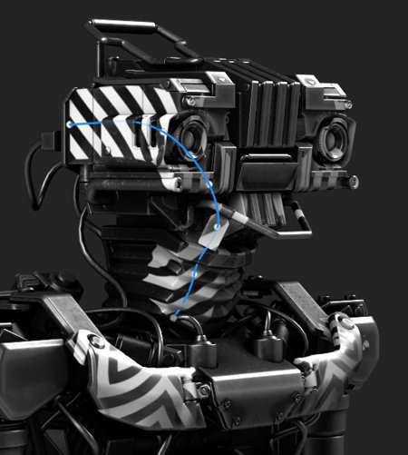
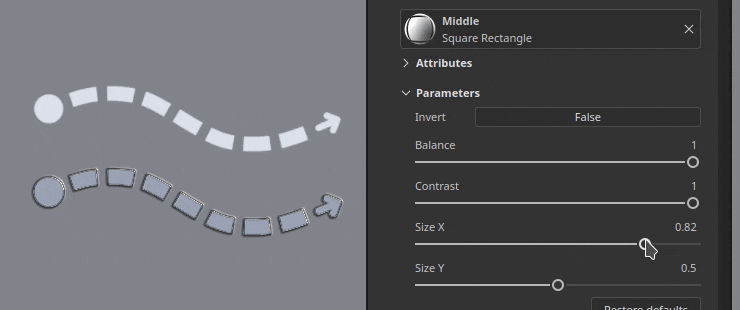
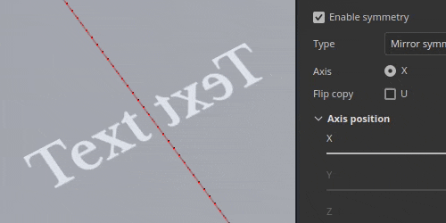
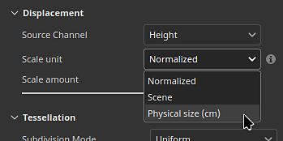
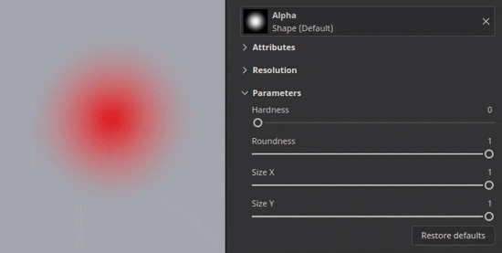

# Version 11.1

<b>Substance 3D Painter 11.1 </b> bietet das neue Bandpfad-Tool mit eigenem Inhalt, Symmetrie auf Füllebenen und -effekten, Physikgröße für Versatz und Unterstützung der Vulkan-Grafik-API.

Freigabedatum: <b>18. November 2025</b>

>[!NOTE]
>
> In dieser Version von Painter wird die Grafik-API von OpenGL auf Vulkan umgestellt. Diese Änderung kann sich darauf auswirken, welche GPUs von der Anwendung unterstützt werden, insbesondere für das Backen mit GPU-basiertem Raytracing.
> 
> Weitere Informationen finden Sie auf unserer Seite mit den Systemanforderungen für [&#128279;](../getting-started/system-requirements.md).

## Wichtigste Funktionen

### Neues Menüband-Werkzeug

Der <b>Bandpfad</b> ist ein neues Tool in der Pfadwerkzeugfamilie. Über ein Menüband wird eine Textur entlang eines Pfades ohne Schnitte transformiert und wiederholt. Der Anfang und das Ende können zusätzlich gesteuert werden. Obendrein sind Optionen für scharfe Ecken verfügbar.

Dieses neue Werkzeug öffnet die Tür zu neuen Verhaltensweisen, z. B. das Platzieren von Text entlang von Pfaden, das Platzieren eines perfekten Verlaufs entlang eines Pfades und das einfache Erstellen eigener erweiterter Zuschnitte, die um ein Gitter gewickelt werden können.\
Kurz gesagt, das Menüband ist ein saubereres Werkzeug für präziseres Zeichnen mit Pfaden.

* <b>Neues Bandwerkzeug neben anderen pfadähnlichen Werkzeugen verfügbar</b>\
  Das neue Menüband-Werkzeug ist neben dem anderen Pfad verfügbar, z. B. Werkzeuge in der Benutzeroberfläche. Sie können ihn entweder über die Symbolleiste oder über die Tastaturbefehle für Pfadtext auswählen.

  

  
* <b>Das Menüband ist ein kontinuierlicher Pfad, der über alle Arten von Oberflächen hinweg funktioniert</b>\
  ItThe Ribbon ist ein Werkzeug, mit dem Sie eine Textur entlang eines Pfades wiederholen oder dehnen können. Es funktioniert über jede Art von Oberflächen und Geometrie, auch wenn die Gitterteile nicht verbunden sind.

  
* <b>Wiederholende Muster und Verläufe erstellen</b>\
  Dieses neue Werkzeug kann Bilder auf verschiedene Weise wiederholen, ohne Nähte oder Schnitte, was für Verläufe und saubere Muster geeignet ist.

  
* <b>Bilder mit benutzerdefiniertem Anfang und Ende dehnen</b>\
  Mit der Einstellung <b>Streckung zwischen Versätzen</b> können Teile eines Bildes isoliert werden, um sie als Start- und Endabschnitte auf einem Pfad zu verwenden, während der mittlere Abschnitt entlang des restlichen Pfads gestreckt wird. So kannst du z. B. mit einfachen Bitmaps schnell auf Pfaden platzieren, die keine Verzerrungen enthalten (z. B. Pfeile).

  
* <b>Verschiedene Eckentypen verfügbar</b>\
  Beim Brechen von Tangenten zum Erstellen von Ecken sind je nach Bedarf mehrere Formen verfügbar - von der klassischen Unterbrechung bis zum glatten Drehen.

  
* <b>Steuerelemente zum Dehnen und Anordnen</b>\
  Bilder können entweder automatisch oder manuell entlang eines Bandpfads wiederholt oder gestreckt werden.

  
* <b>Text entlang Pfad</b>\
  Schriftenressourcen können direkt auf einem Bandpfad verwendet werden. Text wird automatisch an den Pfad angepasst, um entlang seiner Kurven zu deformieren. Ausrichtungseinstellungen können verwendet werden, um Text besser an jede Situation anzupassen.

  
* <b>Seitenverhältnis und nicht quadratische Ressourcen</b>\
  Die nicht quadratischen Ressourcen werden automatisch an die Länge des Bandpfads angepasst. Dadurch eignet sie sich ideal für längliche Muster wie sich wiederholende Dekorationen und Verkleidungen.

  
* <b>Kompatibel mit dem Workflow für Substance-Dynamische Pinselstriche</b>\
  Bandpfad sind auch mit dem Substance-basierten Dynamic-Stroke-System kompatibel, sodass komplexe Ergebnisse erzielt werden können. Ein bemerkenswertes Beispiel ist die Möglichkeit, benutzerdefinierte Start-/Endpunkte und linke/rechte Ecken zu haben.\
  Außerdem sind zwei neue Werkzeugvorgaben mit dem Namen <b>Custom Ribbon Grayscale</b> und <b>Custom Ribbon Material</b> verfügbar, damit diese Funktion leicht zugänglich ist.

  
* <b>Kompatibel mit Symmetrie</b>\
  Wie andere Werkzeugtypen ist auch der Bandpfad mit der Symmetrie-Funktion kompatibel.

  
* <b>Füllmethoden bei Selbstüberlappung</b>\
  Wenn sich ein Bandpfad selbst überquert, kann dies zu unerwarteten Ergebnissen führen. Der dedizierte Mischmodus für die Kanäle &quot;Alpha&quot;, &quot;Normal&quot; und &quot;Height&quot; kann zu besseren Ergebnissen beitragen.

  

Zusätzliche Verbesserungen wurden für alle Pfad-Tools vorgenommen:

* <b>Größe und Deckkraft pro Scheitelpunkt auf Pfaden trennen</b>\
  Die Anpassung der Größe und Deckkraft pro Scheitelpunkt auf einem Pfad ist jetzt möglich und nicht mehr an den Druckparameter gebunden. Diese beiden Eigenschaften werden jetzt separat mit dedizierten Schiebereglern in der Benutzeroberfläche behandelt.

  
* <b>Parametergruppierung im Eigenschaftenfenster </b>\
  Die meisten Tools in Painter verfügen jetzt über reduzierbare Gruppen für ihre Parameter. Diese Änderung vereinfacht das Ausblenden von Parametern während des Vorgangs und die Reduzierung der Fensterlänge.

  

>[!NOTE]
>
> Weitere Informationen zum <b>Multifunktionsleisten-Tool</b> finden Sie auf der [Seite zur dedizierten Dokumentation](../painting/tool-list/ribbon-tool.md).
> 
> Weitere Informationen zu <b>Dynamischen Pinselstrichen</b> finden Sie auf der [dedizierten Dokumentationsseite](../painting/dynamic-strokes/dynamic-strokes.md).

### Neuer Inhalt und neue Kategorien für das Menübandwerkzeug

Diese Version enthält 75 neue Werkzeugvorgaben, die die neuen Funktionen der Multifunktionsleiste nutzen. Um das Auffinden der Vorgaben zu erleichtern, wurden neue Vorgabenkategorien im Fenster <b>Eigenschaften</b> hinzugefügt.

* <b>Tastaturbefehle für neue Vorgabenkategorien im Eigenschaftenfenster</b>\
  Eine Reihe neuer Schaltflächen befindet sich jetzt oben im Fenster &quot;<b>Eigenschaften</b>&quot;, wenn Pfadwerkzeuge verwendet werden. Jede Schaltfläche bietet Zugriff auf Werkzeugvorgaben, sortiert nach Kategorien. In der Favoritenkategorie werden die ausgewählten Vorgaben neu gruppiert.

  

  Durch Klicken auf eine der Schaltflächen erhalten Sie schnellen Zugriff auf einige vorausgewählte Vorgaben. Wenn Sie auf <b>Mehr anzeigen in Assets</b> klicken, werden weitere Pfad-Tool-Vorgaben im Fenster <b>Assets</b> angezeigt.

  
* <b>Schneller Wechsel zwischen Vorgaben</b>\
  Um den Wechsel zwischen Vorgaben zu erleichtern, wird durch Klicken auf eine Vorgabe die Auswahl des aktuell bearbeiteten Pfads nicht mehr aufgehoben.

  
* <b>Neuer Inhalt</b>\
  In dieser Version wurden 75 neue Werkzeugvorgaben für das Multifunktionsleisten-Werkzeug als Teil des Standardinhalts hinzugefügt. Diese Vorgaben sind direkt im Fenster <b>Elemente</b> unter dem Pinselabschnitt oder über die Tastaturbefehle für neue Kategorien im Fenster <b>Eigenschaften</b> verfügbar.\
  Diese Vorgaben umfassen:

  * <b>Bekleidung</b>: Verbesserte Presets für Nahtpucker und -aufstiche sowie Reißverschlüsse und Stoffrisse.
  * <b>Einfach</b>: Einfache Striche wie Linien und Striche, aber auch Verläufe und die <b>benutzerdefinierten Multifunktionsleisten</b>-Vorgaben, die auf dem <b>dynamischen Strich</b>-System basieren.
  * <b>Schmutz</b>: 3 Risse zur Simulation von Beschädigungen auf unterschiedlichen Untergründen.
  * <b>Harte Oberfläche</b>: Greif Muster, Panel und Shutlines Details, Bänder und Schweißen zu verwenden oder mechanische Objekte.
  * <b>Organisch</b>: Verbände, sauber und schmutzig, um Haut und andere Oberflächen zu umwickeln.
  * <b>Farbe</b>: Verläufe auf Pinselbasis und Gouachen-Vorgaben.
  * <b>Text</b>: Schnellvorgaben zum Einrichten von Text entlang eines Pfads mit der Multifunktionsleiste mit verschiedenen Ausrichtungsmodi und Dehnung.
* <b>Neues Tool-Schlüsselwort für die Suche im Fenster &quot;Elemente&quot;</b>\
  Die Eingabe von &quot;Menüband&quot;, &quot;Malen&quot;, &quot;Pfad&quot; oder sogar &quot;Verwischen&quot; im Fenster <b>Elemente</b> ist jetzt möglich und kann Ihnen helfen, Vorgaben zu finden, die mit dem entsprechenden Werkzeug übereinstimmen.

  

### Neue Symmetrie für Füllebenen und Effekte

Füllebenen und Effekte unterstützen jetzt die Symmetrie mit ihren 3D-Projektionsmodi. Sie kann über das Symmetrie-Menü in der kontextabhängigen Symbolleiste oder über den neu hinzugefügten Symmetrie-Abschnitt im Fenster <b>Eigenschaften</b> aktiviert werden.

* <b>Symmetrie auf Füllschichten </b>\
  Bei Verwendung von 3D-Projektionsmodi in Fülleffekten und Ebenen kann die Symmetrie jetzt aktiviert werden. Sowohl die Spiegelsymmetrie als auch die Radialsymmetrie sind verfügbar.

  
* <b>Symmetrie über die Kontextsymbolleiste oder das Eigenschaftenfenster aktivieren</b>\
  Die Symmetrie kann über das Menü <b>Kontextsymbolleiste</b>, ähnlich wie Malwerkzeuge, oder über das Fenster <b>Eigenschaften</b> mit dem neuen dedizierten Abschnitt aktiviert werden.

  

  
* <b>Eingaberessource für Texte und Logos spiegeln</b>\
  Die Symmetrie von Füllebenen und Effekten profitiert auch von neuen Optionen, die das Spiegeln der Eingabebilder oder der X/Y-Achsen ermöglichen. So kann z. B. ein Text gespiegelt werden, der aber auf beiden Seiten lesbar ist.

  
* <b>Verbesserte Schnittstelle für Symmetrie-Einstellungen</b>\
  Die Oberfläche der Symmetrieeinstellungen wurde überarbeitet, um leichter lesbar und schneller zu verwenden zu sein. Die Achsenschieberegler haben z. B. jeweils eine eigene Linie, was zu mehr Präzision führt. Die Radialanzeige wurde ebenfalls verkleinert, um weniger Platz einzunehmen.

  

Weitere Informationen zur <b>Symmetrie</b> finden Sie auf der [Seite der dedizierten Dokumentation](../painting/symmetry/symmetry.md).

### Physische Größe für den Versatz

Versatz kann nun mit einer bestimmten Einheit definiert werden. Diese Änderung vereinfacht die Ausrichtung und Anpassung der verschobenen Geometrie in anderen Anwendungen.

* <b>Neue Skalierungseinheitsoption in den Versatz-Einstellungen</b>\
  Im Fenster &quot;<b>Shader settings</b>&quot; ist beim Anpassen der Intensität des Versatzes eine neue Skalierungseinheit verfügbar. Diese Einstellung bietet die folgenden Optionen:

  * <b>Normalisiert</b>: entspricht standardmäßig dem vorherigen Verhalten von Painter. Diese Größe basiert auf dem Gitterbegrenzungsrahmen innerhalb des aktuellen Projekts.
  * <b>Szene</b>: verwendet die in der Gitterdatei gespeicherten Einheiten als Referenzpunkt.
  * <b>Physische Größe (cm)</b>: verwendet die Einheit des Projekts, die im Fenster <b>Projektkonfiguration</b> definiert ist.

  

### Neues Vulkan Grafik-Backend für Windows und Linux

In Fortsetzung der Arbeit, die in unserer Vorgängerversion, die unter Mac OS von OpenGL auf Metal umgestellt wurde, begonnen wurde, verwendet diese neue Version jetzt <b>Vulkan</b> auf Windows- und Linux-Plattformen.

* <b>Vulkan-Grafik-API wird jetzt anstelle von OpenGL unter Windows und Linux verwendet</b>\
  Painter verwendet jetzt die Vulkan-Grafik-API für das Rendern im Viewport und das Berechnen von Texturen. Dieser Schalter sollte die allgemeine Leistung der Anwendung verbessern. Außerdem wird es künftig leichter, neue Funktionen zu integrieren.
* <b>GPU-Raytracing zum Backen über Vulkan</b>\
  DirectX Raytracing (DRX) und Optix wurden zugunsten von Raytracing über die Vulkan Graphics API in unseren Bäckereien ersetzt. Diese Änderung bedeutet, dass GPU-basiertes Raytracing jetzt sowohl auf AMD-GPUs als auch auf dem Linux-Betriebssystem verfügbar ist.\
  Der Wechsel zu Vulkan verbessert auch die Backzeiten, insbesondere bei hohen Auflösungen.

### Sonstiges

In dieser Version wurden zusätzliche Funktionen und Verbesserungen hinzugefügt:

* <b>Überschreiben der Substance-Auflösung</b>\
  Bei Verwendung von Substance-Ressourcen in Tools und Füllebenen/Effekten ist eine neue <b>Auflösung</b>-Parametergruppe verfügbar. Diese Einstellungen können verwendet werden, um die von der Anwendung ausgewählte Standardauflösung zu ändern.\
  Dies kann nützlich sein, um die Auflösung, mit der ein Substance generiert wird, aus Qualitäts- oder Leistungsgründen zu erhöhen oder zu reduzieren.

  Die verfügbaren Einstellungen sind:

  * <b>Auflösung</b>: den Modus und den Kontext, der zur Berechnung der Auflösung verwendet wird. Der Standardwert ist &quot;Auto&quot;, kann jedoch auf <b>Textursatz</b> oder <b>Benutzerdefiniert</b> festgelegt werden.
  * <b>Faktor</b>: zusätzliche Kontrolle über die Auflösung, um relative Unterschiede zu erzeugen. Beispiel: die Hälfte der Auflösung eines bestimmten Kontexts verwendet.
  * <b>Ausgabegröße</b>: die endgültige Auflösung, die anhand der vorherigen Einstellungen berechnet wurde.

  
* <b>Leistungsverbesserungen für ein einzelnes großes Dreieck</b>\
  Bis jetzt hatte Painter mit sehr niedrigen Polymaschen oder Meshes mit sehr großen und/oder langen Dreiecken zu kämpfen. Das ist nicht mehr der Fall. Die Arbeit mit einzelnen Quad-Meshes, z. B. zur Erstellung von Kachelstrukturen, sollte kein Problem mehr sein.
* <b>Die Standardpinselform wurde verbessert</b>\
  Die Standardpinselform wurde mit neuen Einstellungen aktualisiert, um ihre Größe und Rundheit unter Berücksichtigung des Härteverhaltens zu steuern.

  

## Tutorials

Hier ist das neueste Tutorial zu unserer neuen Funktion:

## Versionshinweise

### 11.1.0

Freigabedatum: <b>2025/11/18</b>\
Zusammenfassung: <b>Dieses Update ist eine Hauptversion. Es enthält das neue Multifunktionsleisten-Tool mit eigenem neuen Inhalt, Symmetrie-Unterstützung für Füllebenen, Leistungsparameter für Versatz, verbesserte Physische Größe durch die aktualisierten Bäcker, vollständige Vulkan-Unterstützung für Windows und Linux und weitere Verbesserungen.</b>

<b>Hinzugefügt</b>:

* Neues Bandwerkzeug
* [Tool] Neues Werkzeug für die Multifunktionsleiste hinzufügen, um nahtlose Pfade zu erstellen
* [Menüband] Tastenkombinationen für die Menübandvorgabe im Eigenschaftenfenster hinzufügen
* [Menüband] Ermöglicht das Ändern der Deckkraft des Menübands pro Scheitelpunkt des Pfads.
* [Menüband] Ermöglicht das Ändern der Größe des Menübands pro Scheitelpunkt des Pfades.
* [Menüband] Entfernen von Anfang/Ende, definiert auf einer Substance, wenn Pfade geschlossen sind
* [Menüband] Entfernen der Pfad-/Materialvorschau im Eigenschaftenfenster für Pfade-Werkzeuge zum Malen, Radieren und Verwischen
* [Menüband] Hinzufügen von Füllmethoden für Alpha und einige Kanäle bei selbstüberlappender Anordnung
* Füllsymmetrie
* [Füllen] Unterstützung für Symmetrie auf Füllebenen und Effekten hinzufügen
* [Füllung][UI] Belichten von Symmetrie-Einstellungen im Eigenschaftenfenster für Füllebene und Effekte
* [Füllen] Benutzeroberfläche für Symmetrie-Einstellungen im Ansichtsfenster- und Eigenschaftenfenster überarbeiten
* [Füllen] Ordentliche Texturen bei Projektion im Verkrümmungsmodus korrekt neu ausrichten
* Physische Größe Versatz
* [Versatz] Physische Größe als Versatz verwenden
* Leistungssteigerung
* [Leistung] Verbessern der Darstellung kleiner Pinselstriche auf großen Dreiecken
* [Performance] Verbesserung der Shader-Kompilierungszeit
* [Performance] Volle Vulkan-Unterstützung für Windows und Linux
* [Leistung] Aktualisierte Bäcker mit schnellerem GPU-Rendering und Unterstützung von AMD-Raytracing
* [UI] Ordnen Sie Werkzeugeigenschaften neu in Gruppen an und reduzieren Sie einige standardmäßig
* [Engine] Update-Substance Engine auf Version 9.2.5
* [Substance] Außerkraftsetzung der Auflösung für Substance-Ressourcen in Tools und Füllungen
* [Exportieren] Aktualisieren der Exportvoreinstellung für Mesh Maps zum Exportieren von Graustufen-Texturen
* Python
* [Backen][Python] Anzeige in Änderungslog-Umbruchänderungen nach Aktualisierung des Bäckers
* [Python] Verfügbarmachen von Einstellungen für Füllsymmetrie in Python
* Content und neue Inhalte.
* [Inhalt] Hinzufügen von 75 neuen Werkzeugvorgaben für das Menüband-Werkzeug
* [Inhalt] Aktualisieren der Verlaufsgenerator-Ressource, um mit dem Menüband kompatibel zu sein

<b>Fest</b>:

* [Absturz] Das Laden eines anderen Projekts, während die Pfadausrichtung aktiviert ist, kann abstürzen
* [Absturz] Ein Rechtsklick im Pfadfenster mit Informationen aus einer anderen Sitzung in der Zwischenablage kann abstürzen
* [UI] Die Benutzeroberfläche scrollt in den Werkzeugeigenschaften nach oben, wenn ein Pfad erstellt wird
* [UI] Maus-Cursor verschwindet, wenn die Pfadansichtsport-Visualisierung ausgeblendet ist
* [Pfad] Das Kopieren/Einfügen verschiedener Werkzeugeigenschaften im Bedienfeld &quot;Pfad&quot; führt zu instabilen Eigenschaften
* [Werkzeug] Radierer- und Verwischen-Werkzeugvorgaben aktualisieren nicht immer die Kanalauswahl
* [Tool] Gemalter Wert ist grau, aber Benutzeroberfläche zeigt Weiß nach dem Laden der farbigen Werkzeugvorgabe in der Maske an
* [Tool] Die aus der Maske erstellte Voreinstellung behält Kanalwerte bei, die aus einer anderen Voreinstellung geladen wurden
* [Substance] Die im Diagramm definierte normale Farbraumübersteuerung wird nicht berücksichtigt
* [Inhalt] Die Standard-Pinselformressource verwendet eine veraltete Substance.

<b>Bekannte Probleme</b>:

* Der Verlauf der Shader-Instanz wurde nicht ordnungsgemäß verfolgt
* [Menüband] Leistungsproblem mit UV-Kacheln
* [Menüband] Pfad kann sich in einigen Fällen nach einer Ecke unerwartet überlappen
* [Menüband] Tangenten erzeugen eine unerwünschte Schleife, wenn der Punkt eng an die Pfadenden verschoben wird
* [Absturz][Menüband] Erstellen sehr langer Texte in Menüband kann abstürzen
* [Werkzeug] Die Materialvorschau funktioniert nicht, wenn die Projektion in einer Maske verwendet wird
* [Backen] Die AO-Einstellung &quot;Selbstverdeckung&quot; wird bei mehreren Textursätzen ignoriert und &quot;Namensübereinstimmung&quot; ist aktiviert.
* [Backen] AO mit Normal weist an Kanten Artefakte auf, da die Auffüllung fehlt
* [Farbmanagement] HDR-Farbraumkonvertierungen mit ACE unter Linux erzeugen festgeklemmte Farben
* [Regression][UI] Kontextmenü auf HD-Bildschirmen ist zu klein
* [Crash][Python] USD-Export, ausgelöst durch TextureStateEvent
* [Engine] Malen mit dem Kopierwerkzeug in normalen Kanalverschiebungsfarben falsch
* [Python] Das Ghost-Widget wird durch das noch funktionierende Skript gelöscht.
