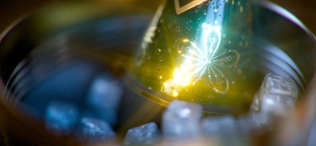

# Version 12.0

<b>Substance 3D Painter 12.0</b> bietet eine Texturreduzierung direkt im Ebenenstapel, einen neuen Automatikmodus für die Verkrümmungsprojektion, einen überarbeiteten Satz von Nachbearbeitungseffekten sowie einen verbesserten Workflow für die Projekterstellung und -einstellungen.

Freigabedatum: <b>9. März 2026</b>

>[!NOTE]
>
> In dieser Version wurde die Unterstützung von <b>integrierten GPUs</b> mit <b>einheitlichem/gemeinsam genutztem Speicher</b> verbessert. Eine bessere Erkennung des Videospeichers ist zu erwarten, was zu einer besseren Leistung und weniger grafischen Problemen führen dürfte.

## Wichtigste Funktionen

### Neue Reduzierung von EBENEN

Eine neue <b>Reduzieren</b>-Aktion ist jetzt im Kontextmenü des Ebenenstapels mit der rechten Maustaste verfügbar. Mehrere Ebenen können schnell zusammengeführt werden, indem sie gruppiert werden (<b>Ctrl/Cmd + G</b>) und eine reduzierte Kopie erstellt wird (<b>Ctrl/Cmd + M</b>). Die Quellgruppe wird automatisch deaktiviert, sodass Sie sie entweder löschen oder alternativ als <b>Smart Material</b> zur späteren Bearbeitung speichern können.

Abgeflachte Elemente des Ebenenstapels können auch direkt auf die Festplatte exportiert werden, um schnelle Iterationen in anderen Anwendungen zu ermöglichen. Gruppen, Ebenen oder Masken können einzeln oder stapelweise über das Kontextmenü des Ebenenstapels exportiert werden.

* <b>Texturen direkt im Ebenenstapel reduzieren</b>\
  Jede Gruppe kann reduziert werden, indem Sie <b>Strg/Befehl + M</b> drücken oder den Eintrag <b>Gruppe reduzieren</b> im Kontextmenü mit der rechten Maustaste auswählen. Dadurch wird eine zusammengeführte Kopie des ausgewählten Inhalts generiert, während die Quellgruppe automatisch deaktiviert wird. Die Originalebenen bleiben intakt, bis entschieden wird, sie zu entfernen oder wiederherzustellen.

  
* <b>Reduzieren und Exportieren von Texturen auf die Festplatte</b>\
  Mit einer speziellen Exportaktion im Kontextmenü wird das reduzierte Ergebnis einer Ebene, Maske oder Gruppe gebacken und direkt auf der Festplatte gespeichert. Dies ist nützlich, um gebackene Inhalte in andere Anwendungen zu übertragen, ohne die vollständige Textur-Export-Pipeline zu durchlaufen.
* <b>Stapelvorgänge</b>\
  Mehrere Ebenen, Gruppen oder Masken können gleichzeitig ausgewählt und in einem einzigen Vorgang einzeln abgeflacht oder exportiert werden, was die Verarbeitung großer Teile eines Ebenenstapels in einem Schritt effizienter macht.

  

>[!NOTE]
>
> Weitere Informationen zum Reduzieren von Ebenen finden Sie auf der [dedizierten Dokumentationsseite &#x200B;](../interface/layer-stack/flatten-layers.md).

### Neuer Modus &quot;Verformen in Geometrie&quot; für Projektionen

Aufkleber können sich jetzt automatisch an komplexe Oberflächen anpassen, sodass keine manuellen Anpassungen mehr erforderlich sind. Der Schalter <b>Auf Geometrie verformen</b> ist in der Kontextsymbolleiste verfügbar, während die Verformen-Projektion aktiv ist.

* <b>Neuer Parameter in der Kontextsymbolleiste</b>\
  Ein neuer Schalter <b>Auf Geometrie verformen</b> ist in der kontextabhängigen Symbolleiste verfügbar, wenn der Projektionsmodus Verformen aktiv ist. Sie kann jederzeit deaktiviert werden, ohne die aktuelle Projektionskonfiguration zurückzusetzen.

  
* <b>Automatisches Wrapping für die Netzoberfläche </b>\
  Wenn diese Option aktiviert ist, folgt die Verkrümmungsprojektion automatisch der Krümmung und Topologie des zugrunde liegenden Gitters. Durch Ziehen der Projektion über die Fläche wird die Projektion weich an die Geometrie angepasst. Dadurch wird die manuelle Feinabstimmung erheblich reduziert, die erforderlich ist, wenn Aufkleber auf komplexen oder gekrümmten Formen platziert werden.

  
* <b>Beibehaltung lokaler Deformationen</b>\
  Beim Bearbeiten der Scheitelpunkte des Verkrümmungsprojektionsrasters versucht der Modus &quot;Verkrümmen in Geometrie&quot;, die vordefinierte Verformung beizubehalten, um sicherzustellen, dass immer dieselbe Form projiziert wird.

  

>[!NOTE]
>
> Weitere Informationen zur Verkrümmungsprojektion finden Sie auf der [dedizierten Dokumentationsseite &#x200B;](../painting/fill-projections/warp-projection.md).

### Neue Post-Effekte

Renderings in Painter können jetzt mit einem brandneuen Satz von Nachbearbeitungseffekten erweitert werden, der im Fenster <b>Anzeigeeinstellungen</b> verfügbar ist. Neue Ergänzungen wie <b>Blendenfleck</b> und <b>Filmkörnung</b> sind jetzt verfügbar, neben verbesserten <b>Tiefen von Halbbild</b> und <b>Blendenfleck</b> unter vielen anderen.

Im Folgenden finden Sie ein Beispiel dafür, was Sie mit den neuen Effekten erreichen können:

* <b>Neue Nachbearbeitungseffekte</b>\
  Alle Nachbearbeitungseffekte können im Fenster <b>Anzeigeeinstellungen</b> einzeln aktiviert und konfiguriert werden. Effekte werden in Stapelreihenfolge angewendet und können einzeln aktiviert oder deaktiviert werden, sodass Sie sie problemlos kombinieren und mit verschiedenen Ergebnissen experimentieren können.

  
* <b>Neue Effektliste:</b>

  * <b>Tiefe des Felds </b>: Weichzeichnet Objekte außerhalb des Brennweitenbereichs, um den Kameraobjektivfokus zu simulieren.
  * <b>Blüte</b>: Fügt einen weichen Schein hinzu, der von hellen Bereichen des Bildes ausgeht.
  * <b>Blendung</b>: Erzeugt Lichtstreifen um Lichtquellen.
  * <b>Blendenfleck</b>: Simuliert optische Reflexionen des Objektivs, wenn in der Kamera helles Licht scheint.
  * <b>Laterale Aberration</b>: Simuliert chromatische Farbsäume an den Bildrändern, die durch Objektivunregelmäßigkeiten verursacht werden.
  * <b>Vignette</b>: Dunkelt die Ecken und Kanten des Frames ab, um den Fokus auf die Mitte zu lenken.
  * <b>Scharfzeichnen</b>: Erhöht den Kantenkontrast, um das gerenderte Bild schärfer erscheinen zu lassen.
  * <b>Filmkörnung</b>: Mit diesem Effekt wird subtiles Rauschen überlagert, um die Textur analoger Filme zu replizieren.
  * <b>Farbtonzuordnung</b>: Ordnet HDR-Luminanzwerte einem anzeigbaren Bereich zu, um einen filmischen Look zu erzielen.
  * <b>Farbkorrektur</b>: Passt Kontrast, Sättigung, Helligkeit und Temperatur an, um die allgemeine Farbbalance zu optimieren.

>[!NOTE]
>
> Weitere Informationen zu den neuen Effekten finden Sie in der [dedizierten Dokumentation](../features/post-processing/post-processing.md).

### Verbessertes neues Projekt- und Einstellungsfenster

Das neue Projektfenster und das Dialogfeld &quot;Projekteinstellungen&quot; wurden überarbeitet, um die Navigation zu erleichtern. Die Parameter wurden neu angeordnet und gruppiert, um die Lesbarkeit zu verbessern, und der Workflow für den erneuten Import von Gittern wurde verbessert, um sich wiederholende Schritte bei der Iteration eines Projekts zu reduzieren.

* <b>Neues Projektfenster wurde verbessert</b>\
  Die Parameter im neuen Projektfenster wurden umstrukturiert und neu angeordnet, sodass die am häufigsten verwendeten Einstellungen deutlicher hervortreten. Das Gesamtlayout kann jetzt leichter gescannt werden, sodass die Zeit für die Konfiguration eines neuen Projekts verkürzt wird.
* <b>Neuer Arbeitsablauf zum erneuten Importieren von Netzen in den Projekteinstellungen</b>\
  Mit dem neuen Kontrollkästchen <b>Mesh </b> in den Projekteinstellungen erneut importieren können Sie das Mesh des Projekts leichter erneut importieren, da der Dateipfad der zuvor geladenen Datei jetzt automatisch gespeichert und vorausgefüllt wird.

  

## Versionshinweise

## Version 12

### 12.0.0

Freigabedatum: <b>2026/03/09</b>\
Zusammenfassung: <b>Dies ist eine Hauptversion. Diese Version enthält die Funktionen zum Reduzieren von Ebenen, Verformen auf Geometrie, neue Post-Effekte, Verbesserung des neuen Projektfensters und andere Verbesserungen.</b>

<b>Hinzugefügt</b>:

* [Ebenen reduzieren] Ebenen innerhalb des Ebenenstapels reduzieren
* [Ebenen reduzieren] Exportieren reduzierter Ebenen auf die Festplatte
* [Verformen zu Geometrie] Hinzufügen neuer automatischer Verkrümmungsfunktionen zu Verkrümmen-Projektionen
* [Post-Effekte] Ersetzen Sie Post-Effekte durch neue
* [Post-Effects] Aktualisieren der Tonzuordnung
* [Post-Effects] Neue Verwendung für Post-Effects-Assets hinzufügen
* [Inhalt][Nacheffekte] Integrieren von Standard-Nacheffekt-Assets in die Bibliothek
* [Neues Projekt] Verbessern der Benutzeroberfläche für die Projekterstellung
* [Neues Projekt] Änderungen an der Funktion zum erneuten Importieren des Gitters
* [Neues Projekt] Öffnen von \*.geo.usd-Dateien zulassen
* [Projektkonfiguration] Verbessern der Benutzeroberfläche für die Projektkonfiguration
* Aktualisieren der USD-Bibliothek auf Version 25.05
* Substance Engine auf Version 9.3.4 aktualisieren
* Erhöhen der Mindesttreiber auf 25.3.1/25.Q2 für AMD-GPUs
* Update Qt auf 6.8.6
* [Scripting] JavaScript-API auf Version 1.1.20 aktualisieren
* Aktualisieren von Python auf 3.13

<b>Fest:</b>

* [Absturz] Das Ändern der Materialkanalausgabe in einer Maske kann abstürzen
* [Import] EXR-Texturen werden beim Importieren von USD-Dateien in sRGB anstelle von linear erzwungen
* [UV-Kacheln] Bildsequenz mit einem einzelnen Bild füllt auch andere UV-Kacheln
* [Backen] AO unterscheidet sich zwischen CPU- und GPU-Backen
* [Farbmanagement][MacOS] Viewport BaseColor stimmt nicht mit dem Farbwähler überein
* [USD] Einheitliche Werte werden in einigen Fällen nicht importiert
