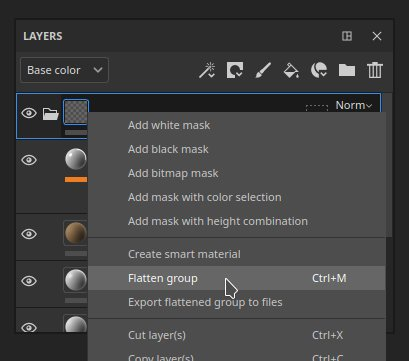
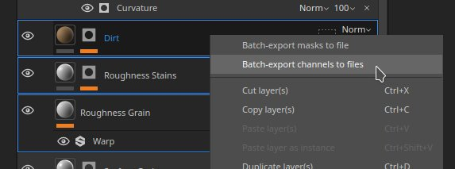
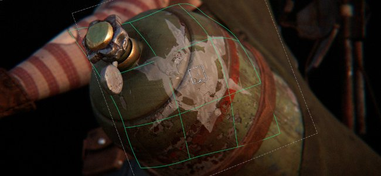
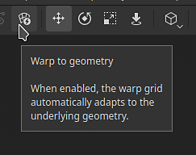
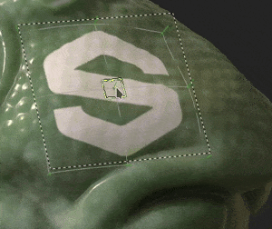
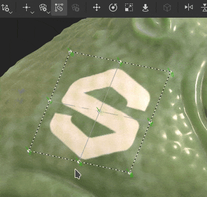
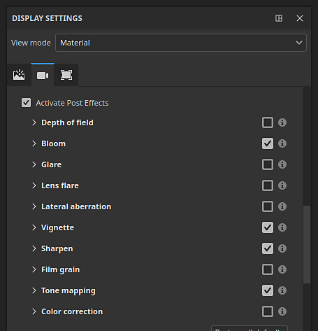
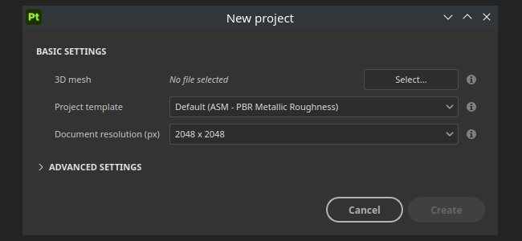
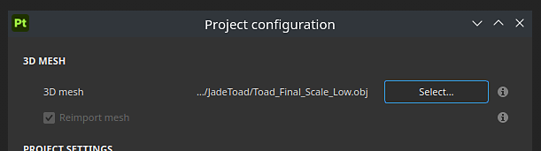

# Version 12.0

<b>Substance 3D Painter 12.0</b> bietet eine Textur-Reduzierung direkt im Ebenenstapel, einen neuen Automatikmodus für die Projektion von Verkrümmungen, einen überarbeiteten Satz von Nachbearbeitungseffekten sowie einen verbesserten Workflow für die Projekterstellung und -einstellungen.

Freigabedatum: <b>9. März 2026</b>

>[!NOTE]
>
> In dieser Version wurde die Unterstützung von <b>integrierten GPUs</b> mit <b>einheitlichem/gemeinsam genutztem Speicher</b> verbessert. Eine bessere Erkennung des Videospeichers ist zu erwarten, was zu einer besseren Leistung und weniger grafischen Problemen führen dürfte.

## Wichtigste Funktionen

### Neue Reduzierung von EBENEN

Eine neue <b>Reduzieren</b>-Aktion ist jetzt im Kontextmenü des Ebenenstapels verfügbar. Mehrere Ebenen können schnell zusammengeführt werden, indem sie gruppiert werden (<b>Ctrl/Cmd + G</b>) und eine reduzierte Kopie erstellt wird (<b>Ctrl/Cmd + M</b>). Die Quellgruppe wird automatisch deaktiviert, sodass Sie sie entweder löschen oder alternativ als <b>Intelligente Material</b> zur späteren Bearbeitung speichern können.

Reduzierte Elemente des Ebenenstapels können auch direkt auf die Festplatte exportiert werden, um schnelle Iterationen in anderen Anwendungen zu ermöglichen. Gruppen, Ebenen oder Masken können einzeln oder im Stapel über das Kontextmenü des Ebenenstapels exportiert werden.

* <b>Texturen direkt im Ebenenstapel reduzieren</b>\
  Jede Gruppe kann reduziert werden, indem Sie <b>Strg/Befehl + M</b> drücken oder den Eintrag <b>Gruppe reduzieren</b> im Kontextmenü mit der rechten Maustaste auswählen. Dadurch wird eine zusammengeführte Kopie des ausgewählten Inhalts generiert, während die Quellgruppe automatisch deaktiviert wird. Die Originalebenen bleiben intakt, bis entschieden wird, sie zu entfernen oder wiederherzustellen.

  
* <b>Texturen reduzieren und auf den Datenträger exportieren</b>\
  Mit einer dedizierten Exportaktion im Kontextmenü wird das reduzierte Ergebnis einer Ebene, Maske oder Gruppe Baking geführt und direkt auf der Festplatte gespeichert. Dies ist nützlich, um Baking geführt Inhalte an andere Anwendungen zu übertragen, ohne die vollständige Textur-Export-Pipeline zu durchlaufen.
* <b>Stapelvorgänge</b>\
  Mehrere Ebenen, Gruppen oder Masken können gleichzeitig ausgewählt und in einem Arbeitsgang einzeln abgeflacht oder exportiert werden. So lassen sich große Teile eines Ebenenstapels in einem Arbeitsgang effizient verarbeiten.

  

>[!NOTE]
>
> Weitere Informationen zum Reduzieren von Ebenen finden Sie auf der [dedizierten Dokumentationsseite ](../interface/layer-stack/flatten-layers.md).

### Neuer Modus &quot;Verformen in Geometrie&quot; für Projektionen

Aufkleber können sich jetzt automatisch an komplexe Oberflächen anpassen, sodass keine manuellen Anpassungen mehr erforderlich sind. Der Schalter <b>Auf Geometrie verformen</b> ist in der kontextbezogenen Symbolleiste verfügbar, während die Projektion Verformen aktiviert ist.

* <b>Neuer Parameter in der Kontextsymbolleiste</b>\
  Ein neuer Schalter <b>Auf Geometrie verformen</b> ist in der kontextabhängigen Symbolleiste verfügbar, wenn der Modus &quot;Projektion verformen&quot; aktiviert ist. Sie kann jederzeit deaktiviert werden, ohne die aktuelle Projektion zurückzusetzen.

  
* <b>Automatisches Wrapping auf die Mesh-Oberfläche </b>\
  Wenn diese Option aktiviert ist, folgt die Verkrümmungs-Projektion automatisch der Krümmung und Topologie des zugrunde liegenden Meshs. Wenn du die Projektion über die Fläche ziehst, passt sie sich nahtlos an die Geometrie an. So musst du komplexe oder gekrümmte Formen mit einem Aufkleber versehen und musst daher weniger manuell nachbearbeiten.

  
* <b>Beibehaltung lokaler Deformationen</b>\
  Beim Bearbeiten der Scheitelpunkte für den Raster der Verkrümmungsgeometrie wird der  &quot;In Projektion verkrümmen&quot; versuchen, die vordefinierte Verformung beizubehalten, um sicherzustellen, dass immer die gleiche Form projiziert wird.

  

>[!NOTE]
>
> Weitere Informationen zur Verkrümmungsseite finden Sie auf der [dedizierten Dokumentationsseite ](../painting/fill-projections/warp-projection.md).

### Neue Post-Effekte

Renderings in Painter können jetzt mit einem brandneuen Satz von Nachbearbeitungseffekten erweitert werden, der im Fenster <b>Anzeigeeinstellungen</b> verfügbar ist. Neue Ergänzungen wie <b>Blendenflecke</b> und <b>Filmkörnung</b> sind jetzt verfügbar, neben verbesserten <b>Tiefen von Halbbild</b> und <b>Blendeffekt</b> unter vielen anderen.

Im Folgenden finden Sie ein Beispiel dafür, was Sie mit den neuen Effekten erreichen können:

* <b>Neue Nachbearbeitungseffekte</b>\
  Alle Nachbearbeitungseffekte können im Fenster <b>Anzeigeeinstellungen</b> einzeln aktiviert und konfiguriert werden. Die Effekte werden in der Reihenfolge der Stapel angewendet. Jeder Effekt kann einzeln aktiviert oder deaktiviert werden, sodass du unterschiedliche Effekte problemlos kombinieren und mit unterschiedlichen Ergebnissen experimentieren kannst.

  
* <b>Neue Effektliste:</b>

  * <b>Tiefe des Felds </b>: Weichzeichnet Objekte außerhalb des Brennweitenbereichs, um den Fokus auf ein Kamera-Objektiv zu simulieren.
  * <b>Blüte</b>: Fügt einen weichen Schein hinzu, der von hellen Bereichen des Bildes ausgeht.
  * <b>Blendeffekt</b>: Erzeugt Lichtstreifen um Lichtquellen.
  * <b>Blendenflecke</b>: Simuliert Lichtreflexionen des Objektivs, wenn in der Kamera helles Licht scheint.
  * <b>Laterale Aberration</b>: Simuliert chromatische Farbsäume an den Bildrändern, die durch Objektivunregelmäßigkeiten verursacht werden.
  * <b>Vignette</b>: Verdunkelt die Ecken und Kanten des Rahmens, um den Fokus auf die Mitte zu lenken.
  * <b>Scharfzeichnen</b>: Erhöht den Kantenkontrast, um das gerenderte Bild schärfer erscheinen zu lassen.
  * <b>Filmkörnung</b>: Mit diesem Effekt wird subtiles Rauschen überlagert, um die Textur eines analogen Films zu replizieren.
  * <b>Farbtonzuordnung</b>: Ordnet die Werte für die HDR. Luminanz einem anzeigbaren Bereich zu, um einen filmischen Look zu erzielen.
  * <b>Farbkorrektur</b>: Passt Kontrast, Sättigung, Helligkeit und Temperatur an, um die allgemeine Farbbalance zu optimieren.

>[!NOTE]
>
> Weitere Informationen zu den neuen Effekten finden Sie in der [dedizierten Dokumentation](../features/post-processing/post-processing.md).

### Verbessertes neues Projekt- und Einstellungsfenster

Das neue Projektfenster und das Dialogfeld &quot;Projekteinstellungen&quot; wurden überarbeitet, um die Navigation zu erleichtern. Die Parameter wurden neu angeordnet und gruppiert, um die Lesbarkeit zu verbessern, und der Arbeitsablauf für den erneuten Import von Meshs wurde verbessert, um sich wiederholende Schritte bei der Iteration eines Projekts zu reduzieren.

* <b>Neues Projektfenster wurde verbessert</b>\
  Die Parameter im neuen Projektfenster wurden umstrukturiert und neu angeordnet, sodass die am häufigsten verwendeten Einstellungen deutlicher hervortreten. Das Gesamtlayout kann jetzt leichter gescannt werden, sodass die Zeit für die Konfiguration eines neuen Projekts verkürzt wird.
* <b>Neuer Arbeitsablauf zum erneuten Importieren von Meshs in den Projekteinstellungen</b>\
  Mit dem neuen Kontrollkästchen <b>Mesh </b> in den Projekteinstellungen erneut importieren können Sie den Projekt-Mesh einfacher erneut importieren, da der Dateipfad der zuvor geladenen Datei jetzt automatisch gespeichert und vorab ausgefüllt wird.

  

## Versionshinweise

## Version 12

### 12.0.0

Freigabedatum: <b>2026/03/09</b>\
Zusammenfassung: <b>Dies ist eine Hauptversion. Diese Version enthält die Funktionen zum Reduzieren von Ebenen, Verformen der Geometrie, neue Post-Effekte, Verbesserung des neuen Projektfensters und weitere Verbesserungen.</b>

<b>Hinzugefügt</b>:

* [Ebenen reduzieren] Ebenen innerhalb des Ebenenstapels reduzieren
* [Ebenen reduzieren] Exportieren reduzierter Ebenen auf die Festplatte
* [Verformen zu Geometrie] Hinzufügen neuer Funktionen für die automatische Verkrümmung zu den Verkrümmen-Projektionen
* [Post-Effects] Ersetzen Sie Post-Effekte durch neue
* [Post-Effects] Aktualisieren der Tonzuordnung
* [Post-Effects] Neue Verwendung für Post-Effects-Assets hinzufügen
* [Inhalt][Nacheffekte] Integrieren von Standard-Nacheffekt-Assets in die Bibliothek
* [Neues Projekt] Verbessern der Benutzeroberfläche für die Projekterstellung
* [Neues Projekt] Änderungen an der Funktion zum erneuten Importieren von Meshs
* [Neues Projekt] Öffnen von \*.geo.usd-Dateien zulassen
* [Projektkonfiguration] Verbessern der Benutzeroberfläche für die Projektkonfiguration
* USD auf Version 25.05 aktualisieren
* Substance Engine auf Version 9.3.4 aktualisieren
* Erhöhen der Mindesttreiber auf 25.3.1/25.Q2 für AMD-GPUs
* Update Qt auf 6.8.6
* [Scripting] JavaScript-API auf Version 1.1.20 aktualisieren
* Aktualisieren von Python auf 3.13

<b>Fest:</b>

* [Absturz] Ändern der Ausgabe eines Material-Kanals in einer Maske kann Absturz verursachen
* [Importieren] EXR Texturen werden beim Importieren von USD in sRGB anstelle von linear erzwungen
* [UV-Kacheln] Bildsequenz mit einem einzigen Bild füllt auch andere UV-Kacheln
* [Baking] AO unterscheidet sich zwischen CPU- und GPU-Baking
* [Farbmanagement][MacOS] Viewport BaseColor stimmt nicht mit dem Farbwähler überein
* [USD] Einheitliche Werte werden in einigen Fällen nicht importiert.
