# Version 12.1

<b>Substance 3D Painter 12.1</b> bietet einen verbesserten Arbeitsablauf für das Baking mit automatischem Nachmalen und Verzerrungskorrektur-Malen, Unterstützung für die Definition des OpenPBR-Materials und einen neuen Festoberflächenmodus für den automatischen UV-entpack.

Freigabedatum: <b>22. Juni 2026</b>

>[!NOTE]
>
> Diese Version erhöht die mindestens unterstützte macOS-Version auf 13.0 (Ventura). Weitere Informationen finden Sie auf unserer Seite mit den Systemanforderungen für [&#128279;](../getting-started/system-requirements.md).

## Wichtigste Funktionen

### Verbesserter Arbeitsablauf beim Baking mit Neigungsmalen

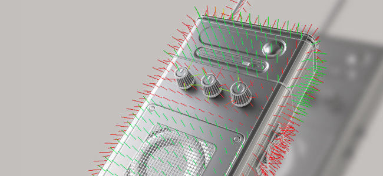

Der Baking-Arbeitsablauf wurde überarbeitet und unterstützt jetzt kontinuierliches Nachmalen, Malen auf Mesh-Verzerrungskorrekturen, Kantenschutz und eine neu gestaltete Mesh-Map-Liste.

* <b>Automatisches Ausblenden</b>

  Ein Mesh-Map kann fortlaufend umgebrochen werden, wenn die Parameter für das Baking angepasst werden, sodass nach jedem Wechsel kein Baking mehr manuell ausgelöst werden muss. Die automatische Wiederherstellung wird pro Karte aktiviert bzw. deaktiviert und gilt jeweils für eine einzelne Karte. Dies ist besonders praktisch für den Skew-Painting-Arbeitsablauf, aber auch beim Anpassen der allgemeinen Baking-Einstellungen.

  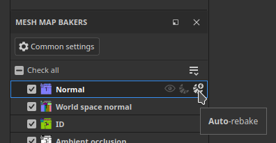

* <b>Verzerrungskorrektur malen</b>

  Wenn der Käfig auf den <b>entfernungsbasierten Modus</b> festgelegt ist, können Verzerrungskorrekturen direkt auf den Mesh mit niedriger Poly gemalt werden, um die Richtung der Projektion zu steuern, die während des Bakings verwendet wird. Die Pinsel-, Radierer- und Polygonfüllwerkzeuge sind mit einer kompakten Graustufenwertauswahl, einer Symmetrie und den üblichen Pinselsteuerelementen (<b>Strg + Rechtsklick</b> zum Ändern der Pinselgröße, <b>X</b> zum Umkehren des gemalten Werts) verfügbar. Aktionen zum Zeichnen mit Verzerrungen können rückgängig gemacht werden.

  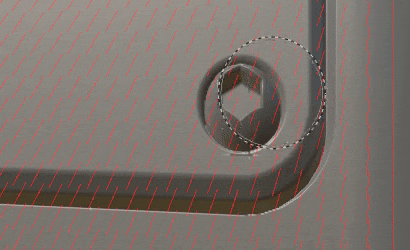

* <b>Kantenschutz</b>

  Beim Malen von Verzerrungskorrekturen behält eine neue Kantenschutzoption die auf harte Kanten projizierte hohe Weichheit bei. Das Ergebnis wird von den Parametern <b>Edge Distance</b> und <b>Edge Contrast</b> gesteuert.

  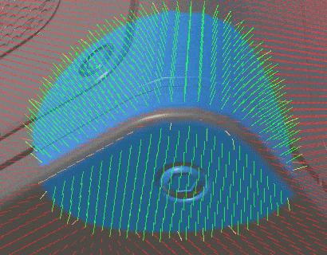

* <b>Neugestaltete Mesh-Map-Liste</b>

  Die Mesh-Map-Liste bietet Steuerelemente für die einzelnen Zuordnungen: &#39;Map&#39; als Viewport <b>Vorschau</b> umschalten, <b>Schnellzuordnung</b> als einzelne Map, <b>Baking für automatische Wiederherstellung</b> umschalten und <b>Einstellungen für alle Textursatz synchronisieren</b> (verfügbar, wenn das Projekt mehrere Textursatz hat). Jedes Steuerelement verfügt beim Bewegen des Mauszeigers über eine QuickInfo.

  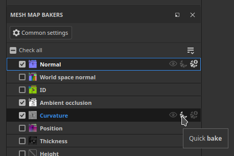

* <b>Schaltfläche &quot;Vereinfachtes Baking&quot;</b>

  Die Schaltfläche &quot;Viewport-Baking&quot; wurde durch eine einzige <b>Baking</b>-Schaltfläche ersetzt, die die Anzahl der zu Baking führend Zuordnungen anzeigt (Textursatz x UV-Kacheln x ausgewählte Mesh-Map).

  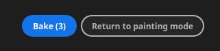

>[!NOTE]
>
> Weitere Informationen zum Baking finden Sie auf der [dedizierten Dokumentationsseite &#x200B;](../baking/baking.md).

### Unterstützung für OpenPBR

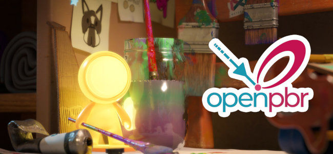

Das OpenPBR-Schattierung-Modell wird jetzt in Painter unterstützt und als Standardarbeitsablauf verwendet, der eine standardisierte Material-Definition bereitstellt, die anwendungsübergreifend ausgeführt werden kann.

* <b>Neuer OpenPBR-Shader und Standardarbeitsablauf</b>

  Ein Shader, der die OpenPBR 1.1-Spezifikation implementiert, ist verfügbar und wird standardmäßig verwendet. Ein neues Projekt, das ohne Vorlage erstellt wurde, verwendet den OpenPBR-Shader, und der erste Eintrag des neuen Projektfensters wird jetzt mit <b>OpenPBR</b> anstelle von <b>ASM</b> bezeichnet. Neue Projektvorlagen für OpenPBR sind enthalten, und die Beispielprojekte wurden aktualisiert, um sie zu verwenden.

  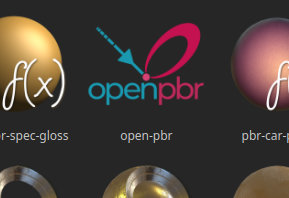

* <b>Shader aus der Projektvorlage beim Importieren ausgewählt</b>

  Beim Importieren einer USD- oder GLTF-Datei wird der Shader jetzt aus der Projektvorlage festgelegt und nicht aus dem Dateiinhalt erraten. Eine Meldung wird im Protokoll gemeldet, wenn ein Material und eine Vorlage Workflows verwenden, die nicht übereinstimmen.

  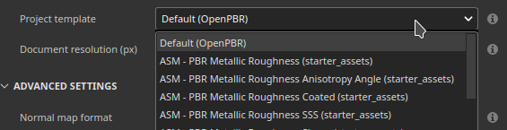

* <b>OpenPBR-Benennungskonvention beim Export</b>

  Das Fenster &quot;<b>Texturen exportieren</b>&quot; verfügt über ein neues Dropdown-Menü, in dem Sie die Benennungskonvention auswählen können. Standardmäßig wird OpenPBR verwendet, wenn mindestens ein Shader im Projekt es verwendet, und das ausgewählte Schema wird in der Kartenliste jedes Textursatzes angezeigt.

  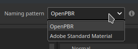

* <b>USD und MDL-Support</b>

  OpenPBR-Material werden über das USD unterstützt. Außerdem wurde eine neue MDL hinzugefügt, um das Rendern von OpenPBR-Materialien in Iray zu ermöglichen und so präzisere Material-Darstellungen zu ermöglichen.

>[!NOTE]
>
> Benutzerdefinierte Shader müssen möglicherweise aktualisiert werden. Der Shader-API wurde geändert, um OpenPBR zu unterstützen. Weitere Informationen finden Sie im Änderungsprotokoll im Hilfemenü der Anwendung.

### Neuer automatischer entpack mit harter Oberfläche

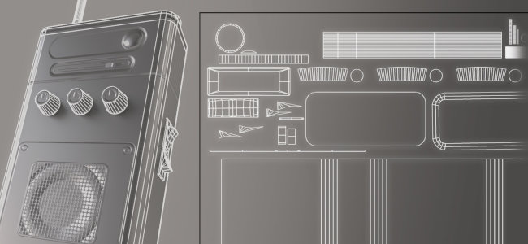

Ein neuer automatischer entpack-Modus, der auf Assets mit festen Oberflächen zugeschnitten ist, wurde hinzugefügt.

* <b>Modus &quot;entpackt Oberfläche&quot;</b>

  Die Option <b>Hard surface</b> ist in den Einstellungen für den automatischen entpack verfügbar. Es minimiert die Verzerrung der UV und erzeugt orthografisch ausgerichtete UV-Layouts, wodurch es besser für mechanische und oberflächenharte Meshs geeignet ist.

  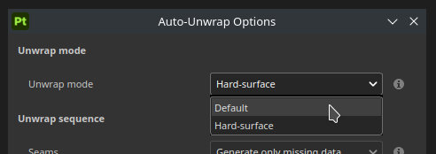

>[!NOTE]
>
> Weitere Informationen zum automatischen entpack finden Sie auf der [Seite für die dedizierte Dokumentation](../features/automatic-uv-unwrapping.md).

### Sonstiges

In dieser Version wurden zusätzliche Funktionen und Verbesserungen hinzugefügt:

* <b>Mehrere Kanäle gleichzeitig hinzufügen oder entfernen</b>

  Nach der Einführung von OpenPBR können Sie in einem neuen Fenster, auf das über die <b>Kanaleinstellungen</b> zugegriffen werden kann, mehrere Textursätze gleichzeitig auswählen. Dies ist praktisch, wenn Sie die vom OpenPBR-Workflow verwendete große Kanalliste einrichten möchten.

  * Auf das neue Fenster kann über die Schaltfläche <b>Textursätze hinzufügen oder entfernen</b> in den Kanaleinstellungen zugegriffen werden.

    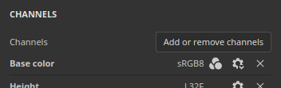

  * Das Fenster gibt einen Überblick über alle Kanäle, die in Painter verwendet werden können.

    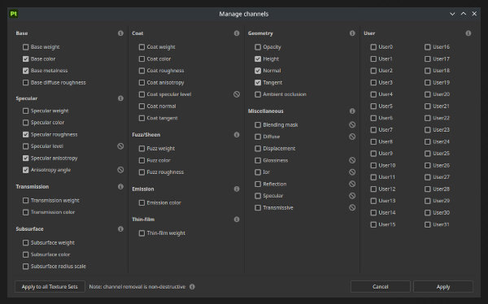

  * Mit der Schaltfläche <b>Auf alle Textursatz anwenden</b> kann die Kanalkonfiguration aller Textursatz gleichzeitig bearbeitet werden.

    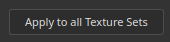

* <b>Alle Instanzen zwischen Textursätzen reduzieren</b>

  Eine neue Option <b>Alle Instanzen reduzieren</b> ist für instanzierte Ebenen und Gruppen verfügbar. Das Ergebnis wird auf alle Textursatz, auf denen die Instanz angezeigt wird, abgeflacht und in der gesamten Instanzenstruktur nach unten verschoben. Der Vorgang wird als einzelner Rückgängig-Schritt aufgezeichnet.

  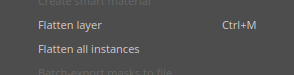

* <b>Einheitlicher Rückgängig-Verlauf</b>

  Baking- und Malmodi nutzen jetzt denselben Verlauf zum Rückgängigmachen. Das Umschalten zwischen dem Baking- und dem Malen-Modus wird als Schritt zum Rückgängigmachen aufgezeichnet. Aktionen können daher nur in dem Modus rückgängig gemacht werden, in dem sie ausgeführt wurden.

## Tutorials

Sehen Sie sich unser neuestes Tutorial auf YouTube an:

[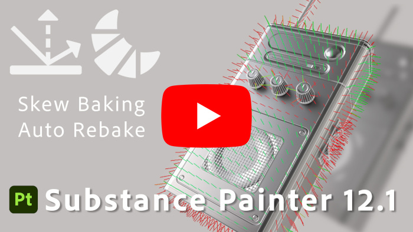](https://www.youtube.com/watch?v=WwyElRpiQgY)

## Versionshinweise

### 12.1.5

Freigabedatum: **2026/09/15**

Zusammenfassung: **Nebenversion**

**Fest:**

* Das Exportieren eines Bildes aus einem Regal in ein Netzwerk funktioniert nicht mehr
* [Generator] Die Einstellung &quot;Textur verwenden&quot; auf &quot;false&quot; deaktiviert nicht die Verwendung der Textur-Eingabe.
* Einfrieren des Viewports beim Speichern während der Bearbeitung der 3D-Projektion
* Material-Ebenenauflösung ist zu niedrig

### 12.1.4

Freigabedatum: **2026/09/04**

Zusammenfassung: **Nebenversion**

**Fest:**

* [Absturz] Absturz beim Importieren oder Exportieren von Dateien, deren Dateinamen Nicht-ASCII-Zeichen enthalten

### 12.1.3

Freigabedatum: **2026/08/25**

Zusammenfassung: **Nebenversion**

**Hinzugefügt:**

* Aktualisieren des Substance-Engine auf Version 9.4.6v

**Fest:**

* [Graustufenwähler] Die Auswahl bleibt nach dem Ändern des Tools geöffnet
* [Baking verzerren] Verzerrungskorrektur wird beim Malen und Rückgängigmachen unterbrochen
* Die Interaktion mit dem [Projektion-Tool]-Viewport wird vom Projektion-Tool blockiert.
* [Dynamische Kontur] Fehlende dynamische Konturparameter in den Pinseleigenschaften
* Export in ein Netzwerk funktioniert nicht mehr

### 12.1.2

Freigabedatum: **2026/08/03**

Zusammenfassung: **Nebenversion**

**Fest:**

* \[Absturz\] Einige Substance können beim Rendern zu einem Absturz führen
* \[Absturz\] Mesh beim Baking erneut importieren
* \[Absturz\] Fehler bei der Initialisierung der Grafikanzeige kann zu einem Absturz führen.
* \[Absturz\] Beim Exportieren von Texturen kann in einigen Fällen ein Absturz beim Aktualisieren des Protokolls auftreten.
* \[Absturz\] Absturz im Baking-Modus in einigen Fällen beim Laden/Aktualisieren der Umgebungs-Map
* \[Baking\] Das erneute Starten des Baking nach dem Ändern einer Datei mit hohem Poly-Wert kann zu einem Einfrieren führen
* \[An Photoshop senden\] Fehler beim Exportieren der Ebenenmaske
* \[Engine\] Das Ergebnis des Ankerpunkts wird nicht zwischen einer Maske und einem Farbkanal gerendert

### 12.1.1

Freigabedatum: <b>2026/07/09</b>

Zusammenfassung: Nebenversion

Hinzugefügt:

* [Skew-Baking] Gelegt: Normaler Neigungsbasismodus: Mesh oder pro Dreieck
* [Eigenschaften] einheitliche Farben immer auf den Standardwert ihres Kanals zurücksetzen lassen
* [OpenPBR] Kanäle nach Kategorien im Fenster &quot;Texturen exportieren&quot; für die Erstellung von Ausgabevorlagen neu gruppieren
* Substance Engine auf Version 9.4.5 aktualisieren

Fest:

* [Projekt] Das Öffnen und Speichern einiger Projekte kann länger als gewöhnlich dauern
* [Absturz] Erneutes Laden mehrerer Mesh kann zu einem Absturz führen
* [Absturz] Löschen eines Kanals im Maskenansichtsmodus führt zu einem Absturz
* [Absturz] Einige Substance können beim Rendern zu einem Absturz führen
* [Malen Skew] Das ausgewählte Tool in Malen Skew bleibt nach dem Wechsel in den Malmodus ausgewählt.
* [Allgemeine Einstellungen Baking geführt] Käfig-Entfernungseinstellungen aktualisieren die Drahtgitter- und Shader-Visualisierung des Käfigs nicht
* [Engine] UV-Auffüllmodus &quot;3D Space Neighbor&quot; funktioniert nicht gut bei dünnen Dreiecken
* Das Ergebnis des [Engine]-Ankerpunkts wird nicht zwischen einer Maske und einem Farbkanal gerendert

### 12.1.0

Freigabedatum: <b>2026/06/23</b>

Zusammenfassung: <b>Dieses Update ist eine Hauptversion. Es enthält Verbesserungen an Bakern mit dem Standardzustand &quot;Neues Baking&quot;, der Zeichnungs-Skew-Map, dem automatischen Reake, einer neuen Option für den automatischen entpack von UV für Mesh und OpenPBR mit fester Oberfläche. Weitere Informationen finden Sie in den vollständigen Versionshinweisen.</b>

<b>Hinzugefügt</b>:

* [Baking Neigen] Malwerkzeuge Neigen
* [Skew-Baking] Hinzufügen von Skew-Vorschau-Shader und Skew-Richtung Vektorgrafiken beim Malen von Skew-Maps
* [Baking verzerren] Option &quot;Kantenschutz hinzufügen&quot;
* [Baking neigen] Automatische Wiederherstellung
* [Skew-Baking] Benutzeroberfläche der Mesh-Map-Liste überarbeiten
* [Baking verzerren] Mesh-Map teilen / Allgemeine Baking-Einstellungen + Allgemeine Einstellungen aus Mesh-Map-Liste verschieben (nur Grundfarbe oder Maske)
* [Baking verzerren] Symbolleistenschaltflächen für Viewport ändern
* [Baking verzerren] Symmetrie für Pinsel in der oberen Symbolleiste anzeigen
* [Skew-Baking] Umbenennungsoptionen im Menü &quot;Synchronisierung der Mesh-Map-Liste&quot;
* [Skew-Baking] Dialogfelder &quot;Synchronisation aktualisieren&quot; und &quot;Überwachter Status&quot;
* [Skew-Baking] Erstellen einer Graustufen-Farbwählervariante
* [Baking verzerren] Symbol &quot;Baking-Modus aktualisieren&quot;
* [Automatisch Entpackt] Option zum Integrieren von Festplatten
* [OpenPBR] Unterstützung für OpenPBR 1.1 hinzufügen
* [OpenPBR] OpenPBR zum Standardarbeitsablauf und -Shader machen
* [OpenPBR] Importieren von OpenPBR-Materials und -Texturen über USD
* [OpenPBR] Exportieren von OpenPBR-Materials und -Texturen über USD
* [OpenPBR] Fenster &quot;Export-Texturen aktualisieren&quot;, um die Namenskonvention für OpenPBR anzuzeigen
* [OpenPBR] Hinzufügen von Dokumentationen zu Änderungen an der Support-OpenPBR
* [OpenPBR]&#x200B;[Iray] Fügen Sie eine neue MDL hinzu, um OpenPBR 1.1 in Iray zu unterstützen.
* Mehrere geringfügige Verbesserungen bei USD Exporten
* [UI] Hinzufügen einer Warnung im Viewport beim Malen auf einem anderen Textursatz
* [Reduzieren] Reduzieren aller instanzierten Ebenen über Textursatz hinweg zulassen
* [Kanaleinstellungen] Mehrere Textursätze gleichzeitig über ein neues Fenster auswählen
* [Verlauf] &quot;Wert&quot; aktualisieren Eintragsformulierung rückgängig machen, um den Parameternamen wiederzugeben
* [Ebenenstapel] Fülleffekte in Masken standardmäßig auf Weiß einstellen (1.0)
* [Substance] Neue Engine-Map-Eingabe &quot;Mesh_hard_edges_triangle&quot; hinzufügen
* [Substance] Neue Engine-Map-Eingabe &quot;Mesh_harte_Kanten&quot; hinzufügen
* [Shader] Verhindern von Shader-Instanzen, dieselben Namen zu verwenden
* [Shader] Verwenden Sie den Shader aus der Projektvorlage beim Importieren einer USD- oder GLTF-Datei.
* Adobe Color Engine auf Version 7.0 aktualisieren
* Aktualisieren der MacOSX-Mindestversion auf 13.0 (Ventura)
* [Inhalt] Neue Projektvorlagen für OpenPBR
* [Inhalt] Aktualisieren von Beispielprojekten, um den neuen OpenPBR Shader zu verwenden
* [Python] Erweitern Sie die Geometrie-Masken-API, um Einschluss- und Ausschlussmodi wie in der Benutzeroberfläche zu ermöglichen.

<b>Fest</b>:

* [Absturz]&#x200B;[Mesh-Map-Einstellungen] Einstellungen auf andere Textursatz anwenden
* [Absturz] Beim Baking führ von Krümmungen von einer Karte ohne Welt-Raum-Normale
* [Absturz]&#x200B;[Baking] Baking mit aktiviertem benutzerdefiniertem Käfig, aber ohne Dateiauswahl-Absturz
* [Absturz] AO-Baking wird abgebrochen
* [Auto-Käfig] Unendliche Ladezeit, wenn der hohe Poly-Dateipfad ungültig ist
* [Linux]&#x200B;[Windows] Der Farbwähler kann manchmal ganz schwarz sein oder nicht angezeigt werden.
* [Polygon-Füllwerkzeug] Das Werkzeug funktioniert nicht mit Nicht-PBR
* &lbrack;[Malen] Beim Löschen des Farbkanals werden zuvor gemalte Grundfarben nicht gelöscht
* [USD] Nicht alle Shader-Instanzen werden korrekt erkannt.
* [Substance] Es wird nur die erste Verwendung eines Eingabe-/Ausgabeknotens berücksichtigt
* [Shader] Ambient occlusion wird zweimal mit Textursätzen unter Verwendung verschiedener Mischmethoden aufgetragen
* [Engine] Normale Texturen mit leerem Blaukanal (Schwarz) können zu falschen Angleichungsergebnissen führen
* [GLTF Import] Alpha-Überblendung ist auf jedem Textursatz aktiviert
* [GLTF-Export] Alpha-Überblendung ist beim Export immer aktiviert
* [Export] Doppelseitige Geometrie ist beim Importieren einer GLTF-Datei immer deaktiviert
* [Javascript] Das Ändern von Shader-Einstellungen trägt nicht zum Rückgängigmachen des Verlaufs bei
* [Beispiele] Volumenstreuung ist in den Anzeigeeinstellungen für die Meetingmatte nicht aktiviert.
