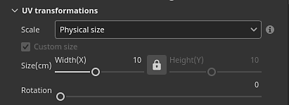

# Version 8.1

**Substance 3D Painter 8.1** integriert das Adobe Color Engine (ACE) mit Unterstützung für ICC-Profile, neue Baker, neue 3D-Rauschen und 20 Schmutz-Maps sowie einer verbesserten Pipette.

Freigabedatum: *7. Juni 2022*

## Wichtigste Funktionen

### Neues Farbmanagement mit Adobe Color Engine (ICC-Unterstützung)

In dieser neuen Version wurde das Farbmanagementsystem um die Unterstützung des Adobe Color Engine (ACE) erweitert, das die Verwendung von ICC-Profilen freigibt. Dieses neue System ermöglicht den Farbabgleich in einer Vielzahl von Anwendungen, einschließlich Photoshop.

* **Neue Projekteinstellungen**\
  Beim Erstellen eines neuen Projekts ist es jetzt möglich, das Farbmanagement-Engine mit dem neu hinzugefügten **Adobe Color Engine** (ACE) anzugeben.

  {width="400px"}

  ACE verfügt über den folgenden Arbeitsfarbraum:

  * **Linearer sRGB**
  * **ACEScg**
  * **Lineare Adobe RGB**
* **ICC-Profilunterstützung überwachen**\
  Sie können Ihr ICC-Profil verwenden, um den Viewport-Look anzupassen und Ihre Farben an Ihren Bildschirm anzupassen.

  {width="400px"}

* **Importieren und Exportieren von Bildern mit eingebetteten ICC-Profilen**\
  Beim Importieren von Bitmaps kann das ICC-Profil automatisch extrahiert werden. Es ist auch möglich, dieses Profil in den Ebeneneigenschaften zu überschreiben.\
  Beim Exportieren kann das beabsichtigte ICC-Profil angegeben werden, das in die Textur-Dateien eingebettet wird.

  {width="400px"}

* **Neue JSON-Vorlageneinstellungen** Um Einstellungen projektübergreifend freizugeben und wiederzuverwenden, können Sie eine Vorgabedatei angeben. Weitere Informationen zu den Vorgabespezifikationen finden Sie in der [dedizierten Dokumentation](../features/color-management/color-management-with-adobe-ace-icc.md).

>[!NOTE]
>
> Weitere Informationen finden Sie in der Dokumentation zum [Farbmanagement](../features/color-management/color-management.md).

### Neue Physische Größe-Unterstützung für Substance-Material

Die Größe innerhalb von Substance-Materialien kann jetzt verwendet werden, um ihre Skalierung und Kachelung innerhalb von Füllebene-Projektionen zu steuern. Dies ist ein nützliches Werkzeug, um Materialien auf Oberflächen richtig an ihre tatsächliche Größe anzupassen, ohne raten zu müssen.

* **Neue Füllebene-Parameter**\
  Eine Füllebene (oder ein Effekt) Es gibt neue Parameter, um die Kachelung/Wiederholung eines Materials zu steuern, wenn eine Physische Größe definiert ist. Diese neuen Parameter sind nur mit 3D-Projektionen verfügbar.

  {width="400px"}

* **Neues Ansichtsport-Raster**\
  Um die Physische Größe leichter verständlich und visualisierbar zu machen, ist es jetzt möglich, einen Raster im 3D-Viewport über das Fenster [Anzeigeeinstellungen](../interface/display-settings/display-settings.md) zu aktivieren.\
  Nach der Aktivierung wird der Raster je nach Zoomstufe automatisch untergetaucht. Die Raster-Einheit wird unten links im Viewport angezeigt.

  {width="400px"}

  {width="400px"}

>[!NOTE]
>
> Weitere Informationen finden Sie in der [dedizierten Dokumentation](../features/physical-size.md).

### Neue Baker

Diese drei neuen Funktionen schließen die Lücke zwischen Designer und Painter, um die Möglichkeiten für Texturierung und Rendering zu erweitern.

Sie wurden der Bäckerliste hinzugefügt, sind jedoch standardmäßig deaktiviert:

Die neuen Baker sind:

* **Bent normals Baker** Der Bent normals Baker ermöglicht das Baking einer Vektorrichtung (als Verdeckung, ähnlich wie Normalen-Map). Diese Textur kann verwendet werden, um die Schattierung im Viewport zu verbessern, indem die Einstellung &quot;**Bent Normal**&quot; im Fenster &quot;[Shader settings](../interface/shader-settings/shader-settings.md)&quot; aktiviert wird. Bent normals verbessern die Echtzeitgenauigkeit der Viewport-Schattierung erheblich.\
  Für **diffuse Schattierung** gibt sie eine präzisere Verdeckung und kann sogar wie eine ungefähre globale Beleuchtung aussehen (erstes Beispiel unten).\
  Bei **Specular-Reflexionen** ist es möglich, Selbstschattierungen zu simulieren und den Lichtaustritt zu reduzieren, sodass sich das Objekt besonders bei metallic Flächen viel geerdeter anfühlt (zweites Beispiel unten).

  {width="350px"}

  {width="400px"}

* **Height-Bäcker**\
  Der Height-Bäcker ermöglicht es, die Differenz zwischen dem niedrigen und dem hohen Poly-Mesh als Graustufen-Textur zu backen, die dann verwendet werden könnte, um Versatz auf tessellierten Meshes zu erzeugen. Zum Beispiel beim Sichern von Scaninformationen gegen eine Ebene.

  {width="400px"}

* **Deckkraft-Baker**\
  Der Bäcker für die Deckkraft erstellt eine Schwarz-Weiß-Landkarte mit Löchern aus einem Polygonnetz. Zum Beispiel kann es verwendet werden, um Zäune oder sogar Löcher in einer Gewebeoberfläche zu backen.

### Neuer Inhalt

In dieser Version wurde eine Vielzahl neuer Inhalte hinzugefügt, darunter:

* **Neue und verbesserte 3D-Geräusche mit mehr als 100 Vorgaben**\
  Die bestehenden 3D-Rauschen wurden überarbeitet und drei neue hinzugefügt. Jeder von ihnen enthält jetzt vordefinierte Einstellungen, die insgesamt 105 Vorgaben für 7 Geräusche bedeuten. Diese Vorgaben können als Ausgangspunkt verwendet werden, um mit ihren Parametern zu experimentieren und einen bestimmten Look zu erzielen. Wie immer bei 3D-Rauschen sind sie nahtlos und können sich sehr leicht wiederholen, ohne dass ein auffälliges Muster entsteht.

  Die 3D-Rauschen finden Sie im Bedienfeld &quot;Elemente&quot; im Abschnitt &quot;Vorgehensweisen&quot;:

  {width="400px"}

  Die Rauschen bieten eine Vielzahl von Möglichkeiten. Hier sind beispielsweise die Vorgaben, die mit **3D Voronoi Fractal** verfügbar sind:

  {width="300px"}

* **20 neue Schmutz-Bitmaps und 2 Stoffmuster**\
  Ein neuer Satz von Grunges wurde mit dem Standardinhalt hinzugefügt, um den vorhandenen Bereich von Mustern zu erweitern. Sie finden sie unter **Procedurals > Grunges Bitmap**.\
  Zwei Stoffmuster sind auch unter **Prozedurale > Stoff** verfügbar.

  {width="400px"}

>[!NOTE]
>
> Einige der 3D-Rauschen können einige Sekunden dauern, bis sie bei ihrer ersten Verwendung berechnet werden.

### Verbesserte Pipette und Material-Auswahl

Mehrere Verbesserungen an der Pipette wurden vorgenommen, um das Extrahieren und Verwalten von Farben zu vereinfachen.

* **Neuer Kommissioniermodus**\
  Beim Auswählen von Farben ist es nicht mehr erforderlich, den Mausklick zu drücken und beizubehalten, während die Maus bewegt wird. Jetzt können Sie auf die Pipette klicken, die Maus an die gewünschte Position bewegen und erneut klicken, um eine Farbe aufzunehmen.

* **Neue Pipettenschaltflächen**\
  Neben den Farbschaltflächen befindet sich ein neues Pipettensymbol, mit dem Sie Farben erfassen können, ohne den Farbwähler zuerst öffnen zu müssen.

  {width="400px"}

* **Neuer Tastaturbefehl für Pipette**\
  Wenn das Farbwählerfenster geöffnet ist, können Sie auch **I** drücken, um den Pipettenmodus aufzurufen, ohne auf das entsprechende Symbol klicken zu müssen. Dadurch ist es einfacher, schnell zwischen Auswahl und Malen zu wechseln.

* **Neue Vorschau beim Pipetten**\
  Wenn Sie die Pipette zum Auswählen einer Farbe verwenden, wird neben der Maus keine neue Vorschau angezeigt. Diese Vorschau ist auch farbverwaltet.

  

* **Neue Auswahl direkt in einem Kanal**\
  Mit dem neuen Pipettenverhalten ist es nun möglich, direkt in einen Kanal auf dem Mesh zu greifen. Halten Sie dazu einfach die UMSCHALTTASTE gedrückt, um eine Farbe direkt aus dem Kanal auszuwählen. Der Kanal wird ermittelt, von wo aus die Pipette gestartet wurde. Diese Methode umgeht jede Farbtransformation, die beim Farbmanagement wichtig ist, um präzise Farben abzurufen. Eine QuickInfo wird angezeigt, die angibt, aus welchem Kanal die Farbe erfasst wird.

  

* **Neue Farbraumeinstellungen beim Erfassen einer Farbe**\
  Wenn das Farbmanagement aktiviert ist, ist eine neue Einstellung im Farbwähler verfügbar, mit der der beim Aufnehmen von Farben verwendete Farbraum angegeben werden kann. Diese Einstellung gilt global für die Painter-Sitzung und auch für die Pipette neben den Farbschaltflächen im Eigenschaftenfenster.

  

* **Verbessertes Verhalten der Material-Auswahl**\
  Die Materialauswahl auf der Werkzeugleiste (Tastaturbefehl P) berücksichtigt jetzt die Kanalauswahl im Eigenschaftenfenster. Sie wird nicht mehr über die Kanäle selbst aktiviert.

  {width="400px"}

### Verbesserter automatischer entpack

Der automatische UV-Entpackungsprozess sorgt jetzt für eine natürlichere Segmentierung.

Jetzt werden die Gitter in verschiedene UV-Inseln zerlegt, indem eine Methode verwendet wird, die dem näher kommt, was von Hand gemacht werden kann, besonders bei organischen Gittern.

## Versionshinweise

### 8.1.0

*(veröffentlicht am 07. Juni 2022)*

**Hinzugefügt:**

* [Farbmanagement] Unterstützung für ICC-Profile mit Adobe Color Engine (ACE) hinzufügen
* [Farbmanagement] Unterstützung für &quot;Adobe 98 RGB&quot; als Arbeitsfarbraum für ICC hinzufügen
* [Farbmanagement] ACE/ICC-Einstellungen über eine Konfigurationsdatei konfigurieren
* [Farbmanagement] Zulassen, dass lineare Farbwerte im Farbwähler mit dem Legacy-Modus eingegeben werden
* [Farbmanagement] Geben Sie das Farbprofil an, das für die Farbauswahl außerhalb der Benutzeroberfläche verwendet wird.
* [Farbmanagement] Merken Sie sich den letzten im Darstellungsfenster ausgewählten Anzeigewert.
* [Farbmanagement][Substance] Sorgen Sie dafür, dass Generatoren/Filter mit dem Farbmanagement ordnungsgemäß funktionieren.
* [Farbmanagement][Substance] Fügen Sie neue Schlüsselwörter für die Farbraumüberschreibung $working und $standardsrgb hinzu
* [Physische Größe][Engine] Extrahieren von Physische Größe-Informationen aus Mesh
* [Physische Größe][Engine] Physische Größe Berechnung
* [Physische Größe] Leg von Optionen zur Verwendung von Physische Größe in der Benutzeroberfläche
* [Physische Größe] Visuelle Helfer im Viewport hinzufügen
* [Baking] Height-Baker hinzufügen
* [Baking] Bent normals-Baker hinzufügen
* [Baking] Baker für Deckkraft hinzufügen
* [Pipette] Neue Farbwähler-Vorschau
* [Pipette] Das Farbwählerbedienfeld wird wieder an der letzten Position angezeigt, wenn es erneut geöffnet wird
* [Pipette] Ein neues Symbol für die Material-Auswahl
* [Pipette] Farbe verwaltet die Kanalvorschau des Farbwählers
* [Pipette] Fügen Sie der Pipette eine Funktion zum Klicken hinzu, um diese auszuwählen
* [Eye Dropper] Kanalauswahl aktiviert nicht aktive Materialien nicht mehr
* [Pipette] Pipette mit Tastaturbefehl verwenden
* [Pipette] Die Pipette nimmt den relevanten Kanal auf, falls zutreffend.
* [Pipette] Beim Aufrufen des Farbwählermodus werden alle Tastaturbefehle deaktiviert
* [Pipette] Automatische Auswahl des Hexadezimalfelds entfernen
* [Pipette] Schließen Sie das Bedienfeld nicht, wenn Sie die Material-Auswahl verwenden
* [Pipette] Neuer deaktivierter Zustand, wenn der Kanal nicht zur Auswahl verfügbar ist
* [Exportieren] Fügen Sie das Attribut &quot;Tangente&quot; dem glTF-Export hinzu
* Substance Engine auf Version 8.4 aktualisieren
* Update Auto Entpack auf 0.9.0
* Update auf Qt 5.15.8
* Update auf Python 3.9
* [Shader] Unterstützung für die Schattierung &quot;Gebeugte Normale&quot; hinzufügen
* [MacOS] Unterstützung von 3DConnection SpaceMouse
* [Python] Dokumentieren der in der API verwendeten Python-Version
* [Inhalt] Hinzufügen von 6 neuen 3D-Geräuschen mit 105 Vorgaben
* [Inhalt] 20 neue Schmutz Maps und 2 Stofffalten
* [Inhalt] Aktualisieren der Exportvoreinstellung &quot;Mesh Maps&quot;, um neue Bäcker zu verwenden
* [Inhalt] Die Steigung des Weichzeichners und des Verkrümmungsfilters hängt von der Auflösung des Textursatzes ab
* [Inhalt] Aktualisierung von Beispielprojekten, um die 3 neuen Bäcker zu verwenden

**Fest:**

* [glTF] glTF kann nicht mit Sonderzeichen geöffnet werden
* [Engine] Artefakte mit deaktivierter Anisotropie und SVT
* [MacOS][M1] Smart-Materialien werden nicht korrekt angezeigt
* [Mesh Processing] Meshes können nicht aus Modeler importiert werden
* [UI] Horizontale Bildlaufleiste in neuem Projektfenster mit aktiviertem Farbmanagement
* [Farbmanagement] Bei einigen OCIO-Konfigurationen fehlt der Arbeitsfarbraumwert im Farbwähler
* [Farbmanagement] Pinselvorschau im Viewport ist nicht farbverwaltet
* [SpaceMouse] Pivot wird nicht sofort mit Fokusänderung aktualisiert und kann außerhalb des Modells liegen
* [Exportieren][USD] Exportierte USD-Dateien haben eine falsche Struktur
* [USD] Ambient occlusion-Problem beim Exportieren
* [Inhalt] Mesh der Miniaturansicht entsprechend dem Vorschaukugel-Beispielprojekt aktualisieren

**Bekannte Probleme:**

* Texturen mit Innenabständen exportieren macht schwarze Diffusionen.
* Normale/Ambient occlusion-Mischung ist defekt
* [MacOS] Absturz beim Starten von Iray in seltenen Fällen
* [Vorschau-Miniaturansicht] Vereinfachte Miniaturansichten werden nicht aktualisiert, wenn ein Anker verwendet wird
* [Farbmanagement] HDR-Farbraumkonvertierungen mit ACE unter Linux erzeugen festgeklemmte Farben
