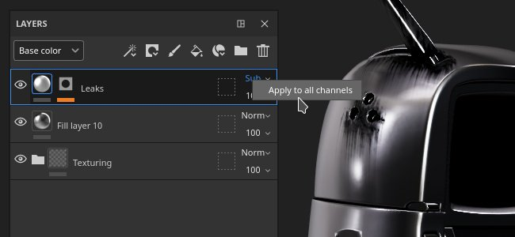
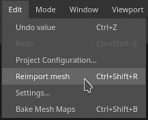
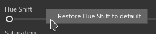

# Version 8.2

**Substance 3D Painter 8.2** konzentriert sich auf viele Verbesserungen der Lebensqualität mit dedizierten Funktionen in mehreren Bereichen der Anwendung.

Freigabedatum: *6. Oktober 2022*

## Wichtigste Funktionen

### Neue Optionen für Füllmethoden und Deckkraft

Es wurden mehrere Tastaturbefehle und Aktionen hinzugefügt, damit es schnell und einfach ist, Füllmethoden und die Deckkraft auf mehreren Kanälen im Ebenenstapel zu kopieren und anzuwenden.

* **Klicken Sie mit der rechten Maustaste auf einen Mischmodus oder ein Deckkraftsteuerelement**\
  Wenn Sie mit der rechten Maustaste auf einen Mischmodus oder eine Deckkraft klicken, wählen Sie die Aktion **Auf alle Kanäle anwenden** aus, um diesen Mischmodus auf alle anderen Kanäle der Ebene anzuwenden. Diese Aktion ist auch für Effekte mit Füllmethode- und Deckkraftsteuerelementen verfügbar.

  

* **Klicken Sie mit der rechten Maustaste auf eine Ebene und wählen Sie Fülloptionen** aus.\
  Es ist auch möglich, mit der rechten Maustaste auf eine Ebene (oder einen Effekt) zu klicken und eine der folgenden Aktionen auszuwählen:

  * **Überblendung auf alle Kanäle anwenden**: wendet den aktuellen Kanal-Mischmodus auf alle anderen Kanäle der aktuellen Ebene/des aktuellen Effekts an.
  * **Deckkraft auf alle Kanäle anwenden**: die Deckkraft des aktuellen Kanals auf alle anderen Kanäle der aktuellen Ebene bzw. des aktuellen Effekts anwenden.
  * **Beide Kanäle anwenden**: den aktuellen Mischmodus und die Deckkraft des Kanals auf alle anderen Kanäle der aktuellen Ebene bzw. des aktuellen Effekts anwenden.
  * **Kanalüberblendungseinstellungen kopieren**: Kopieren Sie alle Füllmethoden und Deckkraftwerte der aktuellen Ebene/des aktuellen Effekts in die Zwischenablage.
  * **Kanalüberblendungseinstellungen einfügen**: Wenden Sie die Füllmethoden und Deckkraftwerte, die sich derzeit in der Zwischenablage befinden, auf die gewünschte Ebene/den gewünschten Effekt an.

  

### Neue Füllmethode und Deckkraft für Filter- und Farbauswahleffekte

Filter- und Farbauswahleffekte können jetzt mit Füllmethoden und Deckkraft-Steuerelementen verwendet werden.

* **Füllmethode und Deckkraft für Filter**\
  Für Filter können jetzt Füllmethoden und Deckkraftwerte verwendet werden. Sie verwenden standardmäßig **Ersetzen**, um das gleiche Verhalten wie zuvor beizubehalten und eine Verdoppelung der Alphakomponenteninformationen zu vermeiden. Mit Füllmethoden für Filter lassen sich Effekte berechnen und ihre Ergebnisse direkt auf Ebenen kombinieren. So ist es nicht erforderlich, Ankerpunkte und Fülleffekte zu verwenden, um dasselbe Ergebnis zu erzielen. Dadurch entfällt auch die manuelle Implementierung von Füllmethoden innerhalb des Filters.

  

* **Füllmethode und Deckkraft für Farbauswahl**\
  Der Effekt &quot;Farbauswahl&quot; unterstützt jetzt Mischmodi und Deckkraft. Zuvor gab dieser Effekt ein Alpha-Ergebnis aus. Damit die Füllmethoden wie erwartet funktionieren, wurde eine neue Einstellung hinzugefügt, um die Hintergrundfarbe anzugeben, die ausgegeben wird. Die Farbe wird nicht transparent, sondern schwarz eingestellt (dies ist das alte Verhalten).

  

  

* **Vereinfachter Effektstapel**\
  Früher, als Effekte auf bestimmte Weise kombiniert werden mussten (z. B. mithilfe von Füllmethoden), waren Ankerpunkte und Fülleffekte eine Notwendigkeit. Mit Mischmodi, die direkt auf Filtern angewendet werden, kann die Komplexität des Effektstapels nicht mehr unbedingt verringert werden.

  {width="400px"}

### Neue Effekte für Ordner

Ordnerinhalte (der Farbteil einer Ebene) können jetzt Effekte jeder Art empfangen. Bevor es erforderlich war, komplexe Ebenenkonfigurationen (wie Passthrough-Ebenen oder Ankerpunkte) zu erstellen, um dasselbe Ergebnis zu erzielen.

### Export des neuen Substance-Archivs (SBSAR)

Beim Exportieren von Texturen ist jetzt das Dateiformat Substance-Archiv (SBSAR) verfügbar. Ein SBSAR ist ein Container, der in vielen Anwendungen mit Substance-Integration geöffnet werden kann, was das Plug-and-Play benutzerdefinierter Texturen beschleunigt und erleichtert.

* **Exportieren eines Substance-Archivs (SBSAR)**\
  Es ist jetzt möglich, das SBSAR-Dateiformat aus der Liste der Dateiformate im Fenster **Texturen exportieren** anzugeben. Dadurch wird eine einzelne SBSAR-Datei exportiert, die alle angegebenen Texturen enthält. Die Benennung der Ausgabeknoten und ihrer Verwendungen wird anhand der ausgewählten Exportvorgabe und ihrer Kanaltypen definiert.

  

* **Hybridexportvorgaben mit PSD- und SBSAR-Dateiformaten**\
  Exportvorgaben können jetzt zusätzlich zu allen anderen Bildformaten auch Ausgabemaps als PSD oder SBSAR angeben. PSD- und SBSAR-Formate werden als &quot;Container&quot; betrachtet, d. h., es können mehrere Texturen innerhalb des Containers gespeichert werden. Wenn in einer Exportvorgabe sowohl Containerformate als auch eigenständige Bildformate festgelegt sind, werden alle Ausgaben in der Vorlage, die eine SBSAR-Datei betreffen, gruppiert, während die anderen Ausgaben als einzelne Dateien exportiert werden.

  

### Neue Umgebungsoption zum Beleuchten unter 3D-Modellen

Mit einer neuen Einstellung in den [Anzeigeeinstellungen](../interface/display-settings/environment-settings.md) kann die Umgebungszuordnung an der Kamera ausgerichtet werden, wodurch es möglich ist, den Beleuchtungswinkel anzupassen und Teile unterhalb des 3D-Modells aufzuhellen.

Um diese neue Einstellung zu verwenden, wechseln Sie zu [Anzeigeeinstellungen](../interface/display-settings/environment-settings.md) und ändern Sie die Einstellung **Umgebungsausrichtung**:

* **Welt**: Die Umgebungskarte wird an der Szene ausgerichtet.
* **Lokal**: Die Umgebungskarte wird an der Kamera ausgerichtet.

Schatten werden automatisch entsprechend der Konfiguration dieser Einstellung angepasst.

### Neue Favoriten und Löschen/erneutes Laden im Fenster &quot;Elemente&quot;

Dem Fenster &quot;[Assets](../interface/assets/assets.md)&quot; wurden neue Aktionen hinzugefügt, um die Verwaltung von Ressourcen zu vereinfachen.

* **Bevorzugte Ressourcen, um sie schnell zu finden**\
  Klicken Sie mit der rechten Maustaste auf eine beliebige Ressource im Fenster Elemente, um sie als Favoriten (oder als Favoriten aufzuheben) festzulegen. Bei Suchabfragen werden bevorzugte Ressourcen immer zuerst in der Zeile angezeigt, mit einem kleinen Sterntag in der Ecke, sodass sie hervorstechen und zugänglich sind. Eine spezielle Suchanfrage wurde ebenfalls hinzugefügt, sodass Sie ganz einfach alle Ihre bevorzugten Ressourcen anzeigen können.

  {width="350px"}

* **Ressourcen auf dem Datenträger löschen und neu laden**\
  Ressourcen, die sich in Benutzerbibliotheken befinden, können jetzt gelöscht, neu geladen oder umbenannt werden (mit Ausnahme von Ressourcen, die Teil eines Pakets sind, wie Substance-Graphen oder ABR-Pinseln).

### Verschiedene Funktionen und Verbesserungen

In dieser neuen Version wurden viele kleine zusätzliche Verbesserungen und Funktionen hinzugefügt:

* **Neuer Begrüßungsbildschirm und neues Fenster**\
  Um über neue Funktionen informiert zu bleiben, die der Anwendung hinzugefügt wurden, wird jetzt beim Starten der Anwendung ein neues Begrüßungsfenster und ein neues Fenster mit Informationen zu neuen Funktionen eingeführt. Diese Fenster können leicht geschlossen werden und werden beim nächsten Start nicht wieder angezeigt. Sie können jederzeit über das Menü **Hilfe** erneut geöffnet werden.

  {width="400px"}

  {width="400px"}

* **Neue Aktion zum schnellen erneuten Importieren eines 3D-Modells**\
  Ein neuer Tastaturbefehl (**CTRL+SHIFT+R** standardmäßig) wurde hinzugefügt und ermöglicht ein schnelles erneutes Importieren des 3D-Modells des aktuellen Projekts. Dies vereinfacht und beschleunigt die Iteration eines Assets. Wenn die Quelldatei nicht gefunden werden kann, wird eine Fehlermeldung im Protokoll ausgelöst. Dem Menü &quot;**Bearbeiten**&quot; wurde ebenfalls eine Aktion hinzugefügt.

  

* **Verbesserte HDPI-Unterstützung**\
  Es wurden mehrere Korrekturen in Bezug auf HDPI-Bildschirme und Systemskalierung vorgenommen. Wir unterstützen jetzt auch Zwischenwerte für die Skalierung (z. B. 125 %), wodurch vermieden werden sollte, dass die Benutzeroberfläche auf bestimmten Bildschirmen zu groß oder zu klein ist. Das Verschieben von Fenstern zwischen HDPI-Bildschirmen mit unterschiedlichen Skalierungswerten sollte sich ebenfalls korrekt verhalten.

* **Substance-Diagrammparameter auf Standard zurücksetzen**\
  Überall, wo ein Substance-Diagramm verwendet wird (als Alpha, Material, Filter usw.) Es ist nun möglich, die Parameter auf die Standardwerte zurückzusetzen.

  * **Alle Parameter zurücksetzen**: Verwenden Sie die Schaltfläche &quot;Standardeinstellungen wiederherstellen&quot; unter der Parameterliste, um die gesamte Substance-Ressource zurückzusetzen.
  * **Klicken Sie mit der rechten Maustaste auf**: Klicken Sie mit der rechten Maustaste auf einen bestimmten Parameter, um ein Menü mit einer für diesen Parameter spezifischen Rücksetzaktion zu öffnen.

   

* **Anzeigen einzelner RGBA-Komponenten in Viewports**\
  Wenn Sie einen Kanal in den Viewports anzeigen, gibt es eine neue Einstellung mit dem Namen **Farbkanäle** unter **Anzeigeeinstellungen > Kanalanzeige**, mit der Sie RGBA-Komponenten einzeln betrachten können. Dies kann nützlich sein, um Texturen zu analysieren oder bestimmte Komponenten in Benutzerkanälen zu isolieren.

  

  {width="450px"}

* **Kacheln von Füllebenen und Effekten über 128 hinaus**\
  Der Kachelparameter von Füllebenen und Effekten wurde geändert, um einen weichen Bereich zu erhalten. Dadurch ist es nun möglich, einen beliebigen Kachelwert einzugeben. Der Standardbereich des Schiebereglers wurde ebenfalls von [-128,128] auf [-32,32] reduziert, um das Ziehen zu vereinfachen.

  

* **Neue Exporteinstellung für EXR-Texturen 16f und 32f**\
  Früher wurde der EXR-Texturexport auf 32f Bit in der Schnittstelle erzwungen, aber innerhalb der tatsächlichen Datei führte er zu 16f Bit-Daten (Halbschwebetyp). Es wurde nun behoben, und es besteht eine explizite Möglichkeit, zwischen 16f und 32f Bits zu wählen. Alte Projekte und Exportvorgaben, die EXR als Dateiformat verwenden, verwenden standardmäßig 16f Bit, um dem alten Verhalten zu entsprechen (vor allem, um die Produktion größerer Dateien als zuvor zu vermeiden).

  

* **UI-Layouts exportieren und neu laden**\
  Neue Aktionen zum Speichern und erneuten Laden des UI-Layouts finden Sie im Menü **Windows**. Dadurch ist es einfacher, zwischen verschiedenen Layouts zu wechseln oder eine Benutzeroberfläche auf mehreren Computern zu speichern und wiederzuverwenden. Die beiden aktuellen Painter-Modi - Rendern und Malen - haben ihre eigenen Layouts. In Python sind auch einige Funktionen verfügbar, mit denen Sie das UI-Layout speichern und erneut importieren können (siehe unten).

  

* **Das Dateimenü wurde neu organisiert**\
  Wir haben das Dateimenü aufgelöst, indem wir mehrere erweiterte Speicherfunktionen zusammengefasst haben. Einige dieser Aktionen wurden ebenfalls umbenannt, um ihr Verhalten zu verdeutlichen.

  

* **Die Fehlermeldung beim Öffnen von Projekten, die zu neu sind, wurde verbessert.**\
  Eine hilfreichere Meldung wird jetzt beim Öffnen von Projekten angezeigt, die mit einer neueren Version der Anwendung erstellt wurden. Die Meldung enthält jetzt sowohl die Projekt- als auch die Anwendungsversion, sodass Sie besser über die erforderliche Version informiert werden können.

  {width="400px"}

### Verbessertes Python-Skript

Der Python-API wurden mehrere neue Funktionen hinzugefügt. Ausführliche Informationen finden Sie in der Dokumentation im Hilfemenü der Anwendung.

* **substance\_painter.resource**\
  **substance\_painter.resource.Type** ermöglicht es jetzt, weitere Arten von Ressourcen zu identifizieren, insbesondere Substance- und Photoshop-Pinselpakete.\
  Ressourcenobjekte können jetzt ihre übergeordneten und untergeordneten Objekte auflisten, sodass sie beispielsweise zwischen Substance-Paketen und Substance-Graphen navigieren können.

* **substance\_painter.textureset**\
  Es wurden zwei neue Funktionen (und eine Enumeration) zum Abrufen und Festlegen von Gitterzuordnungen in den Einstellungen für den Textursatz hinzugefügt: **get\_mesh\_map\_resource()** und **set\_mesh\_map\_resource()**.

* **substance\_painter.ui**\
  Mehrere Funktionen wurden hinzugefügt, um das UI-Layout zu speichern und neu zu laden. Beachten Sie, dass das Layout auch vom aktuellen Anwendungsmodus (Malen oder Rendern) abhängt.

* **substance\_painter.event**\
  Ein neues **TextureStateEvent** wurde hinzugefügt, um Änderungen im Ebenenstapel von Textursätzen sowie andere Parameteränderungen zu verfolgen. Dieses Ereignis löst beim Malen oder Hinzufügen/Entfernen von Kanälen aus.

## Versionshinweise

### 8.2.0

*(Freigegeben: 6. Oktober 2022)*\
Zusammenfassung: **Hauptversion mit neuen Onboarding-Bedienfeldern (neues Begrüßungs-Bedienfeld und neues Bedienfeld), Export in SBSAR, Effekten für Ordner, mehreren Verbesserungen für die Lebensqualität und Fehlerbehebungen.**

**Hinzugefügt:**

* [Onboarding] Onboarding-Bereich zur Begrüßung neuer Benutzer

  Es wurde ein neuer Begrüßungsbildschirm hinzugefügt, wenn neue CC-Benutzer Painter zum ersten Mal öffnen.
* [Onboarding] Neuerungen im Bedienfeld zur Verbesserung der Auffindbarkeit neuer Funktionen

  Es wurde ein neuer Bildschirm &quot;Neue Funktionen&quot; hinzugefügt, auf dem die wichtigsten neuen Funktionen angezeigt werden. Es wird automatisch angezeigt, wenn Painter nach einem wichtigen Update zum ersten Mal geöffnet wird, und Sie können erneut auf es über Hilfe > Neue Funktionen zugreifen.
* [Onboarding] Alten Begrüßungsbildschirm in &quot;Startseite&quot; umbenennen

  Alter Begrüßungsbildschirm wurde in Startbildschirm umbenannt, um Verwechslungen mit dem neuen Begrüßungsbildschirm zu vermeiden.
* [UI] Beheben von Skalierungsproblemen für Bildschirme mit hoher DPI

  Verbesserte Anpassung der Painter-Benutzeroberfläche auf HD-Bildschirmen mit benutzerdefinierter Anzeigeskalierung.
* [UI] Vermeiden Sie persistente Fehlermeldungen in der Benutzeroberfläche

  Fehlermeldungen aus vorherigen Projekten werden jetzt aus der unteren Statusleiste entfernt.
* [UI] Menü zum Speichern von Überarbeitung

  Zusätzliche Speicheroptionen sind jetzt in einem Untermenü gruppiert und einige werden aus Konsistenzgründen umbenannt.
* [UI] Speichern und Exportieren/Freigeben von UI-Layouts

  Im Menü &quot;Fenster&quot; (Window) gibt es neue Aktionen, mit denen Sie das UI-Layout in Dateien speichern und neu laden können. Die Layouts &quot;Malen&quot; und &quot;Rendern&quot; werden separat gespeichert.\
  &quot;substance\_painter.ui&quot; wurde um verschiedene Funktionen erweitert, mit denen auch UI-Layouts gespeichert, zurückgesetzt und geladen werden können.
* Hinzufügen von Kopier-/Einfügeaktionen für Mischmodi/Deckkraft einer Ebene

  Es wurde ein neuer Eintrag &quot;Fülloptionen&quot; im Kontextmenü von Ebenen hinzugefügt. Damit können Sie den Mischmodus und die Deckkraft aller Kanäle von einer Ebene in eine andere kopieren und einfügen.
* Mischmodus/Deckkraft auf alle Kanäle einer Ebene anwenden

  Dem Mischmodus und der Deckkraft von Ebenen wurde eine Rechtsklick-Funktion hinzugefügt, mit der die derzeit angeklickte Einrichtung auf alle Kanäle angewendet werden kann.
* Gitter mit einem Tastaturbefehl neu laden (STRG+UMSCHALT+R)

  Es wurde ein bearbeitbarer Tastaturbefehl hinzugefügt, um die Gitterdatei mit den zuletzt verfügbaren Einstellungen neu zu laden. Sie können auch über Bearbeiten > Wiederholen importieren darauf zugreifen.
* Substance-Parameter auf die Standardeinstellungen zurücksetzen

  In den Eigenschaften am unteren Rand von .sbsar-Ressourcen wurde eine neue Schaltfläche hinzugefügt, mit der die Ressource auf die Standardwerte zurückgesetzt werden kann.
* Malpinsel auf Standard zurücksetzen

  Es wurde ein neues Menü zum Abschnitt &quot;Pinsel&quot; in den Eigenschaften hinzugefügt, über das Sie den Standard-Standardpinsel zurücksetzen können.
* Rechtsklick zum Zurücksetzen der einzelnen Substance-Parameter auf die Standardeinstellungen

  Es wurde die Möglichkeit hinzugefügt, einzelne Parameter innerhalb einer .sbsar-Ressource per Rechtsklick zurückzusetzen.
* [Bedienfeld &quot;Elemente&quot;] Favoritenelemente &quot;anheften&quot;, die oben im Bedienfeld &quot;Elemente&quot; angezeigt werden

  Es wurde eine neue Option zum Rechtsklick hinzugefügt, um Bibliothekselemente zu erstellen, mit der sie als Favoriten an den oberen Rand des Bedienfelds angeheftet werden können. Sie können auch alle Ihre bevorzugten Assets über &quot;Gespeicherte Suchen&quot; anzeigen.
* [Bedienfeld &quot;Elemente&quot;] Elemente löschen, neu laden und umbenennen

  Kontextmenüoptionen zum Löschen, erneuten Laden und Umbenennen von Elementen in der Benutzerbibliothek wurden hinzugefügt. Sie werden direkt aus ihrem Bibliotheksspeicherort auf der Festplatte gelöscht und vom ursprünglichen Speicherort neu geladen. Elemente, die Teil eines Pakets wie .abr oder .sbsar sind, können nicht einzeln bearbeitet werden.
* [Farbauswahl] Hinzufügen von Füllmethoden zum Effekt &quot;Farbauswahl&quot;
* [Ebenenstapel] Füge Mischmodus und Deckkraft zu Filtern hinzu
* [Ebenenstapel] Lassen Sie Kachelwerte größer als 128 für Füllebenen/Effekte zu
* [Ebenenstapel] Zylinderkappen für zylindrische Projektion in Füllschicht/Effekt

  Die zylindrische Projektion in den Eigenschaften der Füllebene bietet jetzt die Möglichkeit, Zylinderkappen zu entfernen.
* [Protokoll] Fehlermeldung anzeigen, wenn sich ein Gitterteil im negativen Raum befindet, wenn versucht wird, ein UV-Kachelprojekt zu erstellen

  Es wurde eine deutlichere Fehlermeldung hinzugefügt, wenn kein UV-Kachelprojekt erstellt werden kann, da UV-Teile in negativen Bereichen gefunden werden.
* [Project] Geben Sie beim Öffnen eines Projekts die Version in der Fehlermeldung &quot;Daten zu aktuell&quot; an.

  Wenn Sie ein Projekt öffnen, das für die Anwendung zu neu ist, wird in der Fehlermeldung jetzt die Version des Projekts angezeigt, damit Sie die richtige Anwendungsversion leichter erkennen können.
* [Viewport] Gitter von unten beleuchten

  Es wurde ein neuer Parameter Umgebungsausrichtung in Anzeigeeinstellungen > Kamera > Umgebungseinstellungen hinzugefügt, um die Umgebungszuordnungsbeleuchtung an der Kamera auszurichten, wenn sie auf &quot;Lokal&quot; eingestellt ist.
* [Viewport] Anzeigen von R, G, B und Alpha im Viewport (Einzelanzeigemodus)

  Unter Anzeigeeinstellungen > Viewport-Einstellungen > Kanalanzeige gibt es eine neue Farbkanaleinstellung, mit der nur die R-, G-, B- oder Alpha-Komponente eines Kanals im Einzelanzeigemodus angezeigt werden kann.
* [Shader] Benutzerkanäle als RGBA in Material Layer-Shadern festlegen

  Wenn Sie die Konfiguration Textursatz-Kanäle innerhalb eines Shaders für die Materialschichtung einstellen, ist es jetzt möglich, das Format des Kanals so festzulegen, dass es vom Standardwert abweicht. Auf diese Weise können insbesondere Farb-Benutzerkanäle anstelle von nur Graustufen angefordert werden.
* [Exportieren] Texturen als SBSAR exportieren

  Beim Exportieren von Texturen über das Fenster Datei > Texturen exportieren kann das Dateiformat SBSAR (Substance Archive) ausgewählt werden, um sie neu zu gruppieren. Der Inhalt des SBSAR richtet sich nach der verwendeten Ausgabevorlage.\
  Das SBSAR-Dateiformat kann auch in den Exportvorgaben festgelegt werden. Bei Verwendung einer Hybrid-Konfiguration (SBSAR + Anderes Format) werden Texturen, die auf ein SBSAR abzielen, gruppiert, während der Rest parallel exportiert wird.
* [Export] 16-Bit-Option für EXR-Dateiformat verfügbar machen

  Beim Exportieren von EXR-Texturdateien können Sie jetzt im Fenster Texturexport (sowohl für Exporteinstellungen als auch Exportvorgaben) 16f Bit (Half-Float) oder 32f Bit (Float) auswählen. Alte Projekte und alte Exportvorgaben werden standardmäßig auf 16f Bit gesetzt, um das alte Verhalten widerzuspiegeln.
* [Python] Ereignis hinzufügen, um zu erfahren, wann Textursätze geändert werden

  Der neue &quot;substance\_painter.event.TextureStateEvent&quot; gibt Aufschluss darüber, wann ein Textursatz entweder aufgrund eines Malstrichs, eines hinzugefügten oder eines entfernten Kanals geändert wurde.
* [Python] Abrufen und Festlegen von Mesh Map-Ressourcen in den Einstellungen für den Textursatz

  Neue Funktionen wurden im Modul &quot;substance\_painter.project&quot; hinzugefügt, um Netzzuordnungsressourcen abzurufen und festzulegen. Diese Funktionen können verwendet werden, um die Gitterzuordnungen zu aktualisieren, auf die in den Einstellungen für den Textursatz verwiesen wird.
* [Plug-ins] Option entfernen, um andere JS-Plug-ins zu erhalten

  Die Option, Javascript-Plugins zu erhalten, wurde entfernt, da sie auf der veralteten Share-Website gehostet wurden.
* [Inhalt] Neue Roblox-Vorlage hinzufügen und Vorgabe exportieren

  Eine neue Roblox-Projektvorlage &quot;Materialvariante&quot; und &quot;Oberflächenerscheinung&quot; sowie eine Exportvorgabe wurden hinzugefügt, um den Export von PBR-Texturen nach Roblox zu erleichtern. Auf die Vorlage kann über das Fenster Datei > Neues Projekt zugegriffen werden.
* Substance Engine auf die neueste Version (8.6.3) aktualisieren
* [Steam] Optimierter Build für Apple Silicon Chipsatz (Apple M1 / M2)

**Fest:**

* Absturz bei Verwendung von 16k exr
* [Absturz] Strg Z Nach dem Löschen einer Shader-Instanz
* [Iray] IoR ist für einige Shader auf 1 blockiert
* [Win][Backen] Einige hohe Poly-Fehler beim Laden.
* [Farbmanagement] Falscher Farbraumname in der Benutzeroberfläche mit Filtern
* [Python] Von der Importfunktion zurückgegebene Ressourcenobjekte haben keinen Typ

  Beim Importieren des Substance-Pakets in Python gab die Funktion das Paket zurück, anstelle der Diagramme. Das Ressourcenmodul stellt nun Funktionen und Parameter bereit, um die Graphen eines Substance-Pakets abzurufen.

**Bekannte Probleme:**

* [Farbmanagement] HDR-Farbraumkonvertierungen mit ACE unter Linux erzeugen festgeklemmte Farben
* [Ebenenstapel] Eingabequelle nicht pro Ebene gespeichert
* [Malen] Zeitweiliges Anti-Aliasing verursacht beim Malen in einigen Fällen Artefakte
* [Export] 2DView exportiert zufällig einheitliche Karte
