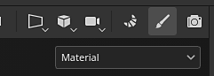
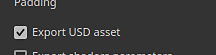
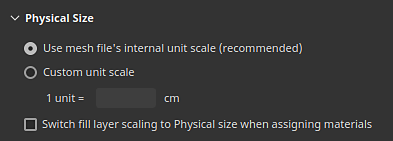

# Version 8.3

Mit **Substance 3D Painter 8.3** wird ein brandneuer Baking-Modus eingeführt, bei dem Dateien importiert USD und Physische Größe im UV-Projektion-Modus unterstützt wird.

Freigabedatum: *10. Januar 2023*

## Hauptmerkmal

### Neuer Backmodus

Das alte Backfenster wurde durch einen speziellen Modus mit mehreren neuen Funktionen ersetzt, insbesondere mit Darstellungsmöglichkeiten wie der Anzeige des Käfigs und Anpassungsfehlern.

* **Zugriff auf Modi und Wechsel zwischen Modi**\
  Backen ist jetzt ein neuer und separater Modus zusätzlich zu den bereits vorhandenen Mal- und Rendermodi der Anwendung. Um zum Baking zu gelangen, verwenden Sie einfach das kleine Croissant-Symbol in der kontextbezogenen Symbolleiste. Das Umschalten zwischen den Modi kann auch anders erfolgen: über das Menü &quot;Modus&quot; oder die Tastaturbefehle. Um in einen anderen Modus zurückzukehren, verwenden Sie einfach das entsprechende Symbol des Textursatz (außerdem kann die Schaltfläche **Baking Mesh-Map** in den [Moduseinstellungen](../interface/texture-set/texture-set-settings.md) weiterhin verwendet werden, um in den neuen Modus zu wechseln).

  

  

* **Neue Modusschnittstelle**\
  Das herkömmliche Baking wurde in einen Modus mit eigens dafür vorgesehenen Docks transformieren, insbesondere:

  * Die **Textursatz-Liste** kann verwendet werden, um zu definieren, welche Teile des Projekts Baking geführt werden.
  * **Mesh-Map Baker** ermöglicht die Auswahl zwischen den allgemeinen Baking- und Baker-Einstellungen. Hier können Sie auch angeben, welcher Baker-Prozess gestartet wird.
  * **Mesh-Map Settings**&quot; ist der Speicherort aller Baker- und allgemeinen Einstellungen und kann je nach Auswahl aus den beiden vorherigen Fenstern geändert werden.
  * **Das Sicherungsprotokoll** gruppiert verschiedene Informationen zum Sicherungsprozess, insbesondere Fehlermeldungen, neu.
  * **Visualisierung wird gebacken**: Dieses Bedienfeld befindet sich im Viewport und steuert verschiedene Optionen für die Anzeige der Meshs mit niedriger und hoher Poly-Zahl.

  {width="500px"}

* **Starten und Abbrechen des Bakings direkt vom Viewport aus**\
  Die Schaltfläche zum Starten oder Abbrechen des Bakings befindet sich jetzt unten im Viewport. Ein kleiner Pfeil kann auch verwendet werden, um den Baking-Modus anzugeben: basierend auf der Auswahl der Textursatz-Liste oder mithilfe des aktuell aktiven Textursatzes.

  

  

* **Anzeige von Mesh mit hohem Poly-Wert im Viewport**\
  Wenn Sie in den Baking-Einstellungen einen Mesh mit hoher Poly-Intensität angeben, wird dieser nun auch im Viewport geladen (sofern die dedizierte Visualisierungseinstellung nicht deaktiviert ist). Auf diese Weise kann überprüft werden, ob die Geometrie des Polygonnetzes mit der Geometrie des Polygonnetzes mit der Geometrie des Polygonnetzes mit der Geometrie des Polygonnetzes übereinstimmt.

  {width="400px"}

* **Fehler beim Anzeigen des Käfigs im Viewport mit verpassten Bereichen als Mesh**\
  Das Gitter des Käfigs kann auch im Darstellungsfenster angezeigt werden. Wenn keine dedizierte Meshdatei verwendet wird, wird stattdessen ein impliziter Käfig angezeigt, der auf den Parameter &quot;Max. Frontalentfernung&quot; reagiert. Wenn Sie die Größe des Käfigs anpassen, wird jeder Teil des Meshs mit hoher Poly, der sich außerhalb des Käfigs befindet, standardmäßig als rot angezeigt, sodass Sie leicht einen Teil des Meshs finden können, der beim Baking verloren geht.

  

* **Gitter beim Laden und Backen durchsuchen**\
  Das Laden von Meshs und das Baking frieren die Anwendung nicht mehr ein, sodass es möglich ist, während dieser Vorgänge mit dem Viewport zu interagieren. Dies kann nützlich sein, um den Backvorgang zu untersuchen, Probleme frühzeitig zu erkennen und den Backvorgang abzubrechen, um am Ende Zeit zu sparen. In ähnlicher Weise wird jetzt zuerst der sichtbarste Textursatz im Viewport eingebrannt, der dabei hilft, die Ergebnisse in bestimmten Bereichen im Voraus zu überprüfen.

  

* **Einstellungen für neutrales Material und neutralen Viewport**\
  Um sich auf die Ergebnisse des Bakings zu konzentrieren und gegebenenfalls nach Problemen zu suchen, zeigt der Baking-Modus keine gemalten Texturen an, sondern verwendet stattdessen ein neutrales Material. Die Einstellungen für dieses neutrale Material können im Visualisierungsbedienfeld für das Backen im Viewport angepasst werden.

  

* **Harte Kanten mit fehlenden UV anzeigen**\
  Beim Backen entstehen unter anderem Artefakte durch harte Kanten, die keine UV-Nähte aufweisen. Das kann zu sichtbaren Linien führen und die Smoothness der Schattierung unterbrechen. Dazu wurden Visualisierungseinstellungen hinzugefügt, um sie sowohl in der 3D- als auch in der 2D-Ansicht hervorzuheben, da sie sonst leicht zu übersehen sind.

  {width="450px"}

  {width="300px"}

* **Parameter synchronisieren und nicht synchronisieren**\
  Mit der neuen Synchronisierungsaktion können Sie angeben, welcher Teil der Baking-Einstellungen über Textursatz hinweg synchronisiert werden soll. Andernfalls wäre es mühsam, Einstellungen mehrfach auf identische Weise zu konfigurieren. Manchmal ist es sinnvoll, Textursatz mit dedizierten Einstellungen zu verwenden und diese nicht zu synchronisieren. Wenn Sie z. B. die gemeinsamen Einstellungen getrennt halten, können Sie jetzt eine maximale Frontalentfernung, Auflösung und/oder eine Liste von Meshs mit hoher Poly-Rate verwenden, die sich pro Textursatz unterscheiden würden.

  {width="400px"}

  {width="400px"}

* **Übereinstimmung mit der Namensüberprüfung**\
  Die Registerkarte &quot;**Zuordnung nach Name**&quot; im **Fehlerprotokoll** kann beim Finden von Baking im Zuordnungsvorgang vor dem Baking helfen, sodass Mesh, die nicht übereinstimmen, leichter erkannt werden. Zugehörige Mesh werden gruppiert, andere werden isoliert und in Rot dargestellt.

  {width="450px"}

>[!NOTE]
>
> Es gibt viele weitere neue Einstellungen in diesem neuen Modus. Weitere Informationen finden Sie auf der [Seite zur dedizierten Dokumentation](../baking/baking.md).

### Neuer Import und Export von USD

Mit dieser neuen Version wird die Unterstützung des Dateiformats [Universal Scene Description (USD)](https://graphics.pixar.com/usd/release/intro.html) hinzugefügt. Es ist jetzt möglich, ein Painter-Projekt zu starten und Mesh und Texturen in einem USD zu exportieren, was einen konsistenteren Workflow über Anwendungen hinweg ermöglicht.

* **Importieren Sie USD Datei mit Varianten, Skinning und in einem bestimmten Rahmen**\
  Ein USD Dateiformat kann verwendet werden, wenn ein Projekt erstellt oder ein Mesh innerhalb eines Projekts erneut importiert wird. USD-Dateien können häufig komplexe Szenen sein, daher ist auch ein Selektor &quot;scope&quot; und &quot;variant&quot; verfügbar, um nur einen Teil der Datei zu importieren.

  {width="400px"}

  {width="400px"}

* **USD als neue Datei exportieren oder mit der im Projekt verwendeten USD verknüpft sind**\
  Wenn die Texturierung fertig ist, können Sie das Fenster &quot;**Datei&quot; > &quot;Texturen exportieren**&quot; verwenden, um die USD neben den Texturen zu exportieren. Aktivieren Sie dazu einfach die Einstellung **USD-Asset exportieren**. Dadurch werden mehrere USD generiert, die anschließend einfach in eine Pipeline integriert werden können. Wenn Sie eine Nicht-USD-Datei oder eine USD-Datei ohne UVs verwendet haben, wird dadurch eine neue USD-Geometriedatei zusätzlich zu Textur-Maps und USD Material-Datei exportiert.\
  Darüber hinaus ist es auch möglich, den Mesh **Datei > Exportieren** zu verwenden, um die Projektgeometrie als USD zu exportieren.

  

  {width="400px"}

### Verbesserte Unterstützung der Physische Größe im UV-Modus

Die Unterstützung von Substance-Materialien mit eingebetteten Physische Größen wurde auf UV-basierte Projektionen erweitert.

* **Physische Größe im UV-Modus**\
  Es ist jetzt möglich, den Skalierungsmodus in den Füllebene- und Fülleffekten im UV-Projektion-Modus auf &quot;Physische Größe&quot; anstatt auf &quot;Kachelung&quot; festzulegen. Die Größe der UV wird automatisch anhand der Durchschnittsgröße der Dreiecke aus der entpackend UV berechnet.

  {width="400px"}

* **Automatisch zur Physische Größe wechseln** Es wurde eine neue Projekteinstellung hinzugefügt, um die Skalierungseinstellung beim Erstellen eines Materials (z. B. beim Ziehen und Ablegen einer Ressource für das Elementfenster) automatisch auf Physische Größe festzulegen. Dies ermöglicht die Verwendung konsistenter Größen in einem Projekt, ohne dass Sie bei jeder Erstellung einer neuen Füllebene die Einstellungen manuell ändern müssen. Um sie in einem bestehenden Projekt zu aktivieren, gehen Sie zu **Bearbeiten > Projektkonfiguration** und aktivieren Sie **Skalierung der Füllebene auf Physische Größe umschalten, wenn Materialien zugewiesen werden**. Diese Einstellung kann auch beim Erstellen eines neuen Projekts aktiviert werden.

  

## Informationen zur Plattformunterstützung

Mit dieser Version haben wir die mindestens unterstützte Version von Painter auf Steam auf Ubuntu 20.04 erhöht.

## Tutorials

Im neuesten Tutorial erfahren Sie mehr über den neuen Baking-Modus:

## Versionshinweise

*(Freigegeben: 10. Januar 2023)*\
Zusammenfassung: **Hauptversion mit neuem Importmodus, neuem Baking und Export von USD und Physische Größe-Unterstützung für UV-Projektion**

**Hinzugefügt:**

* [Backmodus] Neuer Backmodus, der dem Backvorgang gewidmet ist
* [Backmodus] Kurzbefehl zum Wechseln in den Backmodus auf F8 festlegen
* [Backmodus] Hinzufügen der Schaltfläche &quot;Backen beginnen&quot; und &quot;Backen abbrechen&quot; im Viewport
* [Backmodus] Backauswahl in der Liste &quot;Textursatz&quot; hinzufügen
* [Backmodus] Neues Fenster &quot;Gitterzuordnungs-Bäcker&quot; hinzufügen, um Bäcker auszuwählen
* [Backing-Modus] Neues Fenster &quot;Gitterzuordnungs-Einstellungen&quot; hinzufügen, um Backing-Einstellungen zu bearbeiten
* [Backing Mode] Neues Backing Log-Fenster hinzufügen, um Backing-Prozess zu verfolgen
* [Backing Mode] Backing-Parameter hinzufügen und Aktionen im Verlaufsfenster rückgängig machen
* [Backing-Modus] Hinzufügen von Breadcrumbs in den Mesh-Map-Einstellungen
* [Backmodus] Hinzufügen von Mesh Maps-Miniaturansichten im Fenster &quot;Gitter-Map-Bäcker&quot;
* [Backmodus] Menü &quot;Visualisierungseinstellungen reduzierbar&quot; im 3D-Viewport hinzufügen
* [Backmodus] Fügen Sie eine Visualisierungseinstellung hinzu, um das High-Poly-Gitter ein- oder auszublenden
* [Backmodus] Visualisierungseinstellung hinzufügen, um das Gitter und das Drahtgitter des Käfigs ein- bzw. auszublenden
* [Backmodus] Fügen Sie eine Visualisierungseinstellung hinzu, um das Gitter mit der niedrigen Poly-Intensität ein- oder auszublenden.
* [Backmodus] Hinzufügen einer Visualisierungseinstellung, um harte Kanten ohne UV-Nähte als Fehler anzuzeigen
* [Backing Mode] Informieren Sie im Viewport über Gitter- und Backing-Fehler, wenn das Backing-Protokoll nicht sichtbar ist
* [Backmodus] Aktion hinzufügen, um die Backeinstellungen für alle Textursätze zu synchronisieren

  Im Fenster &quot;Gitter-Map-Bäcker&quot; kann jeder Bäcker (sowie die allgemeinen Einstellungen) über Textursätze hinweg synchronisiert werden, indem Sie auf das Verknüpfungssymbol neben seinem Namen klicken. Durch diese Aktion wird ein Fenster geöffnet, in dem Sie auswählen können, welche Textursätze dieselben Parameter verwenden sollen.
* [Backmodus] Hinzufügen von Aktionen zum Kopieren und Einfügen von Backereinstellungen

  Im Fenster &quot;Gitterzuordnungs-Bäcker&quot; stehen Aktionen zum Kopieren und Übergehen der einzelnen Bäckereinstellungen über Textursätze entweder über das spezielle Menü oben im Fenster oder das Kontextmenü mit der rechten Maustaste zur Verfügung.
* [Backing Mode] Schaltfläche Hinzufügen im Backing Log, um von Fehler zu den richtigen Einstellungen zu springen

  Wenn ein Bäcker ausfällt oder ein Gitter nicht ordnungsgemäß geladen wird, wird im Backprotokoll eine Fehlermeldung angezeigt. Mit einer Schaltfläche neben der Meldung können Sie das Fenster Gitterzuordnungs-Bäcker und Gitterzuordnungs-Einstellungen ändern, um die zugehörigen Einstellungen anzuzeigen. Dies hilft dabei, die Ursache eines Problems einfacher zu isolieren, um es beheben zu können.
* [Backmodus] Hinzufügen von Menüs zum Verwalten von Textursätzen und Bäcker-Auswahlen

  Sowohl in der &quot;Texture Set-Liste&quot; und &quot;Mesh Map Bakers&quot; Fenster wurden ein kleines Action-Menü hinzugefügt, um zu kopieren, invertieren Auswahlen.
* [Backmodus] Baker-Auswahlliste nach Textursatz teilen
* [Backmodus] Teilen allgemeiner Einstellungen pro Textursatz
* [Backmodus] Laden von High-Poly- und Käfigmaschen ohne Einfrieren der Schnittstelle
* [Backmodus] Verwenden Sie die Viewport-Fortschrittsleiste, um die Gitterbelastung anzuzeigen
* [Backing-Modus] Hinzufügen des Netzladestatus im Backing-Protokoll
* [Backmodus] Umkehren des Gitters im Viewport während des Backens zulassen
* [Backmodus] Backreihenfolge basierend auf der aktuellen Gittersichtweite des Ports festlegen
* [Backmodus] Anzeige des impliziten Backkäfigs im Viewport

  Wenn Sie keine benutzerdefinierte Gitterdatei für den Käfig verwenden, wird ein automatisches Gitter für den Käfig generiert und im Viewport angezeigt. Die Größe basiert auf dem Parameter &quot;Max. Frontalentfernung&quot; der üblichen Backeinstellungen. Das Gitter des Käfigs wird verwendet, um anzuzeigen, wie weit die Anpassung zwischen dem niedrigen und dem hohen Poly gehen wird.
* [Backing-Modus] Übereinstimmende Liste von Gitternamen für &quot;Übereinstimmender Name&quot; im Backing-Protokoll anzeigen
* [Backmodus] Verwenden Sie neutrales Material, um das 3D-Modell im Viewport anzuzeigen.
* [Backing-Modus] Deaktivieren der Engine-Berechnung im Backing-Modus
* [Backmodus] Beim Beenden der App während des Backens wird eine Warnung angezeigt
* [Bäcker] Aktualisieren der Beschriftungen für Anti-Aliasing-Einstellungen

  Die Einstellungswerte für das Anti-Aliasing wurden in &quot;Supersampling&quot; umbenannt und mit einer expliziten Multiplikatornummer versehen, um das Verhalten zu verdeutlichen.
* [Bakers] Aktualisieren Sie Bakers auf Version 2.5.7.
* [USD] Importieren und Exportieren von Universal Scene Description (USD)-Dateien
* [USD] Hinzufügen von USD-Optionen zum Fenster &quot;Neues Projekt&quot;, wenn Sie eine USD-Datei auswählen
* [USD] Neues Auswahlfenster für Umfang und Varianten hinzufügen

  Wenn Sie eine USD-Datei importieren, können Sie durch Klicken auf die Schaltfläche &quot;Ändern&quot; im Fenster &quot;Neues Projekt&quot; oder &quot;Projektkonfiguration&quot; auswählen, welcher Teil und welche Varianten einer USD-Datei importiert werden sollen.
* [USD] Option &quot;Unterteilungsebenen hinzufügen&quot;

  Wenn Sie ein neues Projekt mit einer USD-Gitterdatei erstellen, die Unterteilungen enthält, können Sie die Ebene der Unterteilungen mithilfe eines Schiebereglers auswählen. Das Projekt wird mit dem unterteilten Gitter erstellt. Die Ebene kann über die Projektkonfiguration geändert werden.
* [USD] Importieren von in USD gehäuften Netzen in einem bestimmten Frame

  Wenn Sie ein neues Projekt mit einer USD-Gitterdatei erstellen, die Animationen enthält, können Sie den Frame mit einem Schieberegler auswählen, der die eingebettete Timeline-Sequenz widerspiegelt. Der Frame kann über die Projektkonfiguration geändert werden.
* [USD]&#x200B;[Exportieren] Fügen Sie eine Option zum Exportieren von USD-Dateien hinzu.

  Das neue Kontrollkästchen &quot;USD exportieren&quot; wurde dem Fenster &quot;Texturen exportieren&quot; hinzugefügt. Wenn diese Option aktiviert ist, können Sie USD-Dateien sowie Texturmaps aus beliebigen Vorlagen exportieren.
* [USD]&#x200B;[Exportieren] Fügen Sie dem Gitterexport das USD-Dateiformat hinzu.
* [USD] Benennen Sie die vorhandene Exportvoreinstellung &quot;USD PBR Metal Roughness&quot; um, um ein expliziteres Format zu erhalten

  Die USD-Exportvorlage, die zuvor als &quot;USD PBR Metal Roughness&quot; bekannt war, ist weiterhin über &quot;Texturen exportieren&quot; > &quot;Ausgabevorlage&quot; > &quot;USDz&quot; (Apple AR) verfügbar.
* [Automatisch entpacken] Ausrichtung für Packing sperren hinzufügen

  Neue Option für Einstellungen zum automatischen Ausgliedern, mit der die Ausrichtung vorhandener UV-Inseln beibehalten werden kann, wenn die Funktion &quot;Packing&quot; verwendet wird. Der Zugriff darauf erfolgt über &quot;Neues Projekt&quot; > &quot;Optionen zum automatischen Ausgliedern&quot; > &quot;Ausrichtung der UV-Insel&quot;.
* [Physische Größe] Fügen Sie eine Einstellung hinzu, um die Physische Größe automatisch in Fülleffekt/Ebene zu verwenden.

  Es wurde eine neue Option hinzugefügt, mit der bei Verwendung eines Materials mit eingebetteter Physische Größe automatisch zur Physische Größe-Skala gewechselt werden kann. Sie kann pro Projekt über &quot;Neues Projekt&quot; oder über &quot;Bearbeiten&quot; > &quot;Projektkonfiguration&quot; > &quot;Physische Größe&quot; > &quot;Beim Zuweisen von Materialien Füllebenenskalierung auf Physische Größe umschalten&quot; aktiviert werden.
* [Physische Größe] Physische Größe für UV-Projektion verfügbar machen

  Physische Größe-Skalierung ist jetzt für UV-Projektionen verfügbar - sie ermöglicht die automatische Größenänderung für ein Material basierend auf der Physische Größe eines Gitters. Sie kann über &quot;Skalieren > Physische Größe&quot; in der Füllebene oder im Effekteigenschaftsfenster ausgewählt werden.
* [Scripting]&#x200B;[Python] Abfrage der Anwendungsversion zulassen
* [Scripting]&#x200B;[JavaScript] Update-API für neue Backing-Parameter
* [Scripting]&#x200B;[Python] Backmodul: Backparameter bearbeiten
* [Scripting]&#x200B;[Python] Backmodul: Backen starten/abbrechen
* [Scripting]&#x200B;[Python] Backmodul: Methode der selektierten Krümmung
* [Scripting]&#x200B;[Python] Backmodul: Auswahl an Bäckereien/UV-Fliesen
* [Scripting]&#x200B;[Python] Backmodul: Bäckereinstellungen für alle Textursätze synchronisieren
* [SVT] Aktivieren der Unterstützung für wenig Hardware auf AMD-GPUs

  Hardwarebeschleunigung für das System &quot;Spare Virtual Textures&quot; kann jetzt mit AMD-GPUs aktiviert werden. Diese Einstellung wird in den allgemeinen Voreinstellungen automatisch aktiviert.
* [Projektion] Umbenennen zylindrischer Projektionsparameter

  Der Parameter &quot;Cylinder Cap Culling&quot; wurde in &quot;Backface Culling&quot; umbenannt, um seine Aktion besser darzustellen. Die zugehörige QuickInfo wurde entsprechend angepasst.
* [Project] Speichern Sie die Anwendungsversion im Projekt und rufen Sie sie über Skripterstellung ab.

  Seit Version 8.2 wird die Version der Anwendung beim Speichern in der spp-Datei gespeichert.\
  Diese Versionsnummer kann mit der Funktion last\_saved\_substance\_painter\_version() im Projektmodul der Python-API abgerufen werden.\
  Für Projekte, die vor 8.2 erstellt wurden, ist der zurückgegebene Wert null.
* [Import] Verbessern der allgemeinen Importzeit von 3D-Modellen

  Wir haben die allgemeine Importzeit von Meshes verbessert. So wird beispielsweise die Wartezeit beim Beladen von hochpolaren Maschen zum Backen verkürzt. Diese Optimierung gilt insbesondere für das Laden von OBJ-Dateien.

**Fest:**

* [Absturz] Ändern von Kanälen bei Filtern mit bestimmtem Stapel
* [Mac]&#x200B;[M1] Absturz beim Erstellen einer Füllebene und Verlassen des Ebenenstapels

  Dieses Problem kann durch Aktualisieren auf Mac OS 13 (Ventura) behoben werden.
* [Scripting]&#x200B;[Python] Absturz bei Verwendung von ui.add\_dock\_widget() mit falschem Typ
* [Backen] Unvollständige Fehlermeldung im Protokoll, wenn ein Backen fehlschlägt
* [Backen] Speicher wird nach Abschluss des Backens nicht freigegeben
* [Engine] Texturcache wird nicht aktualisiert, wenn die Effektsichtbarkeit geändert wird
* [Export] 2DView exportiert zufällig einheitliche Karte
* [Projekt] Speicherzuordnungsfehler beim Speichern eines Projekts mit großem Gitter
* [Viewport] TAA verursacht beim Malen in einigen Fällen Artefakte

**Bekannte Probleme:**

* [Farbmanagement] HDR-Farbraumkonvertierungen mit ACE unter Linux erzeugen festgeklemmte Farben
* [Ebenenstapel] Eingabequelle nicht pro Ebene gespeichert
* [Exportieren] 2D-Ansicht exportiert zufällig einheitliche Karte
