# Version 8.3

Mit **Substance 3D Painter 8.3** wird ein brandneuer Baking-Modus eingeführt, bei dem Dateien importiert USD und Physische Größe im UV-Projektion-Modus unterstützt wird.

Freigabedatum: *10. Januar 2023*

## Hauptmerkmal

### Neuer Baking-Modus

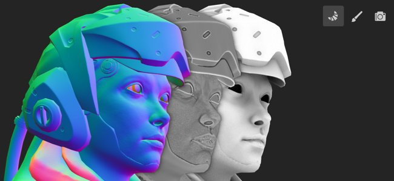

Das alte Baking wurde durch einen speziellen Modus mit mehreren neuen Funktionen ersetzt, insbesondere mit Viewport-Visualisierung wie der Anzeige des Käfigs und Abgleichfehlern.

* **Zugriff auf Modi und Wechsel zwischen Modi**\
  Neben den bereits bestehenden Mal- und Rendermodi der Anwendung ist das Baking jetzt ein neuer und separater Modus. Um zum Baking zu gelangen, verwenden Sie einfach das kleine Croissant-Symbol in der kontextbezogenen Symbolleiste. Das Umschalten zwischen den Modi kann auch anders erfolgen: über das Menü &quot;Modus&quot; oder die Tastaturbefehle. Um in einen anderen Modus zurückzukehren, verwenden Sie einfach das entsprechende Symbol des Textursatz (außerdem kann die Schaltfläche **Baking Mesh-Map** in den [Moduseinstellungen](../interface/texture-set/texture-set-settings.md) weiterhin verwendet werden, um in den neuen Modus zu wechseln).

  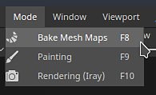

  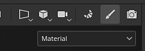

* **Neue Modusschnittstelle**\
  Das herkömmliche Baking wurde in einen Modus mit eigens dafür vorgesehenen Docks transformieren, insbesondere:

  * Die **Textursatz-Liste** kann verwendet werden, um zu definieren, welche Teile des Projekts Baking geführt werden.
  * **Mesh-Map Baker** ermöglicht die Auswahl zwischen den allgemeinen Baking- und Baker-Einstellungen. Hier können Sie auch angeben, welcher Baker-Prozess gestartet wird.
  * **Mesh-Map Settings**&quot; ist der Speicherort aller Baker- und allgemeinen Einstellungen und kann je nach Auswahl aus den beiden vorherigen Fenstern geändert werden.
  * **Das Baking führend Protokoll &quot;**&quot; gruppiert verschiedene Informationen zum Baking führend Prozess, insbesondere Fehlermeldungen, neu.
  * **Visualisierung des Bakings**: Dieses Bedienfeld befindet sich im Viewport und steuert verschiedene Optionen für die Anzeige der Meshs mit niedriger und hoher Poly-Zahl.

  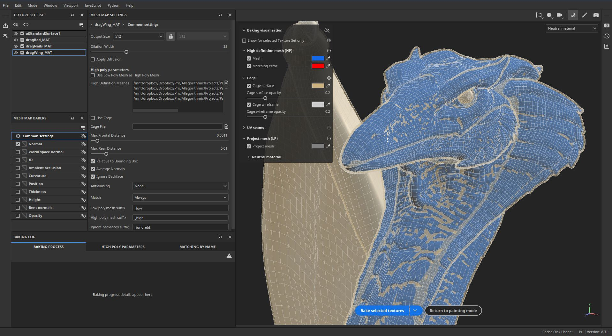{width="500px"}

* **Starten und Abbrechen des Bakings direkt vom Viewport aus**\
  Die Schaltfläche zum Starten oder Abbrechen des Bakings befindet sich jetzt unten im Viewport. Ein kleiner Pfeil kann auch verwendet werden, um den Baking-Modus anzugeben: basierend auf der Auswahl der Textursatz-Liste oder mithilfe des aktuell aktiven Textursatzes.

  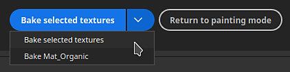

  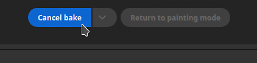

* **Anzeige von Mesh mit hohem Poly-Wert im Viewport**\
  Wenn Sie in den Baking-Einstellungen einen Mesh mit hoher Poly-Intensität angeben, wird dieser nun auch im Viewport geladen (sofern die dedizierte Visualisierungseinstellung nicht deaktiviert ist). Dadurch kann überprüft werden, ob die Geometrie von Low und High-Poly-Mesh gut übereinstimmt.

  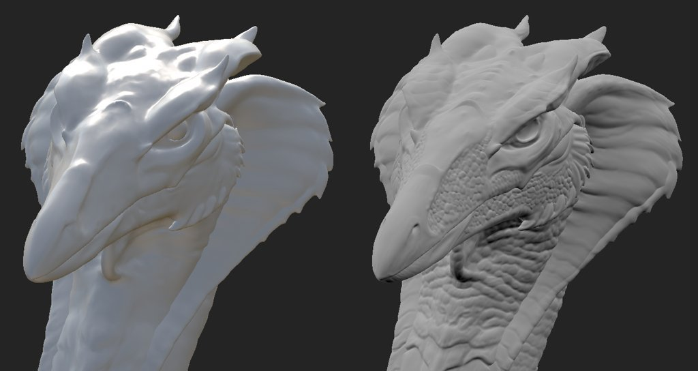{width="400px"}

* **Fehler beim Anzeigen des Käfigs im Viewport mit verpassten Bereichen als Mesh**\
  Der Mesh des Käfigs kann auch im Viewport angezeigt werden. Wenn keine dedizierte Meshdatei verwendet wird, wird stattdessen ein impliziter Käfig angezeigt, der auf den Parameter &quot;Max. Frontalentfernung&quot; reagiert. Wenn Sie die Größe des Käfigs anpassen, wird jeder Teil des Meshs mit hoher Poly, der sich außerhalb des Käfigs befindet, standardmäßig als rot angezeigt, sodass Sie leicht einen Teil des Meshs finden können, der beim Baking verloren geht.

  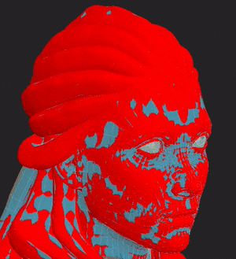

* **Mesh beim Laden und Baking durchsuchen**\
  Das Laden von Meshs und das Baking frieren die Anwendung nicht mehr ein, sodass es möglich ist, während dieser Vorgänge mit dem Viewport zu interagieren. Dies kann nützlich sein, um das laufende Baking zu untersuchen, Probleme frühzeitig zu erkennen und das Baking abzubrechen, um am Ende Zeit zu sparen. In ähnlicher Weise wird jetzt zuerst der Textursatz im Viewport Baking geführt, der die Ergebnisse in bestimmten Bereichen im Voraus überprüfen kann.

  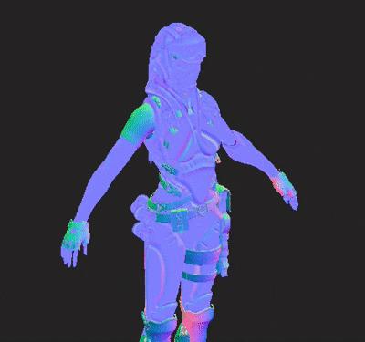

* **Einstellungen für neutrales Material und neutralen Viewport**\
  Um sich auf die Ergebnisse des Bakings zu konzentrieren und gegebenenfalls nach Problemen zu suchen, zeigt der Baking-Modus keine gemalten Texturen an, sondern verwendet stattdessen ein neutrales Material. Die Einstellungen für dieses neutrale Material können im Fenster für die Visualisierung des Bakings im Viewport angepasst werden.

  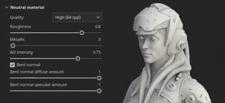

* **Harte Kanten mit fehlenden UV anzeigen**\
  Eine Ursache für Artefakte beim Baking sind harte Kanten, die keine UV-Nähte aufweisen. Das kann zu sichtbaren Linien führen und die Smoothness der Schattierung unterbrechen. Dazu wurden Visualisierungseinstellungen hinzugefügt, um sie sowohl in der 3D- als auch in der 2D-Ansicht hervorzuheben, da sie sonst leicht zu übersehen sind.

  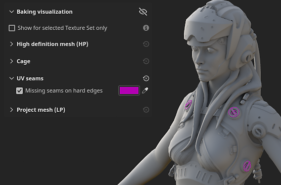{width="450px"}

  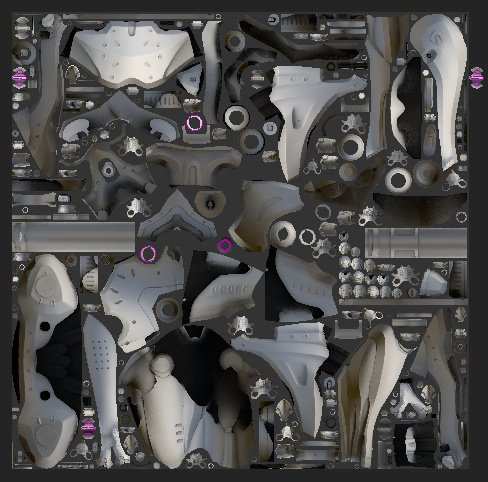{width="300px"}

* **Parameter synchronisieren und nicht synchronisieren**\
  Mit der neuen Synchronisierungsaktion können Sie angeben, welcher Teil der Baking-Einstellungen über Textursatz hinweg synchronisiert werden soll. Andernfalls wäre es mühsam, Einstellungen mehrfach auf identische Weise zu konfigurieren. Manchmal ist es sinnvoll, Textursatz mit dedizierten Einstellungen zu verwenden und diese nicht zu synchronisieren. Wenn Sie z. B. die gemeinsamen Einstellungen getrennt halten, können Sie jetzt eine maximale Frontalentfernung, Auflösung und/oder eine Liste von Meshs mit hoher Poly-Rate verwenden, die sich pro Textursatz unterscheiden würden.

  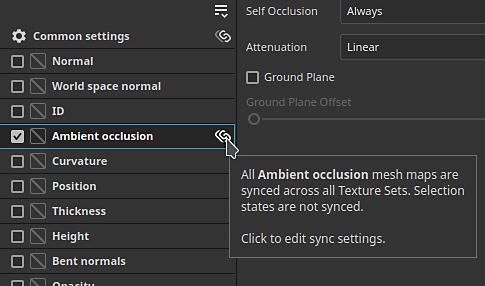{width="400px"}

  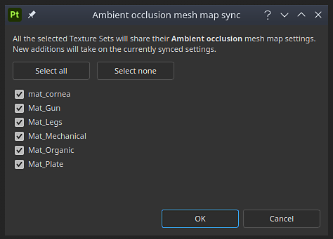{width="400px"}

* **Übereinstimmung mit der Namensüberprüfung**\
  Die Registerkarte &quot;**Zuordnung nach Name**&quot; im **Fehlerprotokoll** kann beim Finden von Baking im Zuordnungsvorgang vor dem Baking helfen, sodass Mesh, die nicht übereinstimmen, leichter erkannt werden. Zugehörige Mesh werden gruppiert, andere werden isoliert und in Rot dargestellt.

  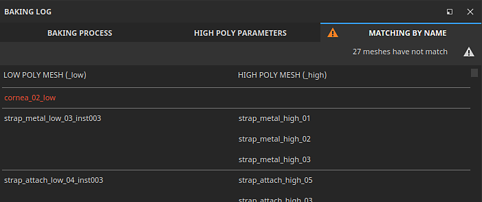{width="450px"}

>[!NOTE]
>
> Es gibt viele weitere neue Einstellungen in diesem neuen Modus. Weitere Informationen finden Sie auf der [Seite zur dedizierten Dokumentation](../baking/baking.md).

### Neuer Import und Export von USD

Mit dieser neuen Version wird die Unterstützung des Dateiformats [Universal Scene Description (USD)](https://graphics.pixar.com/usd/release/intro.html) hinzugefügt. Es ist jetzt möglich, ein Painter-Projekt zu starten und Mesh und Texturen in einem USD zu exportieren, was einen konsistenteren Workflow über Anwendungen hinweg ermöglicht.

* **Importieren Sie USD Datei mit Varianten, Skinning und in einem bestimmten Rahmen**\
  Ein USD Dateiformat kann verwendet werden, wenn ein Projekt erstellt oder ein Mesh innerhalb eines Projekts erneut importiert wird. USD-Dateien können häufig komplexe Szenen sein. Daher sind ein Selektor für Gültigkeitsbereiche und Varianten verfügbar, mit dem nur eine Teilmenge der Datei importiert werden kann.

  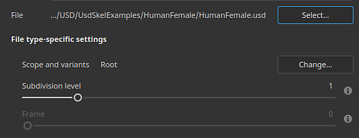{width="400px"}

  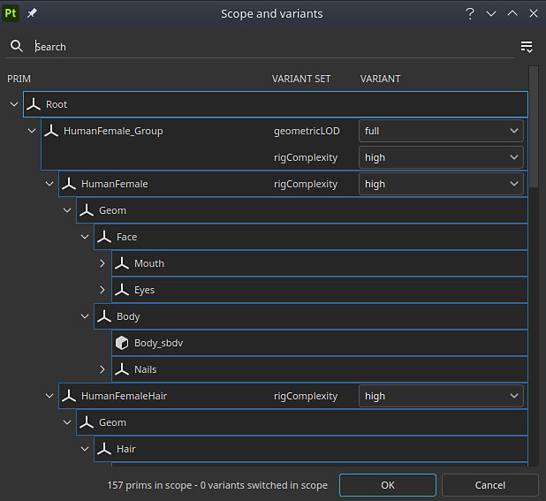{width="400px"}

* **USD als neue Datei exportieren oder mit der im Projekt verwendeten USD verknüpft sind**\
  Wenn die Texturierung fertig ist, können Sie das Fenster &quot;**Datei&quot; > &quot;Texturen exportieren**&quot; verwenden, um die USD neben den Texturen zu exportieren. Aktivieren Sie dazu einfach die Einstellung **USD Asset exportieren**. Dadurch werden mehrere USD generiert, die anschließend einfach in eine Pipeline integriert werden können. Wenn Sie eine Nicht-USD-Datei oder eine USD-Datei ohne UVs verwendet haben, wird dadurch eine neue USD-Geometriedatei zusätzlich zu Textur-Maps und USD Material-Datei exportiert.\
  Darüber hinaus ist es auch möglich, den Mesh **Datei > Exportieren** zu verwenden, um die Projektgeometrie als USD zu exportieren.

  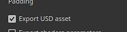

  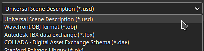{width="400px"}

### Verbesserte Unterstützung der Physische Größe im UV-Modus

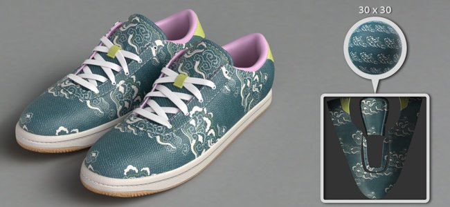

Die Unterstützung von Substance-Materialien mit eingebetteten Physische Größen wurde auf UV-basierte Projektionen erweitert.

* **Physische Größe im UV-Modus**\
  Es ist jetzt möglich, den Skalierungsmodus in den Füllebene- und Fülleffekten im UV-Projektion-Modus auf &quot;Physische Größe&quot; anstatt auf &quot;Kachelung&quot; festzulegen. Die Größe der UV wird automatisch anhand der Durchschnittsgröße der Dreiecke aus der entpackend UV berechnet.

  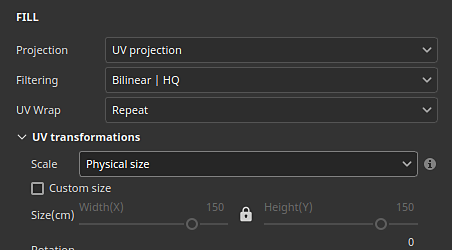{width="400px"}

* **Automatisch zur Physische Größe wechseln** Es wurde eine neue Projekteinstellung hinzugefügt, um die Skalierungseinstellung beim Erstellen eines Materials automatisch auf Physische Größe festzulegen (z. B. beim Ziehen und Ablegen einer Ressource für das Elementfenster). Dies ermöglicht die Verwendung konsistenter Größen in einem Projekt, ohne dass Sie bei jeder Erstellung einer neuen Füllebene die Einstellungen manuell ändern müssen. Um sie in einem bestehenden Projekt zu aktivieren, gehen Sie zu **Bearbeiten > Projektkonfiguration** und aktivieren Sie **Skalierung der Füllebene auf Physische Größe umschalten, wenn Materialien zugewiesen werden**. Diese Einstellung kann auch beim Erstellen eines neuen Projekts aktiviert werden.

  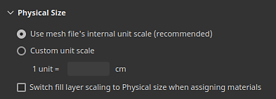

## Informationen zur Plattformunterstützung

Mit dieser Version haben wir die mindestens unterstützte Version von Painter auf Steam auf Ubuntu 20.04 erhöht.

## Tutorials

Im neuesten Tutorial erfahren Sie mehr über den neuen Baking-Modus:

## Versionshinweise

*(Freigegeben: 10. Januar 2023)*\
Zusammenfassung: **Hauptversion mit neuem Importmodus, neuem Baking und Export von USD und Physische Größe-Unterstützung für UV-Projektion**

**Hinzugefügt:**

* [Baking führend Modus] Neuer Baking führend Modus, der dem Baking führend Prozess gewidmet ist
* [Baking-Modus] Stellen Sie den Tastaturbefehl so ein, dass er in den Baking-Modus auf F8 wechselt.
* [Baking-Modus] Hinzufügen der Schaltfläche &quot;Start&quot; und &quot;Baking abbrechen&quot; im Viewport
* [Baking führend Modus] Hinzufügen einer Baking führend Auswahl zur Liste der Textursatz
* [Baking-Modus] Fenster &quot;Neue Mesh-Map-Baker hinzufügen&quot;, um Baker auszuwählen
* [Baking Mode] Neues Mesh-Map-Einstellungsfenster hinzufügen, um Baking-Einstellungen zu bearbeiten
* [Baking führend Modus] Neues Baking führend Protokollfenster hinzufügen, um dem Baking führend Prozess zu folgen
* [Baking Mode] Hinzufügen von Baking-Parametern und Rückgängigmachen von Aktionen zum Verlaufsfenster
* [Baking führend Modus] Hinzufügen von Breadcrumbs in den Mesh-Map-Einstellungen
* [Baking-Modus] Hinzufügen von Mesh-Map-Miniaturansichten im Fenster &quot;Mesh-Map Baker&quot;
* [Baking Mode] Menü &quot;Visualisierungseinstellungen hinzufügen&quot; im 3D-Viewport
* [Baking Mode] Fügen Sie eine Visualisierungseinstellung hinzu, um den Mesh mit der hohen Poly-Dichte ein- bzw. auszublenden.
* [Baking Mode] Fügen Sie eine Visualisierungseinstellung hinzu, um den Käfig Mesh und Drahtgitter ein- bzw. auszublenden
* [Baking Mode] Fügen Sie eine Visualisierungseinstellung hinzu, um den Mesh mit geringer Poly-Zahl ein- bzw. auszublenden.
* [Baking Mode] Fügen Sie eine Visualisierungseinstellung hinzu, um harte Kanten ohne UV-Nähte als Fehler anzuzeigen.
* [Baking Mode] Informieren Sie im Viewport über Mesh- und Baking-Fehler, wenn das Baking Log nicht angezeigt wird.
* [Baking-Modus] Aktion hinzufügen, um die Baker-Einstellungen auf allen Textursätzen zu synchronisieren

  Im Fenster &quot;Mesh-Map-Baker&quot; kann jeder Baker (sowie die allgemeinen Einstellungen) über Textursatz hinweg synchronisiert werden, indem Sie auf das Verknüpfungssymbol neben dem Namen klicken. Dadurch wird ein Fenster geöffnet, in dem Sie auswählen können, welche Textursatz dieselben Parameter verwenden sollen.
* [Baking führend Modus] Hinzufügen von Aktionen zum Kopieren und Einfügen von Baker-Einstellungen

  Im Fenster &quot;Mesh-Map-Baker&quot; stehen Aktionen zum Kopieren und Übergehen der einzelnen Baker-Einstellungen über Textursätze hinweg zur Verfügung, entweder über das spezielle Menü am oberen Fensterrand oder über das Kontextmenü mit der rechten Maustaste.
* [Fehlermodus] Schaltfläche &quot;Hinzufügen&quot; im Fehlerprotokoll, um von den Baking zu den richtigen Baking zu springen

  Wenn ein Baker fehlschlägt oder ein Mesh nicht ordnungsgemäß geladen wird, wird im Protokoll eine Fehlermeldung Baking geführt. Mit einer Schaltfläche neben der Meldung können Sie das Fenster Mesh-Map-Baker und Mesh-Map-Einstellungen ändern, um die entsprechenden Einstellungen anzuzeigen. Dies hilft dabei, die Ursache eines Problems einfacher zu isolieren, um es beheben zu können.
* [Baking-Modus] Hinzufügen von Menüs zum Verwalten von Textursätzen und Auswahl von Bakern

  Sowohl im Fenster &quot;Textursatz-Liste&quot; als auch im Fenster &quot;Mesh-Map-Baker&quot; wurde ein kleines Aktionsmenü hinzugefügt, um das Kopieren und Umkehren von Auswahlen zu unterstützen.
* [Baking-Modus] Auswahlliste für geteilte Baker pro Textursatz
* [Baking-Modus] Gemeinsame Einstellungen pro Textursatz teilen
* [Baking-Modus] Lädt Meshs mit hohem Poly- und Käfig, ohne die Benutzeroberfläche einzufrieren
* [Baking-Modus] Verwenden Sie die Fortschrittsleiste des Viewports, um das Laden des Meshs anzuzeigen
* [Baking Mode] Fügen Sie den Ladestatus des Meshs im Baking-Protokoll hinzu
* [Baking-Modus] Ermöglicht das Umkehren von Mesh im Viewport während des Bakings
* [Baking Mode] Legt die Reihenfolge des Bakings auf der Grundlage der Sichtbarkeit des aktuellen Meshs für den Viewport fest.
* [Baking-Modus] Anzeige des impliziten Baking führend Käfigs im Viewport

  Wenn keine benutzerdefinierte Käfig-Meshdatei verwendet wird, wird ein automatischer Käfig-Mesh generiert und im Viewport angezeigt. Die Größe basiert auf dem Parameter &quot;Max. Frontalentfernung&quot; aus den allgemeinen Einstellungen des Bakings. Mit dem Mesh &quot;Käfig&quot; wird angegeben, wie weit die Anpassung zwischen dem niedrigen und dem hohen Poly-Wert gehen wird.
* [Baking-Modus] Anzeigen einer übereinstimmenden Liste von Mesh-Namen für &quot;Matching By Name&quot; im Baking-Protokoll
* [Modellmodus] Verwenden Sie neutrales Material, um das 3D-Baking im Viewport anzuzeigen.
* [Baking-Modus] Deaktivieren der Engine-Berechnung im Baking-Modus
* [Baking führend Modus] Beim Beenden der App während eines laufenden Baking wird eine Warnung angezeigt
* [Baker] Aktualisieren der Beschriftungen für Anti-Aliasing-Einstellungen

  Die Einstellungswerte für das Anti-Aliasing wurden in &quot;Supersampling&quot; umbenannt und mit einer expliziten Multiplikatornummer versehen, um das Verhalten zu verdeutlichen.
* [Baker] Aktualisieren Sie die Baker auf Version 2.5.7.
* [USD] Importieren und Exportieren von Universal Scene Description (USD)-Dateien
* [USD] Hinzufügen USD Optionen zum Fenster &quot;Neues Projekt&quot; bei Auswahl einer USD
* [USD] Neues Auswahlfenster für Umfang und Varianten hinzufügen

  Wenn Sie eine USD-Datei importieren, können Sie durch Klicken auf die Schaltfläche &quot;Ändern&quot; im Fenster &quot;Neues Projekt&quot; oder &quot;Projektkonfiguration&quot; auswählen, welche Teile und Varianten einer USD-Datei importiert werden sollen.
* [USD] Option &quot;Unterteilungsebenen hinzufügen&quot;

  Beim Erstellen eines neuen Projekts mit einer USD Meshdatei, die Unterteilungen enthält, ist es möglich, die Ebene der Unterteilungen mithilfe eines Schiebereglers auszuwählen. Das Projekt wird mit dem unterteilten Mesh erstellt. Die Ebene kann über die Projektkonfiguration geändert werden.
* [USD] Importieren USD Meshs mit Skin in einem bestimmten Rahmen

  Wenn Sie ein neues Projekt mit einer USD Meshdatei erstellen, die eine Animation enthält, können Sie den Rahmen mithilfe eines Schiebereglers auswählen, der die eingebettete Timeline-Sequenz widerspiegelt. Der Rahmen kann über die Projektkonfiguration modifiziert werden.
* [USD][Exportieren] Fügen Sie eine Option zum Exportieren USD Dateien hinzu.

  Das neue Kontrollkästchen &quot;USD exportieren&quot; wurde dem Fenster &quot;Texturen exportieren&quot; hinzugefügt. Wenn diese Option aktiviert ist, können USD sowie Textur Maps mit einer beliebigen Vorlage exportiert werden.
* [USD][Exportieren] Fügen Sie USD Dateiformat zum Mesh-Export hinzu.
* [USD] Benennen Sie die vorhandene Exportvorgabe &quot;USD PBR Metal Rauheit&quot; um, um ein expliziteres Format zu erhalten.

  Die USD Exportvorlage, die zuvor als &quot;USD PBR Metal Rauheit&quot; bezeichnet wurde, ist weiterhin über &quot;Texturen exportieren&quot; > &quot;Ausgabevorlage&quot; > &quot;USDz&quot; (Apple AR) verfügbar.
* [Automatisch Entpackt] Ausrichtung der Sperre für Packing hinzufügen

  Neue Option für Einstellungen für den automatischen entpack, mit der die Ausrichtung bestehender UV-Inseln beibehalten werden kann, wenn die Funktion &quot;Packing&quot; verwendet wird. Der Zugriff darauf erfolgt über &quot;Neues Projekt&quot; > &quot;Optionen für Automatisches Entpacken&quot; > &quot;Ausrichtung der UV-Insel&quot;.
* [Physische Größe] Fügen Sie eine Einstellung hinzu, um die Physische Größe automatisch in Fülleffekt/Ebene zu verwenden.

  Eine neue Option zum automatischen Umschalten auf die Skalierung der Physische Größe wurde hinzugefügt, wenn ein Material mit eingebetteter Physische Größe verwendet wird. Sie kann pro Projekt über Neues Projekt oder über Bearbeiten > Projektkonfiguration > Physische Größe > Füllebene-Skalierung auf Physische Größe umschalten, wenn Materialien zugewiesen werden, aktiviert werden.
* [Physische Größe] Physische Größe für UV-Projektion Gelegt

  Die Skalierung der Physische Größe ist jetzt für UV-Projektionen verfügbar - sie aktiviert die automatische Größenänderung für ein Material basierend auf der Physische Größe eines Meshs. Sie kann über &quot;Skalieren > Physische Größe&quot; im Fenster &quot;Füllebene&quot; oder &quot;Effekteigenschaften&quot; ausgewählt werden.
* [Scripting][Python] Abfrage der Anwendungsversion zulassen
* [Scripting][JavaScript] Update-API für neue Baking-Parameter
* [Scripting][Python] Baking-Modul: Bearbeiten der Parameter für das Baking
* [Scripting][Python] Baking-Modul: Baking starten/abbrechen
* [Scripting][Python] Baking-Modul: Methode der selektierten Krümmung
* [Scripting][Python] Baking-Modul: Auswahl von Bakern/UV-Kacheln
* [Scripting][Python] Baking-Modul: Baker-Einstellungen auf allen Textursätzen synchronisieren
* [SVT] Aktivieren der Unterstützung für wenig Hardware auf AMD-GPUs

  Die Hardwarebeschleunigung für das Dünn besetzte virtuelle Textur-System kann jetzt mit AMD-GPUs aktiviert werden. Diese Einstellung wird in den allgemeinen Voreinstellungen automatisch aktiviert.
* [Projektion] Parameter für zylindrische Projektion umbenennen

  Der Parameter &quot;Cylinder Cap Culling&quot; wurde in &quot;Rückseiten-Ausblendung&quot; umbenannt, um seine Wirkung besser darzustellen. Die zugehörige QuickInfo wurde entsprechend angepasst.
* [Project] Speichern Sie die Anwendungsversion im Projekt und rufen Sie sie über Skripterstellung ab.

  Seit Version 8.2 wird die Version der Anwendung beim Speichern in der spp-Datei gespeichert.\
  Diese Versionsnummer kann mit der Funktion last\_saved\_substance\_painter\_version() im Projektmodul der Python-API abgerufen werden.\
  Für Projekte, die vor 8.2 erstellt wurden, ist der zurückgegebene Wert null.
* [Import] Verbessern der allgemeinen Importzeit von 3D-Modellen

  Wir haben die allgemeine Importzeit von Meshs verbessert. Zum Beispiel die Verkürzung der Wartezeit beim Laden von High-Poly-Meshs zum Baking. Diese Optimierung gilt insbesondere für das Laden von OBJ.

**Fest:**

* [Absturz] Ändern von Kanälen bei Filtern mit bestimmtem Stapel
* [Mac][M1] Absturz beim Erstellen einer Füllebene und beim Verlassen des Ebenenstapels

  Dieses Problem kann durch Aktualisieren auf Mac OS 13 (Ventura) behoben werden.
* [Scripting][Python] Absturz bei Verwendung von ui.add\_dock\_widget() mit falschem Typ
* [Baking] Unvollständige Fehlermeldung im Protokoll, wenn ein Baking fehlschlägt
* [Baking] Speicher wird nach Abschluss des Bakings nicht freigegeben
* [Engine] Texturen-Cache wird nicht aktualisiert, wenn die Effektsichtbarkeit geändert wird
* [Export] 2DView exportiert zufällig einheitliche Karte
* [Projekt] Speicherzuordnungsfehler beim Speichern eines Projekts mit großem Mesh
* [Viewport] TAA verursacht Artefakte beim Malen in einigen Fällen

**Bekannte Probleme:**

* [Farbmanagement] HDR. Farbraumkonvertierungen mit ACE unter Linux erzeugen festgeklemmte Farben
* [Ebenenstapel] Eingabequelle nicht pro Ebene gespeichert
* [Exportieren] 2D-Ansicht exportiert zufällig einheitliche Map
