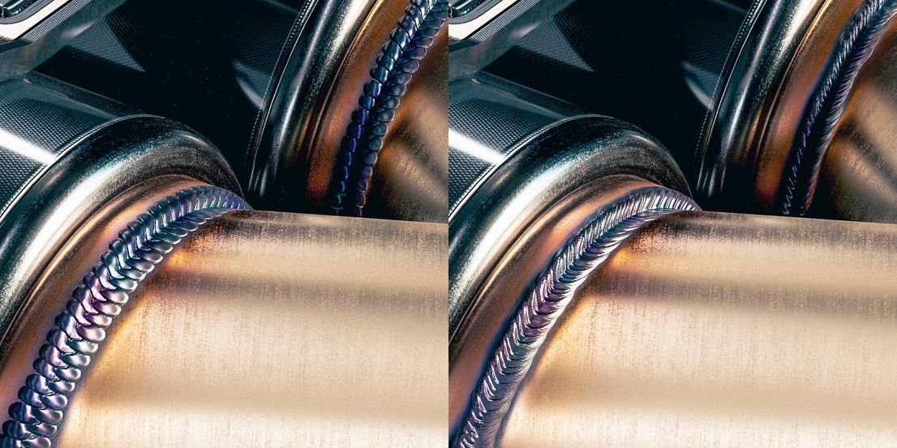

# Version 9.0

<b>Substance 3D Painter 9.0</b> bietet eine neue Möglichkeit zum Malen von Strichen mit einem erneut bearbeitbaren Pfad im 3D-Viewport sowie aktualisierte Standardinhalte.

Freigabedatum: *20. Juni 2023*

## Wichtigste Funktionen

### Neue entlang des Pfades im 3D-Viewport malen

Das Werkzeug <b>entlang Pfad malen</b> ist eine neue Möglichkeit zum Malen von Strichen im 3D-Viewport. Wie in anderen Anwendungen können Sie Bézier-basierte Kurven erstellen, die durch Punkte auf der Oberfläche Ihres 3D-Objekts gesteuert werden, um Muster zu zeichnen. In Kombination mit Substance-Materialien eröffnet dieses neue Tool viele neue Möglichkeiten.

* <b>Neues Werkzeug zum Erstellen von Pinselstrichen, die von einem Pfad mit Punkten gesteuert werden</b>\
  In der Werkzeugleiste des Werkzeugs befindet sich ein neues Symbol, das dem Pfad-Werkzeug gewidmet ist. Mit diesem neuen Werkzeug können Sie Kurven auf der Oberfläche des 3D-Modells zeichnen, um Malstriche zu erstellen. Diese Konturen können immer erneut bearbeitet werden. Wenn das Werkzeug aktiv ist, klicke einfach auf die Gitteroberfläche, um einen Punkt hinzuzufügen. Klicken Sie auf einen vorhandenen Punkt und drücken Sie die Löschtaste, um ihn zu entfernen.

  

  
* <b>Punkte auf der Gitteroberfläche ziehen und verschieben</b>\
  Um die Form eines Pfades zu bearbeiten, klicken und ziehen Sie einfach einen Punkt, um ihn entlang der Oberfläche des 3D-Moduls zu verschieben.

  
* <b>Pfad schließen, um nahtlose Muster zu erstellen</b>\
  Der Pfad kann auch geschlossen werden, um Schleifen zu erstellen. Dies kann nützlich sein, um sich wiederholende Muster um bestimmte Bereiche herum zu erstellen, z. B.

  

  
* <b>Pfade (und ihre Eigenschaften) mit dem Pfadbedienfeld erneut bearbeiten</b>\
  Wenn das Pfadwerkzeug ausgewählt ist, werden die Pfade, die innerhalb der aktuellen Malebene erstellt wurden, im speziellen Pfadbedienfeld oben im 3D-Viewport aufgelistet. In diesem Bereich können Sie Pfade in

  

  
* <b>Kompatibel mit anderen Malfunktionen wie Symmetrie, Geometriemaske, Dynamische Pinselstriche usw.</b>\
  Viele Einstellungen von normalen Malstrichen können mit dem Pfadwerkzeug verwendet werden:

  * Wenn Sie die Symmetrie aktivieren, können Sie einen Pfad mehrmals zeichnen, während Sie nur einen verwalten.
  * Pfad auf einer Ebene mit aktivierter Geometriemaske kann unter verborgener Geometrie malen.

  
* <b>Malen mit anderen Werkzeugen wie Radiergummi oder Verwischen</b>\
  Das Pfadwerkzeug ist auch mit dem Radiergummi- und dem Verwischen-Werkzeug kompatibel, sodass fortschrittlichere Möglichkeiten zum Malen und Kombinieren von Strichen mit der einfachen und erneut bearbeitbaren Möglichkeit zum Bearbeiten von Pfadpunkten verfügbar sind.

  

* <b>Speichern und Wiederverwenden von Pfadeigenschaften mit Vorgaben</b>\
  Wenn Sie das Pfadwerkzeug verwenden, können Sie die Pinseleigenschaften auch als Vorgaben speichern. Dadurch können Werkzeugvorgaben gespeichert werden, die automatisch zum Pfadwerkzeug wechseln, wenn sie im Fenster &quot;Elemente&quot; ausgewählt werden.

>[!NOTE]
>
> Weitere Informationen finden Sie in der [dedizierten Dokumentation](../painting/tool-list/path.md).

### Neue Inhalte für die Funktion &quot;entlang Pfad malen&quot;

In dieser Version wurden einige neue Werkzeugvorgaben hinzugefügt, um die neue Funktion &quot;entlang Pfad malen&quot; zu nutzen:

* Pipe Rack Sci-Fi
* Zusammenziehen
* Nahtstelle
* Topstiching
* Schweißmetall
* Reißverschlussband

### Verbesserte Dynamische Pinselstriche für die Funktion &quot;entlang Pfad malen&quot;

Bei dieser Gelegenheit haben wir mit dem neuen Pfadwerkzeug dem dynamischen Kontursystem neue Eigenschaften hinzugefügt. Diese neuen Eigenschaften ermöglichen neue Arten von Strichen, die vorher nicht möglich waren, wie den Pfeil auf dem Bild, über dem ein anderes visuelles Anfangs- und Endbild zu sehen ist.

* <b>Neue Start-/Mittel-/Endeigenschaft</b>\
  Es kann eine neue Eigenschaft definiert werden, die für das Substance-Diagramm angegeben wird, ob ein Stempel innerhalb einer Kontur der erste, letzte oder ein Stempel in der Mitte ist. So können Start- und Endpunkte erstellt werden, die z. B. zum Erstellen von Reißverschlüssen sehr nützlich sein können. (<b>Hinweis</b>: Der Endstatus ist nur mit dem Pfadwerkzeug verfügbar.)
* <b>Neue Eigenschaft für Größe und Abstand</b>\
  Mit der Eigenschaft &quot;Größe&quot; und &quot;Abstand&quot; kann die Ausgabe eines Substance-Diagramms auf der Grundlage des aktuellen Stempelstatus angepasst werden.
* <b>Neue Konturlängeneigenschaften</b>\
  Der Abstand entlang des Pfades und der maximale Abstand eines Pfades ermöglichen eine bessere Kontrolle, wenn sich einige Effekte wiederholen, anstatt direkt einen normalisierten Wert bereitzustellen.\
  Es ist möglich, sowohl einen Wachstumshub, als auch einen Strich mit einem sich wiederholenden Muster auf der Grundlage der gezeichneten Entfernung (und nicht der Gesamtzahl der gezeichneten Stempel) zu erstellen.

>[!NOTE]
>
> Weitere Informationen finden Sie in der [dedizierten Dokumentation](../painting/dynamic-strokes/creating-custom-dynamic-strokes.md).

### Aktualisierte Standardmaterialien

In dieser Version haben wir uns entschlossen, einige Korrekturen in unserer Bibliothek vorzunehmen. Daher haben wir unsere Standard-Basismaterial geändert, um sie für alle nutzbarer zu machen. Diese Materialien wurden von demselben Team erstellt, das Inhalte auf [Substance 3D Assets](https://substance3d.adobe.com/assets) bereitstellt.

>[!NOTE]
>
> Der Inhalt, der entfernt wurde, ist auf [Substance 3D Community Assets](https://substance3d.adobe.com/community-assets?q=painter23update&u=painter23update) verfügbar.

## Tutorials

Das neue Pfad-Werkzeug ist in diesem Tutorial beschrieben:

## Versionshinweise

### 9.0.0

Freigabedatum: <b>2023/06/20</b>\
Zusammenfassung: <b>Hauptversion mit &quot;Paint along path&quot;, die 3D-Kurven, neue Basismaterialien und das Reinigen älterer Materialien sowie neue Vorgaben für 3D-Kurven ermöglicht</b>

<b>Hinzugefügt:</b>

* [Pfad] Neues Werkzeug &quot;entlang Pfad malen&quot; hinzufügen
* [Pfad] Hinzufügen eines leeren Tastaturbefehls für das Pfadwerkzeug
* [Pfad] Hinzufügen neuer Punkte zu einem vorhandenen Pfad zulassen
* [Pfad] Verknüpfung zum Beenden der aktuellen Pfaderstellung hinzufügen
* [Pfad] Bearbeiten der Pinseleigenschaften für Pfade zulassen
* [Pfad] Automatische Anpassung von Tangenten beim Platzieren eines Punkts
* [Pfad] Tangenten beim Verschieben eines Punkts neu berechnen
* [Pfad] Ausrichten neu erstellter Punkte an der Oberfläche eines Gitters
* [Pfad] Bearbeiten des Drucks pro Scheitelpunkt zulassen
* [Pfad] Anpassen des Drucks des neu erstellten Punkts von benachbarten Punkten
* [Pfad] Umwandeln von Punkten in Übergang/Ecke zulassen (Tangentenumbruch)
* [Pfad] Sofort einen neu hinzugefügten Punkt verschieben
* [Pfad] Punkte aus vorhandenem Pfad entfernen
* [Pfad] Umkehren der Richtung eines Pfads zulassen
* [Pfad] Auswahl eines Pfads im Darstellungsfenster zulassen
* [Pfad] Auswählen von Pfadpunkten mit dem Auswahlrechteck zulassen
* [Pfad] Einführung von STRG+A-Tastaturbefehlen zum Auswählen aller Punkte eines Pfads
* [Pfad] Schließen des Pfads zulassen
* [Pfad] Geben Sie unter &quot;Eigenschaften&quot; den Pfad um die Achse nach oben an.
* [Path] Hinzufügen eines Scheitelpunkt-Steuerungsmenüs zur kontextabhängigen Symbolleiste
* [Pfad] Hinzufügen von Mal-, Lösch- und Verwischen-Modi zum Pfadwerkzeug
* [Pfad] Erstellen von visuellem Feedback für Pfade im Viewport
* [Pfad] Hinzufügen eines visuellen Indikators für die Pfadrichtung
* [Path] Hinzufügen der Thickness zu den Anzeigeeinstellungen des Pfads
* [Path] Pfade ausblenden - Benutzeroberfläche
* [Pfad] Bedienfeld &quot;Pfad hinzufügen&quot; zur Liste der Pfade der aktuell ausgewählten Ebene
* [Pfad] Fügen Sie visuelles Feedback hinzu, wenn Sie den Mauszeiger über einen Pfad im Pfadbedienfeld bewegen
* [Pfad] Pfadbedienfeld anzeigen, wenn das Pfadwerkzeug ausgewählt ist
* [Pfad] Umbenennen, Löschen, Kopieren, Ausschneiden und Duplizieren von Pfaden im Bedienfeld &quot;Pfad&quot; zulassen
* [Pfad] Meldung anzeigen, wenn versucht wird, im 2D-Viewport mit dem Pfad-Werkzeug zu interagieren
* [Library] Integrieren neuer Inhalte (Pfad-Tools und -Basismaterial)
* [Dynamische Pinselstriche] Eigenschaft &quot;Abstand&quot; für Dynamische Pinselstriche hinzufügen
* [Dynamische Pinselstriche] Hinzufügen von Größen- und Abstandseigenschaften zu Dynamischen Pinselstrichen
* [Dynamische Pinselstriche] Hinzufügen der Eigenschaft &quot;Anfang&quot;, &quot;Mitte&quot; und &quot;Ende&quot; für Dynamische Pinselstriche
* [Python][USD] Stellen Sie die Projektkonfigurationsparameter für das USD-Format bereit.
* [Python][USD] Stellen Sie die Projekterstellungsparameter für das USD-Format bereit.
* [Exportieren][USD] Fügen Sie Projektpfadinformationen in die exportierte USD-Datei ein
* [GLTF] Texturen in der Bibliothek beim erneuten Laden einer GLTF-Datei aktualisieren
* [Shader] Reduzieren von Nahtartefakten für UV-Inseln mit unterschiedlicher Ausrichtung
* [Engine] Update auf Substance-Engine Version 9.0

<b>Fest:</b>

* [Importieren] Einige GLB mit Texturen erhalten in Painter keine Texturen
* [AMD] Artefakte an Rändern für alle 3D-Projektionsflächen
* [Engine] Texturen brechen beim Umschalten der Ebenensichtbarkeit ab
* [Engine] Texturen sind an einigen Stellen leer, wenn der Mischmodus geändert wird
* [Engine] Textur/Projektion ist in einigen Fällen leerer Verkrümmungsmodus
* [Iray] Iteration auf 0 zurückgesetzt, wenn Rendering gespeichert wird
* [Protokoll] USD-Fehlermeldung beim Ausführen von Datei > Neu

<b>Bekannte Probleme:</b>

* [Farbmanagement] HDR-Farbraumkonvertierungen mit ACE unter Linux erzeugen festgeklemmte Farben
* [Ebenenstapel] Eingabequelle nicht pro Ebene gespeichert
