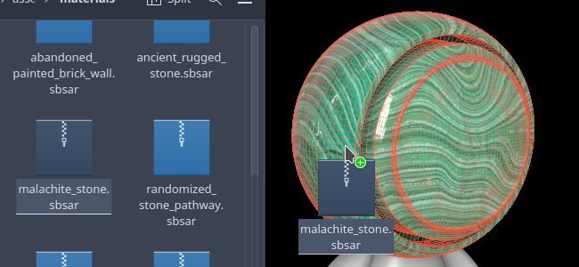
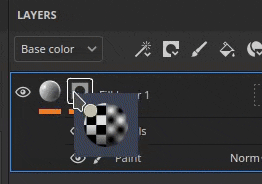

# Version 9.1

<b>Substance 3D Painter 9.1</b> fügt die Tangentensteuerung für das Pfadwerkzeug, die Unterstützung des SVG-Dateiformats, die Möglichkeit zum Importieren und Anwenden von Ressourcen durch Drag &amp; Drop und die Unterstützung für Transparenz im Viewport hinzu.

Freigabedatum: *7. November 2023*

## Wichtigste Funktionen

### Neue Tangentensteuerungen und Verbesserungen für das Pfadwerkzeug

In dieser neuen Version setzen wir die Entwicklung des Pfad-Werkzeugs (eingeführt in Version 9.0) fort, um fehlende Bits und Funktionen hinzuzufügen, die von der Community angefordert wurden.

* <b>Tangenten manuell auf Pfad-Punkte steuern</b>

  Es ist jetzt möglich, die Tangenten eines bestimmten Punktes auf einem Pfad manuell festzulegen. Dies ermöglicht es, das automatische Verhalten zu überschreiben, um neue Formen zu erstellen.

  
* <b>Pfadpunkte über Manipulatoren bearbeiten</b>

  Manchmal reicht es nicht aus, einfach nur Punkte auf der Oberfläche des Objekts zu verschieben. Die Manipulatoren ermöglichen es, Punkte über die Oberfläche hinaus zu verschieben. Dies kann sehr hilfreich sein, um mehrere Punkte gleichzeitig zu verschieben, z. B. wenn sie nach einem erneuten Importieren des Gitters zu weit von einer Oberfläche entfernt waren.

  
* <b>Pfadsichtbarkeit einzeln ein-/ausschalten</b>

  Die Pfadsichtbarkeit kann jetzt über das dedizierte Viewport-Fenster pro Pfad geändert werden. Wenn Sie einen Pfad deaktivieren, werden seine Beiträge aus den endgültigen Texturen entfernt, ohne dass er gelöscht werden muss.

  
* <b>Kopieren und Einfügen von Pfadpositionen und Eigenschaften</b>

  Das Kopieren und Einfügen von Pfaden wurde erweitert, sodass nur Pfadpunktpositionen oder deren Eigenschaften kopiert werden können. Pfade können jetzt auf verschiedene Weise synchronisiert werden, was die Erstellung komplexer Effekte (über die Positionen) oder die gemeinsame Nutzung eines bestimmten Looks an verschiedenen Orten (über die Eigenschaften) erleichtert.

  

  

>[!NOTE]
>
> Weitere Informationen über das Pfad-Tool [finden Sie in der dedizierten Dokumentation ](../painting/tool-list/path.md).

### Neue Unterstützung für Transparenz, Transparenz und Absorption im Viewport

Der Shader <b>Adobe Standardmaterial</b> (ASM), der beim Erstellen eines neuen Projekts der Standard ist, wurde aktualisiert und unterstützt <b>Transparenzeigenschaften</b>, <b>Transparenzeigenschaften</b> und <b>Absorption</b>. Dies bedeutet, dass es jetzt möglich ist, das Ergebnis dieser Rendering-Verhalten im Echtzeit-Viewport (sowie im Iran-Renderer) anzuzeigen.

Authoring-Materialien wie <b>Glas</b>, <b>Laub</b> oder <b>Kunststoff</b> mit einer geringen Absorption an Licht sind jetzt möglich und können direkt im Viewport angezeigt werden. Der Export in andere Substance 3D-Anwendungen führt dank der ASM-Definition ebenfalls zu einem übereinstimmenden Look.

* <b>Neue ASM-Shader-Einstellungen</b>

  Der ASM-Shader wurde aktualisiert, um neue Funktionen zu unterstützen, die über das Fenster [Shader-Einstellungen](../interface/shader-settings/shader-settings.md) geändert werden können:

  * <b>Transparenz</b> (Deckkraft): Es ist nicht mehr notwendig, zu einem anderen Shader zu wechseln, um transparente Oberflächen zu erhalten, wie z. B. Laub. Aktivieren Sie stattdessen den <b>Alphatest</b> oder den <b>Alphamischungs</b>-Parameter unter der Gruppe <b>Geometrie > Deckkraft</b>. Die üblichen Einstellungen, wie z. B. Dithering, sind ebenfalls verfügbar.
  * <b>Transparenz</b>: Mit dieser neuen Eigenschaft können Sie Oberflächen wie Glas erstellen, Formen transparent machen und gleichzeitig die Specular-Reflexionen beibehalten. Um ihn zu verwenden, fügen Sie einen Transparenzkanal in Ihrem Projekt hinzu und aktivieren Sie den Parameter <b>Transluzenz</b> unter der Gruppe <b>Inneres</b>.
  * <b>Absorption</b>: Diese neue Eigenschaft ermöglicht es, Licht zu simulieren, das durch ein Objekt dringt und absorbiert wird, was nützlich sein kann, um Plastik oder Flüssigkeiten auf eine bessere Weise zu simulieren, als mit Volumenstreuung. Um sie zu verwenden, aktivieren Sie die Einstellung &quot;<b>Absorption</b>&quot; unter der Gruppe &quot;<b>Inneres</b>&quot;.
* <b>Verbesserte Benutzeroberfläche für Shader-Einstellungen und QuickInfos</b>

  Mit der Überarbeitung des Shaders haben wir die Gelegenheit genutzt, die Benutzeroberfläche der Parameter zu verbessern und viele neue QuickInfos hinzuzufügen, um leichter zu entdecken, wie man sie aktiviert.

  Die Parameterreihenfolge sollte auch mit der anderer Substance 3D-Software übereinstimmen, was das Hin- und Herschalten beim Ausprobieren der Einstellungen erleichtert.

  
* <b>Neues Beispielprojekt zur Demo des Adobe-Standardmaterials</b>

  Das Bearbeiten der neuen ASM-Eigenschaften kann zunächst schwierig sein. Daher wurde ein neues Beispielprojekt mit mehreren Funktionen des Shaders hinzugefügt, um das Erlernen dieser Eigenschaften zu vereinfachen.

  Dieses Projekt heißt <b>Französischer Restauranttisch</b> und ist über das Menü <b>Datei > Muster öffnen</b> zu finden. Es werden auch viele kleine Tricks verwendet, sodass es eine großartige Lernressource sein kann, um neue Möglichkeiten der Texturierung zu entdecken.

  
* <b>Der Transparenzkanal verwendet jetzt standardmäßig eine schwarze Farbe</b>

  Um die Verwendung der neuen Shader-Eigenschaften zu vereinfachen und unerwartete Ergebnisse im Viewport zu vermeiden, wurde die Standardfarbe der Kanaltransparenz in Schwarz (anstelle von Weiß) geändert.

  Wenn dieser Kanal bereits in Ihrem Projekt verwendet wurde, können Sie das vorherige Verhalten erreichen, indem Sie einfach eine Füllebene am unteren Rand Ihres Ebenenstapels hinzufügen und den Kanalwert auf Weiß festlegen. Sie können die Einstellung <b>Transparenz als Streumaske </b> im Shader-Parameter verwenden aktivieren, um den Beitrag des Kanals auf das Streuergebnis unter der Oberfläche erneut anzuwenden.

### Neue Unterstützung für Vektorgrafikdateien (SVG)

In dieser Version wird die Unterstützung von SVG-Dateien als Ressourcen hinzugefügt, die in Ebenen, Malwerkzeugen usw. verwendet werden können.

SVG-Dateien sind sehr praktisch, um Logos oder Formen präzise darzustellen, während sie sehr leicht sind. In Painter können sie mit einer bestimmten Auflösung gerendert und einfach aktualisiert werden, sodass sie sich perfekt für den nicht-destruktiven Arbeitsablauf eignen.

* <b>SVG-Dateien importieren</b>\
  SVG-Dateien können wie andere Ressourcen in Projekte, Bibliotheken usw. importiert werden. SVG <b> bis Version 1.1</b> kann importiert werden, Funktionen aus neueren Versionen werden nicht unterstützt.

  Der Import wurde auch in dieser Version erleichtert (siehe unten), sodass die Verwendung von SVG-Dateien einfach durch Ziehen und Ablegen von Ressourcen von außerhalb von Painter direkt auf das Gitter oder den Ebenenstapel erfolgen kann.
* <b>Dedizierte SVG-Einstellungen</b>\
  Wenn Sie eine SVG-Ressource verwenden, sind einige Einstellungen verfügbar, um das Aussehen zu steuern:

  * <b>Auflösung</b>: verwenden, entweder einen automatischen Wert, einen in der Datei definierten Wert oder einen benutzerdefinierten Wert.
  * <b>Zuschneidebereich</b>: , um den spezifischen Bereich der zu verwendenden SVG-Arbeitsfläche zu definieren.
  * <b>Umfang</b>: , um den gesamten Inhalt der SVG oder nur einige Elemente auszuwählen.

  
* <b>Neue Materialien für SVG</b>

  3 neue Ressourcen wurden hinzugefügt, um die Verwendung von SVG-Dateien bei der Texturierung zu unterstützen:

  * <b>Benutzerdefinierte Sprühfarbe</b>: ermöglicht die Simulation eines Aufklebers, der von einem einzigen Eingabebild auf eine Wand gemalt wird.
  * <b>Benutzerdefinierter Aufkleber</b>: , um einen Plastikaufkleber auf einer Oberfläche zu erstellen. Es verfügt über mehrere Einstellungen, um Beschädigungen und Falten zu simulieren.
  * <b>Grafik zu Material</b>: ermöglicht die Erstellung mehrerer Materialeigenschaften aus einer einzigen Bildeingabe. Diese Ressource wird automatisch eingefügt, wenn Sie eine SVG-Datei per Drag &amp; Drop in den Viewport ziehen. Diese Ressource bietet eine einfache Möglichkeit, die Transparenz der Eingabe über mehrere Kanäle zu teilen, sodass sie perfekt für einfache Aufkleber geeignet ist.

  

  

>[!NOTE]
>
> Weitere Informationen über das SVG-Format und die Einstellungen finden Sie in [der dedizierten Dokumentation](../painting/vector-graphic-svg.md).

### Neuer Import von Ressourcen per Drag &amp; Drop

Diese Version ermöglicht es, eine externe Datei per Drag &amp; Drop in verschiedene Kontexte der Anwendung zu ziehen, um automatisch eine Ressource zu importieren und zu verwenden. Mit diesem neuen Prozess können Sie mühsame Schritte beim Importieren von Dateien überspringen.

* <b>Importieren per Drag &amp; Drop in den Viewport</b>

  Ziehe eine externe Datei in den Viewport, um sie direkt im Gitter zu platzieren. Dadurch wird automatisch eine neue Ebene erstellt. Je nach Art der Ressource (Bild, Substance, Substance-Filter usw.) wird das Ergebnis entsprechend angepasst.
* <b>Importieren durch Ziehen und Ablegen in den Ebenenstapel</b>\
  Genauso wie es möglich ist, externe Ressourcendateien im Viewport abzulegen, können durch das Ablegen von Dateien im Ebenenstapel direkt Ebenen oder Effekte mit der Ressource darin erstellt werden.
* <b>Importieren durch Ziehen und Ablegen in einen Ressourcensteckplatz</b>

  Es ist auch möglich, eine Ressource direkt in eine Ebene oder ein Werkzeug zu importieren. Wenn bereits eine Füllebene oder ein Effekt mit der richtigen Einstellung vorhanden ist, legen Sie einfach eine externe Datei in einen der Kanalsteckplätze des Eigenschaftenfensters ab, um sie zu importieren und anzuwenden.

>[!NOTE]
>
> Weitere Informationen zum Importieren von Ressourcen [finden Sie in der dedizierten Dokumentation ](../content/importing-assets/import-drag-and-drop.md).

### Neue Verhalten beim Ziehen und Ablegen von Ressourcen

Verbesserungen beim Ziehen und Ablegen sind nicht auf den Import von Ressourcen beschränkt. Das Ziehen und Ablegen einer Ressource aus dem Fenster &quot;Elemente&quot; kann jetzt verwendet werden, um im Handumdrehen neue Ebenen, Effekte und sogar Masken zu erstellen.

* <b>Ziehen und Ablegen vieler Ressourcentypen</b>

  Es ist jetzt möglich, Ressourcen-Typen per Drag-and-Drop direkt in den Viewport oder den Ebenenstapel zu ziehen. Der folgende Ressourcentyp kann jetzt per Drag &amp; Drop (fast) an eine beliebige Stelle verschoben werden:

  * Alphas
  * Texturen
  * Prozedurale
  * Materialien
  * Intelligente Materialien
  * Smart-Masken
  * Generatoren
  * Filter
  * Umgebungskarten
* <b>Ressourcen als neue Ebene oder als neuen Effekt ablegen</b>

  Wenn Painter auswählt, wo eine Ressource abgelegt wird, erstellt es automatisch eine neue Ebene oder einen neuen Effekt:

  
* <b>Auswählen zwischen dem Effektstapel &quot;Inhalt&quot; oder &quot;Maske&quot; beim Ziehen\
  </b>

  Wenn du eine Ressource über eine Miniaturansicht ziehst, wechselt Painter automatisch zu den zugehörigen Effektstapeln. Danach ist es sehr einfach, die Ressource an einer bestimmten Position in diesem Stapel abzulegen. Dadurch müssen Sie nicht vorher zum richtigen Stapel wechseln.

  
* <b>Neue schwarze Maske im Flug erstellen</b>

  Beim Ziehen einer Ressource wird auf einer beliebigen Ebene ohne Maske ein neues Symbol angezeigt. Wenn eine Ressource auf dieser Geistermaske abgelegt wird, wird automatisch eine neue Maske erstellt und die neue Ressource hinzugefügt. Auf diese Weise können Sie schnell eine neue Maske einrichten und das Ziehen und Ablegen abbrechen, um sie manuell hinzuzufügen.

  
* <b>Im Darstellungsfenster neue Ebenen erstellen</b>

  Ziehen und Ablegen von Ressourcen kann auch im Ansichtsfenster durchgeführt werden, um neue Ebenen zu erstellen. Je nach Typ der Ressource kann sich das Ergebnis ändern. Ein Filter erstellt eine Malebene im Durchlaufmodus, während eine Smart-Maske eine Füllebene mit einer neuen Maske erstellt.

  

  
* <b>Tastenmodifikatoren für erweiterte Verhaltensweisen verwenden</b>

  Wenn Sie beim Ablegen einer Ressource den Tastaturmodifizierer STRG oder ALT beibehalten, können zusätzliche Verhalten aktiviert werden:

  * <b>STRG</b> beim Ablegen im <b>Ebenenstapel</b>: Erstelle eine neue Ebene mit der Ressource in einer schwarzen Maske. kann nützlich sein, um ein Material in eine Maske zu zwingen, zum Beispiel. Oder überspringen Sie das Dropdown-Menü mit einem Alpha-Zeichen.
  * <b>ALT</b> beim Ablegen im <b>Ebenenstapel</b>: Gilt nur, wenn Sie über eine Ebenenminiatur legen. Mit ALT werden alle vorherigen Effekte entfernt. So können Sie schnell verschiedene Ressourcen ausprobieren, insbesondere intelligente Masken, ohne sie vorher manuell entfernen zu müssen.
  * <b>STRG</b> beim Ablegen im <b>Ansichtsport</b>: Erstelle eine neue Ebene mit der Ressource in einer schwarzen Maske. Die Ressource wird unter einem <b>Farb-ID-Auswahl</b>-Effekt platziert, der auf der Grundlage der im Viewport vorgenommenen Auswahl festgelegt wird.
  * <b>ALT</b> beim Ablegen im <b>Ansichtsport</b>: Wie zuvor erzwingt dies, dass sich eine Ressource im Decal-Projektionsmodus befindet.

### Verschiedene Verbesserungen

In dieser Version wurden auch einige kleinere Funktionen und Verbesserungen hinzugefügt.

* <b>Verlustfreie Komprimierung von 16-Bit-Bildern</b>

  Ab sofort werden alle Bilder, die in einem Projekt mit einer Bittiefe von 16 enthalten sind, mit einem verlustfreien Algorithmus komprimiert. So können sie ohne Qualitätsverlust komprimiert werden. Außerdem komprimiert die Projektdatei bereits ihre eigenen Daten.

  Diese Änderung zielt hauptsächlich auf <b>Texturen backen</b> ab, was normalerweise der Grund dafür ist, dass Projektdateien auf der Festplatte sehr groß sein können. Im Durchschnitt wurden Projekte auf dem Datenträger um 30 % auf 50 % reduziert</b>.<b>

  Diese Komprimierung wird automatisch angewendet, wenn ein Projekt (alt oder neu) auf Ressourcen gespeichert wird, die noch nicht komprimiert wurden. Das bedeutet, dass für alte Projekte das erstmalige Speichern in dieser neuen Version etwas mehr Zeit in Anspruch nehmen könnte als sonst. Die Zeitersparnis sollte sich wieder normalisieren, sobald dies erledigt ist.
* <b>Neuer UV-Set auf UV-Set-Füllprojektionsmodus </b>

  Ein neuer Projektionsmodus für Füllebenen/Effekte wurde mit dem Namen <b>UV set to UV set projection</b> hinzugefügt. Sie kann verwendet werden, um eine Textur basierend auf verschiedenen UVs, die im Gitter im Projekt verfügbar sind, zu projizieren. Es kann verwendet werden, um eine fortschrittlichere Texturübertragung durchzuführen, ohne auf externe Tools angewiesen zu sein.

  <b>UV-Satz 0</b> ist der standardmäßige UV, der von Painter zum Malen verwendet wird. Wenn zusätzliche UV-Sätze verfügbar sind, sind sie in der Dropdown-Liste in der Einstellung <b>Quelle</b> verfügbar:

  
* <b>Temporale Anti-Aliasing ist standardmäßig für jedes neue Projekt aktiviert</b>

  Beim Erstellen eines neuen Projekts ist die Einstellung <b>Temporale Anti-Aliasing</b>, die im Fenster Anzeigeeinstellungen verfügbar ist, jetzt standardmäßig aktiviert, um die Qualität des Renderings im Viewport zu verbessern.
* <b>Neue Python-API-Verbesserungen</b>

  Die Python-API hat in dieser Version einige Ergänzungen erhalten:

  * Painter kann mit der neuen <b>substance\_painter.application.close() </b>-Funktion über Python geschlossen/heruntergefahren werden.
  * Die Hauptkamera des Ansichtsports kann jetzt über die API geändert werden. Dazu gehören Position, Drehung, aber auch andere Eigenschaften wie Blickfeld, Blende usw. Um die Positionierung der Kamera in Bezug auf das Gitter zu vereinfachen, zeigt die API jetzt auch den Begrenzungsrahmen der Szene an.
  * Das Exportieren des Projektgitters, mit Triangulation oder nicht und Versatz oder nicht, ist jetzt über das Exportmodul möglich.
  * Der Pfad für Projektexporttexturen kann jetzt auch von der API abgerufen werden.
* <b>Neuer Versand an After Effects (Beta)</b>

  Es ist eine neue Aktion zum Senden an verfügbar, mit der ein Gitter und seine Textur in After Effects exportiert werden können, sodass Sie visuelle Effekte bequem iterieren können. Für diese Funktion ist der Zugriff auf die After Effects-Betaversion 24.1 erforderlich.

## Tutorials

## Versionshinweise

### 9.1.0

(Freigegeben: 7. November 2023)\
Zusammenfassung: <b>Hauptversion mit SVG- und Transparenzunterstützung sowie Verbesserungen an Drag-and-Drop- und Pfad-Tools</b>

<b>Hinzugefügt:</b>

* [SVG] Importieren von Vektordateien zulassen (SVG)
* [SVG][UI] Unterstützung für SVG-spezifische Eigenschaften hinzufügen
* [SVG] Fügen Sie eine Option hinzu, um die ursprünglichen Bildproportionen einfach beizubehalten
* [SVG] Automatisches Verwenden von Alpha von SVG mit Transparenz zulassen
* [Interop] Senden eines strukturierten Gitters an After Effects zulassen (Ae 24.1 Beta)
* [Interop] Hinzufügen von Einstellungen für &quot;An After Effects senden&quot;
* [QoL][Assets][UI] Automatisches Importieren von Assets beim Ziehen und Ablegen in einen Steckplatz der Benutzeroberfläche
* [QoL] Zulassen, dass externe Assets in den Ebenenstapel gezogen und abgelegt werden
* [QoL][Ebenenstapel] Ziehen Sie Texturen aus dem Bedienfeld &quot;Elemente&quot; in den Ebenenstapel
* [QoL][Viewport] Generator ziehen und ablegen, Filter auf dem Gitter
* [QoL][Viewport] Zulassen, dass externe Elemente im Gitter abgelegt werden.
* [QoL][Projektion] Hinzufügen eines neuen UV-Satzes zum UV-Satzprojektionsmodus
* [QoL] Ziehen und Ablegen von Smart-Masken als neue Ebenen im Ansichtsfenster und im Ebenenstapel
* [QoL] Hinzufügen eines Selektors für Generatoren mit mehreren Ausgaben, wenn er in der Maske verwendet wird
* [QoL] Einkanalbilder können über einen Fülleffekt gezogen und abgelegt werden.
* [QoL][Ebenenstapel] Verwenden Sie STRG/ALT-Modifizierer mit Drag &amp; Drop, um anzugeben, wo/wie Effekte/Ebenen erstellt werden
* [Pfad] Umschalten der Pfadsichtbarkeit einzeln im Pfadbedienfeld
* [Pfad] Verwenden von Transformationsmanipulatoren für Pfadpunkte zulassen
* [Pfad] Tangenten pro Scheitelpunkt können manuell gesteuert werden.
* [Pfad] Kopieren/Einfügen von Pfadeigenschaften
* [Pfad] Einfügen eines leeren Tastaturbefehls für die Schaltfläche &quot;Tangente unterbrechen&quot;
* [Shader] Unterstützung für Deckkraft und Transparenz in ASM-Shader hinzufügen
* [Shader] Unterstützung für Absorptionsfarbe Channel mit ASM Shader hinzufügen
* [Shader] Verbessern von ASM-Shader-Parametern - QuickInfos
* [Shader] Ändern der Standardfarbe des Transparenzkanals in Schwarz
* [Anzeigeeinstellungen] Temporale Anti-Aliasing standardmäßig aktivieren
* [Anzeigeeinstellungen] Aktivieren Sie standardmäßig die Einstellung für die Teilflächenstreuung.
* [Substance] Hinzufügen von Unterstützung für die ColorSpace-Eigenschaft von der Diagrammeingabe/-ausgabe
* [Substance] Aktualisieren der Substance-Engine auf Version 9.0.3
* [UI] Zugriff auf die Schaltfläche der kontextbezogenen Symbolleiste, auch wenn das App-Fenster klein ist
* [Automatisch entpacken] Steuern der UV-Kachelnummer mit Texeldichte
* [Backen] Deaktivieren von GPU-Raytracing auf AMD-GPUs standardmäßig
* [Leistung] Anwendung der verlustfreien Komprimierung auf 16-Bit-Bilder, um den Projektbedarf zu reduzieren
* [Python] Ändern der Standardkamera in der 3D-Ansicht zulassen
* [Python] Stellen Sie die Möglichkeit bereit, ein Gitter über Skripterstellung zu exportieren.
* [Inhalt][Beispiele] Neues Beispielprojekt hinzufügen &quot;Französische Restauranttabelle&quot;
* [Inhalt] Aktualisieren des Alpha-Substance-Logos auf die neue Version
* [Inhalt] Fügen Sie drei SVG-fokussierte Materialfilter hinzu (Benutzerdefinierter Aufkleber, Benutzerdefiniertes Spray und Grafik zu Material).

<b>Fest:</b>

* [Absturz] Ändern der Manipulatorgröße, wenn das Symmetrie-Werkzeug nicht verwendet wird
* [Absturz] [Ebenenstapel] Erstellen einer Ebene, wenn nichts ausgewählt ist
* [Project] Mesh Maps können nach dem Entfernen nicht verwendeter Ressourcen beschädigt werden.
* [Projekt] Ressourcenbeschädigung nach dem erneuten Importieren oder Backen des Images
* [Assets] Durch erneutes Laden eines Assets wird es aus den Favoriten entfernt
* [Importieren] Ressourcen können nicht importiert werden, wenn im Bedienfeld &quot;Asset&quot; &quot;Kein Ergebnis gefunden&quot; angezeigt wird
* [UI] Der kontextbezogene Symbolleistenpfeil wird in einigen Fällen nicht angezeigt
* [Substance] Schaltfläche &quot;Nebeneinander&quot; für boolesche Werte wird nicht unterstützt
* [Level] Falsche Kanalbeschriftung bei Verwendung in Maske
* [Exportieren][glTF] glTF/GLB-Dateien, die aus Painter exportiert werden, haben keine Physische Größe
* [Inhalt] Intensität des Weichzeichnungsfilters ist auf 16 eingestellt
* [Inhalt] Farbabstimmungsfilter &quot;Zielfarbe&quot; Bildeingabe ist nicht sichtbar

<b>Bekannte Probleme:</b>

* [Farbmanagement] HDR-Farbraumkonvertierungen mit ACE unter Linux erzeugen festgeklemmte Farben
* [Absturz][Linux] mit Linux Wayland auf AMD beim Ziehen und Ablegen von Ressourcen im Ebenenstapel
* [Absturz][Mac] Ändern des anisotropen Filterwerts unter Monterey OS
* [Absturz] Exr als Bildeingabe verwendet
* [Absturz] Verwenden der 16.000-KB-Umgebungszuordnung
* [Automatisches Ausgliedern] UI-Problem für Texeldichtesteuerung
* [Regression][UI] Kontextmenü auf HD-Bildschirm ist zu klein
* [Python] Absturz beim Exportieren von USD, ausgelöst durch TextureStateEvent
* [QoL] Ziehen und Ablegen von Alpha-Ressourcen im Aufklebermodus erzeugt UV-Projektion in der Maske
