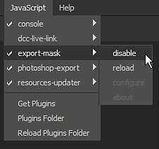

# Erstellen eines JavaScript-Plugins

Diese Schritt-für-Schritt-Anleitung beschreibt, wie Sie ein einfaches Plug-in erstellen, mit dem Sie die Maske der aktuell ausgewählten Ebene in einem Projekt exportieren können.

Ziel des Plug-ins in diesem Leitfaden ist es, alle Kanäle des aktuellen Textursatzes in einem Projekt als einzelne Texturen zu exportieren.

## 1 - Navigation zum Ordner &quot;Plug-ins&quot;

Um ein neues JavaScript-Plugin hinzuzufügen, muss ein Ordner im Plugin-Ordner von Substance 3D Painter erstellt werden.

Um auf den Ordner &quot;**plugins**&quot; zuzugreifen, navigieren Sie zu:

<table data-preserve-html="true" style="width: 100.0%;"> <colgroup> <col style="width: 15.0%;"/> <col style="width: 15.0%;"/> <col style="width: 70.0%;"/> </colgroup> <tbody> <tr> <th>Plattform</th> <th>Version</th> <th>Pfad</th> </tr> <tr> <td rowspan="2"><strong>Windows</strong></td> <td><strong>7.2</strong> oder höher</td> <td colspan="1">C:\Users\username\Documents\Adobe\Adobe Substance 3D Painter</td> </tr> <tr> <td colspan="1">Alte Version</td> <td colspan="1">C:\Users\username\Documents\Allegorithmic\Substance Painter</td> </tr> <tr> <td rowspan="2"><strong>Mac</strong></td> <td colspan="1"><strong>7.2</strong> oder höher</td> <td colspan="1">/Users/Benutzername/Documents/Adobe/Adobe Substance 3D Painter</td> </tr> <tr> <td colspan="1">Alte Version</td> <td colspan="1">/Users/Benutzername/Documents/Allegorithmic/Substance Painter</td> </tr> <tr> <td rowspan="2"><strong>Linux</strong></td> <td colspan="1"><strong>7.2</strong> oder höher</td> <td colspan="1">/home/username/Documents/Adobe/Adobe Substance 3D Painter</td> </tr> <tr> <td>Alte Version</td> <td colspan="1">/home/username/Documents/Allegorithmic/Substance Painter</td> </tr> </tbody> </table>

### 2 - Erstellen des Plug-in-Ordners

Ein Plug-in-Name basiert auf dem Namen seines übergeordneten Ordners.

Erstellen Sie für dieses Beispiel einfach einen neuen Ordner mit dem Namen **export-textures** im Ordner &quot;plugins&quot;.

### 3 - Erstellen der Plug-in-Dateien

Öffnen Sie den neu erstellten Ordner und erstellen Sie zwei leere Textdateien (Notepad):

* **main.qml**
* **toolbar.qml**

Die qml-Dateierweiterung ist eine Javascript-Erweiterung für Skripte, die für die Qt QML-Sprache erstellt wurden. Damit können Sie JavaScript-Code ausführen, aber auch benutzerdefinierte Benutzeroberflächen erstellen.

Die Datei **main.qml** ist obligatorisch. Es handelt sich um die erste Datei, die von der Anwendung gesucht wird, um das Plug-In zu laden. Es können jedoch auch zusätzliche Dateien mit beliebigen Namen erstellt werden, sodass ein Skript zur einfacheren Verwaltung in Teile aufgeteilt werden kann. In diesem Fall wird **toolbar.qml** verwendet, um das Aussehen einer Schaltfläche zu beschreiben, die von dem Plug-In in die Oberfläche eingefügt wird.

### 4 - Skriptinhalt

Öffnen Sie die Skriptdateien in einem Texteditor wie Editor++ und fügen Sie die folgenden Codefragmente ein. Weitere Informationen finden Sie in den Codekommentaren.

**toolbar.qml**

```
import QtQuick 2.7 

import AlgWidgets 2.0 

import AlgWidgets.Style 2.0 

 

AlgButton 

{ 

 tooltip: "" 

 iconName: "" 

 text: "Export Textures" 

}
```


**main.qml**

```
// Default includes, to acces Qt/QML 

// and Substance 3D Painter APIs 

import QtQuick 2.7 

import Painter 1.0 

 

// Root object for the plugin 

PainterPlugin 

{ 

 // Disable update and server settings 

 // since we don't need them 

 tickIntervalMS: -1 // Disabled Tick 

 jsonServerPort: -1 // Disabled JSON server 

 

 // Implement the OnCompleted function 

 // This event is used to build the UI 

 // once the plugin as been loaded by Substance 3D Painter 

 Component.onCompleted: 

 { 

  // Create a toolbar button 

  var InterfaceButton = alg.ui.addToolBarWidget("toolbar.qml"); 

 

  // Connect the function to the button 

  if( InterfaceButton ) 

  { 

   InterfaceButton.clicked.connect( exportTextures ); 

  } 

 } 

 

 // Custom function called by the Button, 

 // this is the core of the plugin 

 function exportTextures() 

 { 

  // Catch errors in the script during execution 

  try 

  { 

   // Verify if a project is open before  

   // trying to export something 

   if( !alg.project.isOpen() ) 

   { 

    return; 

   } 

 

   // Retrieve the currently selected Texture Set (and sub-stack if any) 

   var MaterialPath = alg.texturesets.getActiveTextureSet() 

   var UseMaterialLayering = MaterialPath.length > 1 

   var TextureSetName = MaterialPath[0] 

   var StackName = "" 

 

   if( UseMaterialLayering ) 

   { 

    StackName = MaterialPath[1] 

   } 

 

   // Retrieve the Texture Set information 

   var Documents = alg.mapexport.documentStructure() 

   var Resolution = alg.mapexport.textureSetResolution( TextureSetName ) 

   var Channels = null 

 

   for( var Index in Documents.materials ) 

   { 

    var Material = Documents.materials[Index] 

 

    if( TextureSetName == Material.name ) 

    { 

     for( var SubIndex in Material.stacks ) 

     { 

      if( StackName == Material.stacks[SubIndex].name ) 

      { 

       Channels = Material.stacks[SubIndex].channels 

       break 

      } 

     } 

    } 

   } 

 

   // Create the export settings 

   var Settings = { 

    "padding":"Infinite", 

    "dithering":"disbaled", // Hem, yes... 

    "resolution": Resolution, 

    "bitDepth": 16, 

    "keepAlpha": false 

   } 

 

   // Build the base of the export path 

   // Files will be located next to the project 

   var BasePath = alg.fileIO.urlToLocalFile( alg.project.url() ) 

   BasePath = BasePath.substring( 0, BasePath.lastIndexOf("/") ); 

 

   // Export the each channel 

   for( var Index in Channels ) 

   { 

    // Create the stack path, which defines the channel to export 

    var Path = Array.from( MaterialPath ) 

    Path.push( Channels[Index] ) 

 

    // Build the filename for the texture to export 

    var Filename = BasePath + "/" + TextureSetName 

 

    if( UseMaterialLayering ) 

    { 

     Filename += "_" + StackName 

    } 

 

    Filename += "_" + Channels[Index] + ".png" 

 

    // Perform the export 

    alg.mapexport.save( Path, Filename, Settings ) 

    alg.log.info( "Exported: " + Filename ) 

   } 

  } 

  catch( error ) 

  { 

   // Print errors in the log window 

   alg.log.exception( error ) 

  } 

 } 

} 
```


Speichern und schließen Sie die Datei anschließend.

### 5 - Laden und Aktivieren des Plug-ins

Starten Sie Substance 3D Painter. Standardmäßig werden neue Plug-ins automatisch geladen und aktiviert.

Öffne ein Projekt und klicke auf die UI-Schaltfläche, die vom Plug-in erstellt wurde, um die Kanäle des ausgewählten Textursatzes zu exportieren:


Um ein Plug-in zu aktivieren oder zu deaktivieren, verwenden Sie das Javascript-Menü oben in der Benutzeroberfläche:


