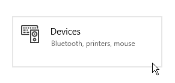

# Konfigurieren von Stiften und Tablets

Auf dieser Seite finden Sie mehrere Empfehlungen zur Konfiguration eines Grafiktablettstifts unter Windows, um die Kompatibilität mit der Anwendung zu verbessern.

## Was ist Windows Ink?

Windows Ink ist eine Software/ein Dienst, die Stifte wie Stifte oder Stifte von Grafiktabletts verarbeitet. Es bietet verschiedene Anwendungen wie Notizen und Skizzenblock, um mit einem Stift auf dem Computer zu interagieren.

Seit der Version 2019.3 ist die Anwendung für Grafiktabletts darauf angewiesen. Vor dieser Version wurde stattdessen Wintab verwendet (älterer Dienst, der nicht von allen Grafiktablett-Modellen unterstützt wird).

## Aktivieren von Windows Ink in Tablet-Treibereinstellungen

Um sicherzustellen, dass der Stiftdruck richtig erkannt wird, muss Windows Ink in den Treibereinstellungen des Grafiktabletts aktiviert sein.

>[!NOTE]
>
> Windows Ink wird auf virtuellen Computern nicht unterstützt, daher werden Grafiktablett-Ereignisse nicht an die Anwendung weitergeleitet. Der Stiftdruck wird daher in dieser Konfiguration nicht unterstützt.

### Aktivieren von Windows Ink für Wacom-Tablets

1. Öffnen Sie das Menü **Start**.
1. Geben Sie **Wacom Tablet Properties** ein, und klicken Sie auf das erste Suchergebnis.
1. Klicken Sie im Fenster **Wacom Tablet Properties** auf den **Stift** in der Werkzeugliste.\
   
1. Klicken Sie auf die Schaltfläche mit dem Pluszeichen **&quot;+&quot;**, um ein Anwendungsprofil hinzuzufügen.\
   
1. Klicken Sie im neuen Fenster auf die Schaltfläche **Durchsuchen**, um die ausführbare Substance 3D Painter-Datei zu suchen.\
   
1. Klicken Sie auf **OK**, um das Profil zu validieren und zu erstellen.\
   
1. Klicken Sie auf die Registerkarte **Zuordnung**.\
   
1. Vergewissern Sie sich links unten im Fenster, dass **Windows Ink verwenden** aktiviert ist.\
   

>[!NOTE]
>
> Starten Sie nach dem Aktivieren von Windows Ink die Anwendung neu, um sicherzustellen, dass die Änderungen ordnungsgemäß berücksichtigt werden.

### Aktivieren von Windows Ink für Huion-Tablets

1. Öffnen Sie das Menü **Start**.
1. Geben Sie **Huion Tablet** ein, und klicken Sie auf das erste Suchergebnis.
1. Klicken Sie im Fenster **Huion Tablet** auf **Digital Pen** .\
   
1. Vergewissern Sie sich links unten im Fenster, dass **Windows Ink aktivieren** aktiviert ist.\
   

## So greifen Sie auf Windows Ink-Einstellungen zu

Auf die Windows Ink-Einstellungen können Sie in den allgemeinen Windows-Einstellungen zugreifen:

1. Öffnen Sie das Menü **Start**.
1. Klicken Sie auf das Symbol **Einstellungen**.\
   
1. Klicken Sie im Fenster Einstellungen auf **Geräte** .\
   
1. Klicken Sie im Fenster **Geräte** auf **Stift &amp; Windows Ink** (nur verfügbar, wenn ein Grafiktablett angeschlossen ist).\
   

## Empfohlene Windows Ink-Einstellungen

Im Folgenden finden Sie die Windows Ink-Einstellungen und die empfohlene Konfiguration für jede dieser Einstellungen.

>[!NOTE]
>
> Auch nach der Befolgung dieses Leitfadens sind einige Grafiken im Zusammenhang mit Windows Ink weiterhin sichtbar. Leider bietet Microsoft unter Windows keine Einstellungen zur Deaktivierung an.
> 
> Die restlichen Grafiken sind:
> 
> * **Kreis** beim Rechtsklick.
> * **QuickInfo** unter der Maus beim Drücken eines Tastenmodifikators (Strg, Alt oder Umschalt).

### Zeichenstift-Einstellungen

| ***Einstellung*** | ***Beschreibung*** |
| --- | --- |
| **Wählen Sie die Hand aus, mit der geschrieben werden soll** | Empfohlen:  **Rechte Hand** Diese Einstellungen steuern, wie die Stiftausrichtung erkannt wird. Wenn Sie diese Einstellung auf &quot;Linke Hand&quot; festlegen, kann es beim Anpassen von Parametern zum Einfrieren der Benutzeroberfläche kommen. |
| **Visuelle Effekte anzeigen** | Empfohlen:  **Deaktiviert** Diese Einstellungen steuern visuelle Effekte, die während verschiedener Zeichenstift-Interaktionen angezeigt werden. Wenn du die Option deaktivierst, kannst du den Effekt &quot;Kreis und Lücke schließen&quot; ausblenden, wenn du klickst: 

 |
| **Zeiger anzeigen** | Empfohlen:  **Deaktiviert** |
| **Verwenden des Stifts als Maus in einigen Desktop-Anwendungen** | Empfohlen:  **Aktiviert** Mit diesen Einstellungen kann der Grafiktablettstift normale Mauseingaben senden. Wenn diese Einstellung deaktiviert ist, kann dies zu Interaktionsproblemen mit UI-Parametern führen. |

### Handschrifteneinstellungen

| ***Einstellung*** | ***Beschreibung*** |
| --- | --- |
| **Schriftgröße beim direkten Schreiben in das Textfeld** | Empfohlen:  **Mittel (Standard)** |
| **Schriftart bei Verwendung von Handschrift** | Empfohlen:  **Segoe-Benutzeroberfläche (Standard)** |
| **Wenn ich mit dem Stift auf ein Textfeld tippe, geben Sie den Text manuell ein** | Empfohlen:  **Nur im Tablet-Modus** Diese Einstellungen steuern, wie und wann das Eingabefenster für Handschrifttext angezeigt wird. Wenn diese Option nicht auf &quot;Nur im Tablet-Modus&quot; eingestellt ist, wird das Fenster jedes Mal angezeigt, wenn ein Textfeld in der Benutzeroberfläche ausgewählt wird. Zum Beispiel, wenn Sie einen bestimmten Wert in einen Schieberegler eingeben. |
| **Verwenden des Stifts als Maus in einigen Desktop-Anwendungen** | Empfohlen:  **Aktiviert** Mit diesen Einstellungen kann der Grafiktablettstift normale Mauseingaben senden. Wenn diese Einstellung deaktiviert ist, kann dies zu Interaktionsproblemen mit UI-Parametern führen. |
| **Mit der Fingerspitze in das Handschriftenfeld schreiben** | Empfohlen:  **Deaktiviert** |

### Einstellungen für Zeichenstift-Tastaturbefehle

| ***Einstellung*** | ***Beschreibung*** |
| --- | --- |
| **Einmal klicken** | Empfohlen:  **Nichts** |
| **Doppelklicken auf** | Empfohlen:  **Nichts** |
| **Drücken und Halten (wird nur bei einigen Stiften unterstützt)** | Empfohlen:  **Nichts** |
| **Apps das Überschreiben der Verknüpfungsschaltfläche erlauben (Verhalten)** | Empfohlen:  **Aktiviert** |
| **Wenn verfügbar, Arbeitsbereich &quot;Tinte&quot; anzeigen, nachdem ich meinen Stift aus dem Speicher entfernt habe** | Empfohlen:  **Deaktiviert** |

## So greifen Sie auf Zeichenstift- und Touch-Einstellungen zu

Auf die Einstellungen für Stift und Touch kann über die Systemsteuerung zugegriffen werden:

1. Öffnen Sie das Menü **Start**.
1. Geben Sie **Systemsteuerung** ein, und klicken Sie auf das erste Suchergebnis.
1. Wechseln Sie im Anzeigemodus der Systemsteuerung **&#x200B;**&#x200B;zum **kleinen Symbol** .\
   
1. Klicken Sie auf **Zeichenstift- und Touch**-Einstellungen.\
   

## Empfohlene Stift- und Touch-Einstellungen

Die folgenden Einstellungen werden empfohlen, um das Malverhalten und die Kamerabewegung zu verbessern.

Um auf die Einstellungen zuzugreifen, klicken Sie im Fenster auf eine der **Aktionen zum Öffnen** und dann auf die Schaltfläche **Einstellungen**.

| ***Einstellung*** | ***Beschreibung*** |
| --- | --- |
| **Einfaches Tippen** | Keine Parameter. |
| **Doppeltippen** | Empfohlen:  **Standardwerte.** |
| **Drücken und halten** | Empfohlen:  **Deaktivieren Sie die Einstellung &quot;Drücken und Halten für Rechtsklick aktivieren&quot;** Wenn Sie diese Einstellung deaktivieren, können Sie jedes Element normal ziehen, ohne den Windows-Ziehkreis zu aktivieren: 

 |
| **Verwenden Sie die Schaltfläche &quot;Öffnen&quot; als Äquivalent mit der rechten Maustaste** | Empfohlen:  **Aktiviert** |
| **Verwenden Sie die Oberseite des Stifts, um die Druckfarbe zu löschen (sofern verfügbar)** | Empfohlen:  **Aktiviert** |
