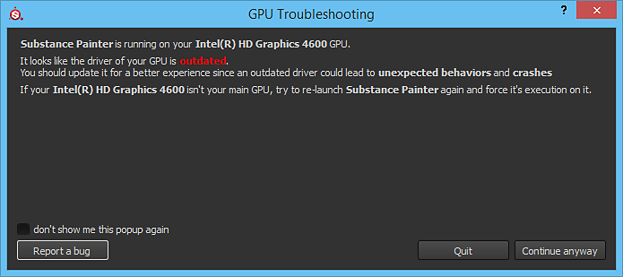

# GPU hat veraltete Treiber

{width="500px"}

Beim Starten von Substance 3D Painter wird möglicherweise ein Popup-Fenster angezeigt, in dem Sie darauf hingewiesen werden, dass die GPU-Treiber veraltet sind. Diese Meldung bedeutet einfach, dass für die Software eine Mindestversion der zu installierenden GPU-Treiber erforderlich ist. Wir haben empfohlen, die GPU-Treiber auf die neueste Version zu aktualisieren, die nach Möglichkeit verfügbar ist, um das beste Arbeitserlebnis zu erzielen.

| *Anbieter* | *Link* |
| --- | --- |
| **NVIDIA** | [http://www.nvidia.com/Download/index.aspx](http://www.nvidia.com/Download/index.aspx?lang=en-us) <ul data-preserve-html="true"><li data-preserve-html="true"><strong> GeForce </strong> : Version von &quot;Studio Drivers&quot; (SD) empfohlen.</li><li data-preserve-html="true"><strong> Quadro </strong> : Version für &quot;Optimal Driver for Enterprise&quot; (ODE) empfohlen.</li></ul> |
| **AMD** | <http://support.amd.com/en-us/download> |
| **Intel** | <https://downloadcenter.intel.com/> |

>[!NOTE]
>
> Einige Computer <b> verfügen möglicherweise über zwei GPUs</b>: einen integrierten (wie einen Intel-Chipsatz) und einen dedizierten (wie eine Nvidia-Grafikkarte). <b>Beide</b> müssen <b>auf dem neuesten Stand </b> sein, um das Fehlerrisiko in Painter zu minimieren.
