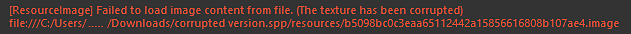

# Fehlermeldung &quot;Beschädigte Textur&quot;

Beschädigte Texturen in einem Projekt verursachen Fehler beim Speichern und können dazu führen, dass Projekte vollständig beschädigt und nicht rückgängig gemacht werden können. Dies kann jedoch manuell behoben werden.\
Eine beschädigte Ressource wird im Protokoll angezeigt, wenn ein Projekt mit einer ähnlichen Fehlermeldung wie im Protokollfenster geöffnet wird:

## Korrigieren eines beschädigten Ressourcenverweises

### 1 - Suchen der Ressource

Der erste Schritt, wenn ein Fehler angezeigt wird, ist das Suchen und Identifizieren der problematischen Ressource.\
In den meisten Fällen stammt der Schuldige aus den **Mesh Maps** (baked textures). Das kannst du schnell überprüfen, indem du dir die Maskengeneratoren im Ebenenstapel ansiehst.

Beschädigte Ressourcen werden wie folgt aussehen:

>[!NOTE]
>
> Das könnte auch bedeuten, dass die Ressource einfach fehlt.\
> Versuchen Sie, den Steckplatz zu leeren und die Kugel manuell erneut zu beeinflussen. Wenn das rote Kreuz weiterhin angezeigt wird, bedeutet dies, dass die Ressource beschädigt ist.

### 2 - Ersetzen der Ressource

Um eine beschädigte Ressource zu ersetzen, müssen zuerst alle Verweise darauf entfernt werden. Ist der Strom relativ klein, kann dies manuell erfolgen.\
Wenn sich das Projekt jedoch über mehrere Textursätze oder viele Ebenen erstreckt, kann der [Ressourcenaktualisierer](../../../features/plugins/resources-updater.md) hilfreich sein, um die beschädigte Ressource zu finden und vorübergehend durch eine andere zu ersetzen.

>[!NOTE]
>
> * Vergessen Sie bei den gebackenen Texturen nicht, auch die Mesh Maps-Steckplätze im Fenster [Textursatz-Einstellungen](../../../interface/texture-set/texture-set-settings.md) zu löschen.
> * Auch Backen, die nur in den Textursatzeinstellungen wie die normale Map verwendet werden, können beschädigt werden. Versuchen Sie auch, sie zu entfernen, wenn weiterhin Fehler auftreten.

### 3 - Bereinigung

Sobald alle Verweise auf die beschädigten Ressourcen verschwunden sind, führen Sie eine Bereinigung des Projekts über das Hauptmenü durch (**Datei** > **Bereinigen**).\
Dadurch sollten alle jetzt nicht verwendeten beschädigten Ressourcen aus dem Projekt entfernt werden. Sie können dies überprüfen, indem Sie auf der Registerkarte &quot;Projekt&quot; in der Ablage navigieren, um sicherzustellen, dass alle problematischen Ressourcen verschwunden sind.

### 4 - Speichern

Versuchen Sie nach der Bereinigung, das Projekt zu speichern :

* Wenn es fehlerfrei speichert, ist das Projekt jetzt frei von Beschädigungen (Gitterzuordnungen können jetzt rückgängig gemacht und Ressourcen erneut importiert werden).
* Wenn weiterhin Fehler auftreten, bedeutet dies, dass im Projekt weiterhin auf eine beschädigte Ressource verwiesen wird.
