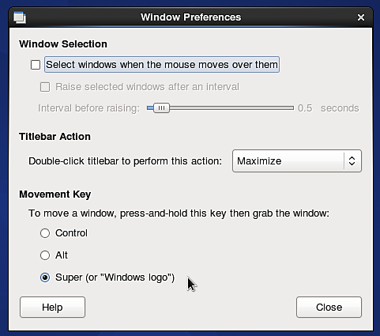
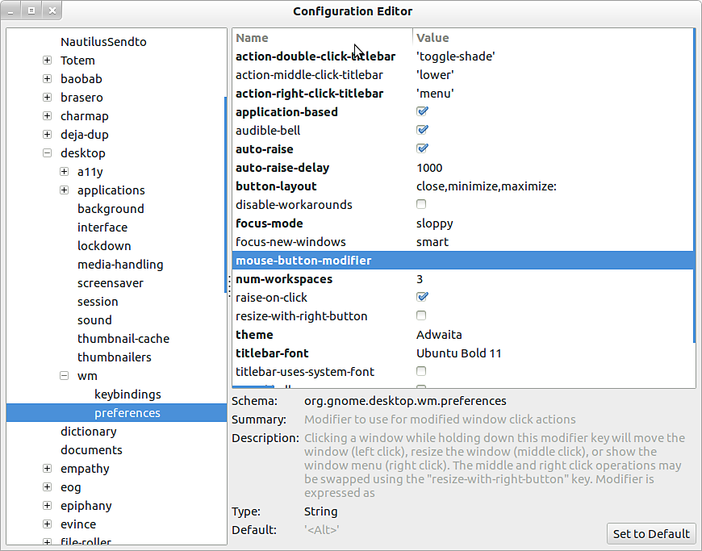

# Verwendung des ALT-Tastatur-Tastaturbefehl unter Linux nicht möglich

Wenn Sie eine Linux-Distribution (**Ubuntu** oder **CentOS**) ausführen, die **Gnome** als Benutzeroberfläche verwendet, sollten Sie das Standardverhalten des **ALT**-Schlüssels deaktivieren, damit Sie im Viewport navigieren können.

## CentOS

1 - Wechseln Sie zu **System > Windows**

{width="250px"}

2 - Ändern Sie die Einstellung &quot;Verschiebungsschlüssel&quot; in einen anderen Wert als &quot;**Alt** &quot;. Verwenden Sie beispielsweise &quot;**Super** &quot; (um die Taste &quot;Windows&quot; Ihrer Tastatur auszuwählen).

{width="350px"}

## Ubuntu

1 - Öffnen Sie ein Terminal und führen Sie den folgenden Befehl aus:

```
sudo apt-get install dconf-tools
```


Dadurch wird ein erweitertes Konfigurationstool installiert. Möglicherweise müssen Sie zulassen, dass zusätzliche Abhängigkeiten installiert werden, um es ausführen zu können.

2 - Öffnen Sie das Startmenü und suchen Sie nach &quot;**Dconf-tools** &quot;. Starten.

3 - Erweitern Sie das Baummenü auf der linken Seite, indem Sie auf die folgende Route gehen:  **org > gnome > desktop > wm > preferences**

4 - Bearbeiten Sie den &quot;mouse-button-modifier&quot; und ändern Sie den Wert. Legen Sie es fest oder stattdessen, aber *lassen Sie es nicht leer* . Super ist ein Äquivalent zur Windows-Taste.

{width="500px"}
