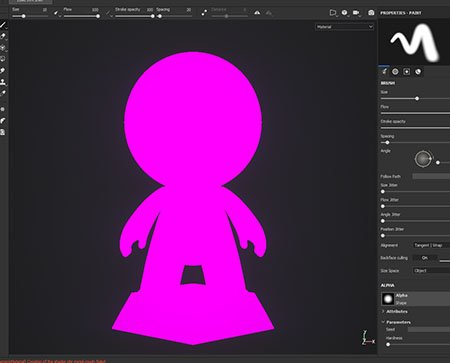

# Mesh erscheint rosa im Viewport

{width="400px"}

Der Mesh kann **pink** im Viewport erscheinen, da der **Shader**, der zum Zeichnen verwendet wurde **, nicht mehr kompiliert wird** (wie vom **Protokollfenster** erwähnt). Dies kann durch einen veralteten Shader verursacht werden, der die neueste Version des Shader-API nicht unterstützt.

So kann es behoben werden:

* Für **Standardshader**: befolgen Sie die schrittweise Anleitung auf der Seite [Aktualisieren eines Shader](../../../interface/shader-settings/updating-a-shader.md).
* Für **benutzerdefinierten Shader**: sehen Sie sich die Fehlermeldung im Protokollfenster sowie auf der Seite [Shader-API](https://helpx.adobe.com/substance-3d/unlisted/documentation/spdoc/custom-shader-api-89686018.html) an.
