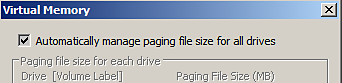
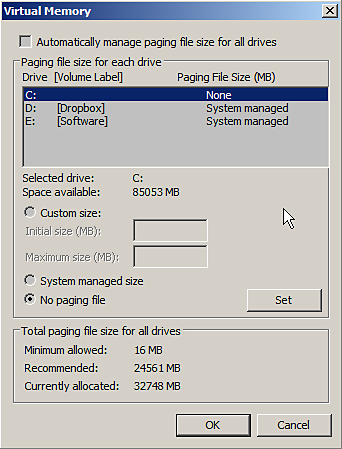

# Absturz mit wenig virtuellem Arbeitsspeicher

Substance 3D Painter kann instabil sein, wenn die Datei **paging** ( **swap** Speicher/ **virtueller** Speicher) mit einem Wert **zu niedrig** festgelegt ist.\
Es wird empfohlen, diese Einstellungen vom Betriebssystem behandeln zu lassen (was in der Regel standardmäßig der Fall ist). Substance 3D Painter benötigt mindestens **&#x200B;**&#x200B;**16 GB** virtuellen Speicher, damit es ordnungsgemäß funktioniert.

## Wie kann ich die Größe des virtuellen Arbeitsspeichers unter Windows ändern?

>[!NOTE]
>
> Wenn Sie die Größe des virtuellen Arbeitsspeichers unter Windows ändern, muss der Computer neu gestartet werden.

Zugriff auf die Einstellungen für den virtuellen Arbeitsspeicher mit den folgenden Schritten

1. Klicken Sie mit der rechten Maustaste auf das Symbol **Computer/This PC** und wählen Sie **Eigenschaften** aus.
1. &quot;**Erweiterte Systemeinstellungen**&quot; auswählen
1. Klicken Sie im Abschnitt **Leistung** auf die Schaltfläche **Einstellungen**.
1. Klicken Sie auf die Registerkarte **Erweitert**.
1. Klicken Sie im Abschnitt **Virtueller Speicher** auf **Ändern**.

Jetzt ist es möglich:

* Aktivieren Sie das Kontrollkästchen **Paging-Dateigröße für alle Laufwerke automatisch verwalten**

**oder**

* Wählen Sie die Festplatte aus, auf der Sie die Größe des virtuellen Arbeitsspeichers ändern möchten, wählen Sie **Vom System verwaltete Größe** aus, und klicken Sie auf die Schaltfläche **Festlegen**.

**Automatisch:**

**Manuell:**

