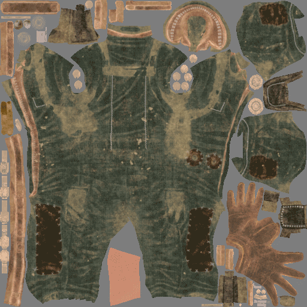

# Ausdehnung der Textur oder Auffüllung

**Auffüllen** (manchmal auch als **Ausdehnung** bezeichnet) ist ein Prozess, der nach dem Generieren einer Textur ausgeführt wird. Sie dient dazu, die Ränder der UV-Inseln zu erweitern, um leere Bereiche mit ähnlichen Pixeln zu füllen.

Das Generieren einer Auffüllung mit guter Qualität ist wichtig, um sicherzustellen, dass die [MIPMAPS](../../../getting-started/glossary.md)-Generierung von Game-Enginen oder Offline-Renderern später gut ist.\
Substance 3D Painter kann eine unendliche Auffüllung generieren: Das bedeutet, dass ein Pixel gedehnt wird, bis es eine andere UV-Insel oder die Ränder der Textur erreicht.

## Generierung unendlicher Innenabstände

Im Folgenden finden Sie ein Beispiel für die unendliche Auffüllung :

<table>
<tr style="border: 0;">
<td style="border: 0;" valign="top">

{width="512px"}

</td>
<td style="border: 0;" valign="top">

</td>
</tr>
</table>

## MipMaps

In 3D-Computergrafiken sind **MIPMaps** vorberechnete, optimierte Sequenzen von Texturen, von denen jede eine progressiv niedrigere Auflösung des gleichen Bildes ist. Sie sollen die Rendering-Geschwindigkeit erhöhen und Aliasing-Artefakte reduzieren. Für Objekte in der Nähe der Kamera wird ein hochauflösendes Mipmap-Bild verwendet. Bilder mit geringerer Auflösung werden verwendet, wenn das Objekt weiter entfernt erscheint. Auf diese Weise lassen sich alle Pixel der ursprünglichen Textur effizient rendern bzw. lesen. Die Mipmaps (jede Ebene) sind in der Textur selbst eingebettet (wenn sie vom Dateiformat unterstützt werden).

Der Innenabstand ist sehr wichtig für Imagemaps, da er verhindert, dass falsche Farben innerhalb der UVs des Meshs verlaufen, wenn die Auflösungen der Textur niedriger sind.

<table>
<tr style="border: 0;">
<td style="border: 0;" valign="top">

{width="400px"}

</td>
<td style="border: 0;" valign="top">

{width="400px"}

</td>
</tr>
</table>

Im Beispiel oben wird der graue Hintergrund in die UVs übergeht (rechtes Bild), während mit der Auffüllung die Farbe sauber bleibt (linkes Bild).

In einer 3D-Anwendung ist dies das Ergebnis:

## Abstandssteuerelemente

Mit Substance 3D Painter können Sie das Verhalten der Generierung von Innenabständen an verschiedenen Stellen ändern (z. B. Deaktivieren):

* **Beim Baking von** : Weitere Informationen finden Sie in der [Dokumentation zum Baking](../../../baking/baking.md).
* **Beim Generieren von Texturen für einen Textursatz** : Weitere Informationen finden Sie in der Dokumentation zu den [Textursatz-Einstellungen](../../../interface/texture-set/texture-set-settings.md).
* **Beim Exportieren von Texturen** : Weitere Informationen finden Sie im Abschnitt &quot;Auffüllungseinstellungen&quot; in der Dokumentation [Exporteinstellungen](../../../export/export-window/export-window.md).
