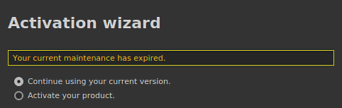

# Dialogfeld &quot;Wartung ist abgelaufen&quot; beim Starten

Beim Starten der Anwendung wird möglicherweise ein Dialogfeld mit der Meldung &quot;Ihre aktuelle Wartung ist abgelaufen&quot; angezeigt. Auf dieser Seite finden Sie Lösungen zum Vermeiden dieses Dialogfelds.

## Lösung 1: Lizenzdatei aktualisieren

Die Warnmeldung wird angezeigt, da die Lizenzdatei zu alt ist und aktualisiert werden muss. Aktivieren Sie dazu einfach **das Produkt** über den Anwendungsassistenten erneut. Die Lizenzdatei kann auch manuell über die Substance 3D-Website heruntergeladen werden: <https://www.substance3d.com/>

## Lösung 2: Bearbeiten Sie die Voreinstellungen, um das Dialogfeld auszublenden

>[!NOTE]
>
> Wir empfehlen, zuerst zu versuchen, die Lizenzdatei zu aktualisieren, bevor Sie diese alternative Lösung verwenden.

Eine andere Lösung besteht darin, die Warnmeldung auszublenden, indem eine bestimmte Einstellung festgelegt wird.

Navigieren Sie zum Speicherort der Anwendungsvoreinstellungen:

<table data-preserve-html="true"><colgroup> <col/> <col/> <col/> </colgroup><tbody><tr><th>System</th><th>Version</th><th>Pfad</th></tr><tr><td rowspan="2">
<strong>Windows</strong>

(Registrierung)
</td><td><strong>7.2</strong> oder höher</td><td>HKEY_CURRENT_USER\Software\Adobe\Adobe Substance 3D Painter</td></tr><tr><td>Alte Version</td><td>HKEY_CURRENT_USER\Software\Allegorithmic\Substance Painter</td></tr><tr><td rowspan="2">
<strong>Mac</strong>

(Bibliothek)
</td><td><strong>7.2</strong> oder höher</td><td>/Users/[Benutzername]/Library/Preferences/com.adobe.Adobe Substance 3D Painter.plist</td></tr><tr><td>Alte Version</td><td>/Users/[Benutzername]/Library/Preferences/com.substance3d.Substance Painter.plist</td></tr><tr><td rowspan="2"><strong>Linux</strong></td><td><strong>7.2</strong> oder höher</td><td>/home/[Benutzername]/.config/Adobe/Adobe Substance 3D Painter.conf</td></tr><tr><td>Alte Version</td><td>/home/[Benutzername]/.config/Allegorithmic/Substance Painter.conf</td></tr></tbody></table>

### Windows

Führen Sie die folgenden Schritte aus, um die Variable unter Windows festzulegen:

1. Öffnen Sie das Startmenü.
1. Suchen Sie nach **Regedit**, um den Registrierungseditor zu öffnen.
1. Navigieren Sie zu dem in der obigen Tabelle aufgeführten Registrierungsschlüssel.
1. Klicken Sie in der Baumstruktur auf der linken Seite auf den Registrierungsschlüssel, der als Software benannt ist.
1. Klicken Sie mit der rechten Maustaste in den leeren Bereich im rechten Bereich und wählen Sie **Neu > Zeichenfolgenwert**.
1. Nennen Sie den neuen Wert **DisableLicenseWarningPopup**, und drücken Sie die Eingabetaste, um die Gültigkeit zu bestätigen.
1. Doppelklicken Sie auf den soeben erstellten Wert.
1. Legen Sie das Datenfeld Wert auf Folgendes fest: **true**
1. Speichern Sie die Änderung.
1. Starten Sie die Anwendung.

### MacOS

1. Öffnen Sie ein neues **Finder**-Fenster.
1. Navigieren Sie zu dem in der obigen Tabelle aufgeführten Pfad.
1. Klicken Sie mit der rechten Maustaste auf die Datei **plist** und wählen Sie **Öffnen mit > Xcode**.
1. Fügen Sie oben in der Liste einen neuen Schlüssel mit dem Namen **DisableLicenseWarningPopup** hinzu.
1. Legen Sie den Schlüsseltyp auf **Zeichenfolge** fest.
1. Legen Sie den Schlüsselwert auf **true** fest.
1. Speichern und schließen Sie die Datei.
1. Starten Sie die Anwendung.

### Linux

Führen Sie die folgenden Schritte aus, um die Variable unter Linux festzulegen:

1. Navigieren Sie zur Pfadliste in der obigen Tabelle.
1. Öffnen Sie die Datei **.conf**, die sich im Ordner befindet.
1. Neue Zeile unter der Zeile **[Allgemein]** hinzufügen
1. Fügen Sie in der neuen Zeile folgenden Text ein: **DisableLicenseWarningPopup=true**
1. Speichern Sie die Datei.
1. Starten Sie die Anwendung.
