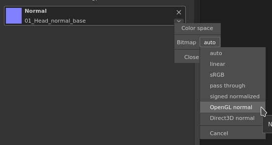

# Normale Karte sieht falsch aus, wenn sie in Ebenen- oder Werkzeugeigenschaften geladen wird

Wenn Sie eine Normale in das aktuelle Werkzeug der Füllebene laden, kann diese falsch erscheinen, wenn es sich um eine OpenGL-Normalmap handelt.\
Der Grund ist ganz einfach: Die Engine von Substance 3D Painter geht davon aus, dass die geladene Normalmap standardmäßig DirectX ist.

Dieses Verhalten lässt sich leicht bearbeiten, indem Sie auf den kleinen Pfeil neben dem Substance-Material oder dem dedizierten Kanal klicken:

