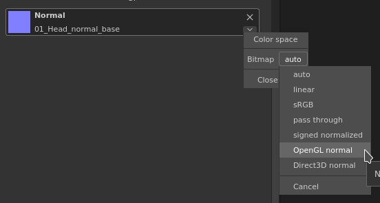

# Normalen-Map sieht beim Laden in Ebenen- oder Werkzeugeigenschaften falsch aus

Wenn Sie eine Normalität in das aktuelle Tool von Füllebene laden, kann diese fehlerhaft erscheinen, wenn es sich um eine OpenGL-Normalen-Map handelt.\
Der Grund ist ganz einfach: Das Engine von Substance 3D Painter nimmt an, dass geladene Normalen-Map standardmäßig DirectX sind.

Dieses Material lässt sich einfach bearbeiten, indem man auf den kleinen Pfeil neben dem Substance-Kanal oder dem dedizierten Kanal klickt:

